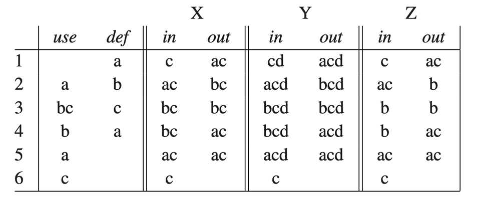

---
tags:
  - ZJU-Courses
---

# Chapter 10: Liveness Analysis

> [!abstract] 本节摘要
> 活跃分析是对指令选择后的临时变量进行活跃性分析，通过对数据流的活跃分析我们可以获取整个程序的所有变量的活跃周期，进而用于编译器后续的寄存器分配

## Introduction

实际使用中的物理机只包含有限数量的物理寄存器，而在编译器中端都使用了无限数量的虚拟寄存器，因此需要把一些变量放置在同一个寄存器中

活跃分析主要处理临时变量的生存周期问题，如果一个变量未来还需要继续使用，那么这个变量在这个时间点就是活跃的

对于不同时活跃的变量，他们的活动轨迹不重叠，因此可以放置于同一个寄存器中，不会产生任何冲突

最方便的方式是从程序的控制流图从后往前分析，因为控制流图从前往后代表了时间上的顺序，因此逆序过来就是从未来到现在

称一个变量在控制流图的边上是活跃的(*Live*)，如果有一条控制流图的有向边，从定义它的节点指向了使用它的节点且中间没有重新定义过这个变量

- Live-in：一个变量在一个节点的任意入边上活跃
- Live-out：一个变量在一个节点的任意出边上活跃

## Dataflow Analysis

一个节点 `{cpp}n` 的所有入边活跃变量的集合为 `{cpp}in[n]`，出边活跃变量的集合为 `{cpp}out[n]`

1. 如果一个变量在该节点的后继节点中被使用，那么该变量在该节点的出边活跃集合中
2. 如果一个变量在该节点中被使用，那么该变量在该节点的入边活跃集合中
3. 如果一个变量在该节点的出边活跃变量集合中且并没有在该节点中重定义，那么该变量属于该节点的入边活跃变量

基于这三个规则，可以总结出数据流的活跃分析方程：

$$
\text{in}[n]=\text{use}[n]\bigcup(\text{out}[n]-\text{def}[n])
$$

$$
\text{out}[n]=\mathop{\bigcup}_{s\in\text{succ}[n]}\text{in}[s]
$$

每个节点的使用变量集 `{cpp}use` 和定义变量集 `{cpp}def` 都是可以直接基于控制流图计算出来的

在实际操作中，可以通过后向分析，先计算节点的出边活跃变量集合再算入边活跃变量集合，可以加速迭代法的收敛速度

$$
\begin{aligned}
&\textbf{for each } n\\
&\quad\text{in}[n]\leftarrow\{\};\ \text{out}[n]\leftarrow \{\}\\
&\textbf{repeat}\\
&\quad \textbf{for each }n\\
&\qquad \text{in}'[n]\leftarrow \text{in}[n];\ \text{out}'[n]\leftarrow \text{out}[n]\\
&\qquad \text{out}[n]\leftarrow \bigcup_{s\in \text{succ}[n]}\text{in}[s]\\
&\qquad \text{in}[n]\leftarrow \text{use}[n] \cup (\text{out}[n] - \text{def}[n])\\
&\textbf{until }\text{in}'[n]=\text{in}[n]\ \textbf{and}\ \text{out}'[n]=\text{out}[n]\ \textbf{for all }n\\
\end{aligned}
$$

> [!note] 复杂度分析
> 假设最多有 $N$ 个节点、$N$ 个变量，每个集合取并集操作的时间复杂度为 $O(N)$，那么在循环体中，每个节点会进行常数次集合运算，因此一轮循环的复杂度为 $O(N^2)$，而所有入口和出口活跃变量的集合大小之和为 $2N^2$，因此可以得出
> - 最坏时间复杂度为 $O(N^4)$
> - 实际运行时间介于 $O(N)$ 和 $O(N^2)$ 之间

> [!tip] 进阶
> 除了前述的基于指令的活跃分析，也可以基于基本块进行活跃分析，或者每次分析只分析单一变量

具体实现时，如果变量数量众多且集合稠密，可以使用位数组，这样集合的合并等操作直接基于两个数组的按位或操作；如果集合稀疏，可以使用有序链表

> [!note] 最小不动点
> 假如程序中还有一个在目标代码片段中未使用的变量，那么分析结果的每个步骤都可以包含这个变量，导致可能不止一个解的情况，因此有一个最小不动点(*Least Fixed Point*)
> 
> 使用前述的迭代算法计算出的一定是最小不动点
> 
> 

## Static And Dynamic Liveness

在静态分析中，编译器无法确定某个分支是否会被触达，这是基于**停机问题**的，所以编译器都会做保守估计

如果控制流图中存在一条从节点 `{cpp}n` 到某处对变量 `{cpp}a` 的使用路径且不经过任何对 `{cpp}a` 的定义，则认为变量 `{cpp}a` 在节点 `{cpp}n` 处**静态活跃**

如果程序实际运行中存在一条从节点 `{cpp}n` 到某处对变量 `{cpp}a` 的使用路径且不经过任何对 `{cpp}a` 的定义，则认为变量 `{cpp}a` 在节点 `{cpp}n` 处**动态活跃**

显然，静态活跃是动态活跃的保守估计

## Interference Graphs

冲突图是活跃分析的一个重要的应用，为编译器后续的寄存器分配服务

当两个变量不能被分配到同一个寄存器中时就称它们存在冲突

- 对于非复制赋值指令，当它定义了一个新的变量，那么就不能把这个新变量和后续还活跃的变量放置于同一个寄存器中，所以需要添加这个变量和那些出边活跃变量的冲突边
- 对于复制赋值指令，这时候需要检查出边活跃变量是否和复制赋值的变量为同一个，如果是就不再添加冲突边了

> [!example] 对于 `{cpp}MOVE` 指令的特殊处理
> ```cpp title:"Copy Move"
> t = s;
> x = ...s...;
> y = ...t...;
> ```
> 
> 显然，上述代码中的 `{cpp}t` 和 `{cpp}s` 是同一个，他们经过复制赋值，且没有重定义，所以他们其实可以放置于同一个寄存器中
