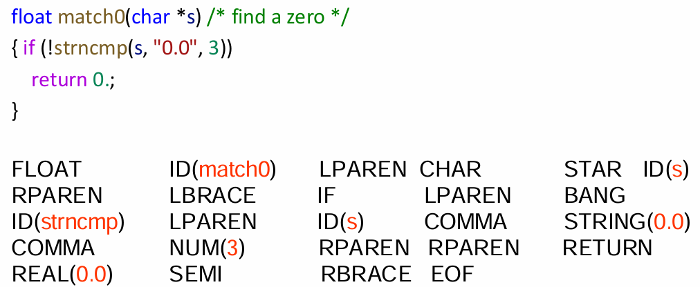
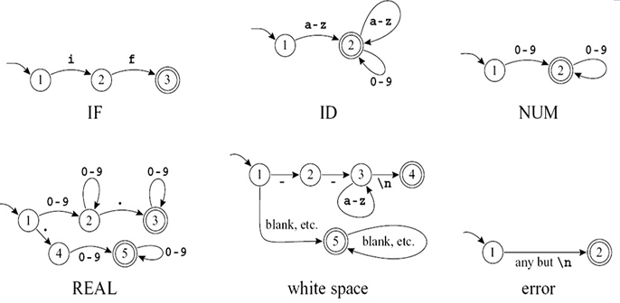
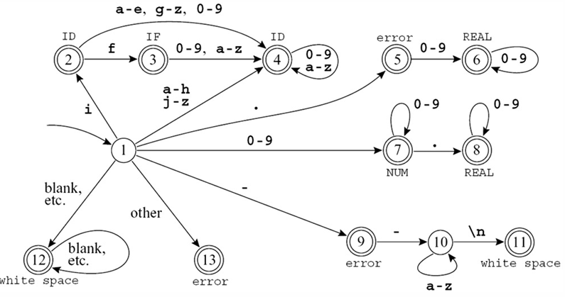
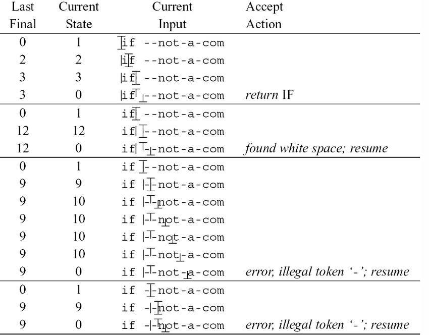

---
tags:
  - ZJU-Courses
---

# Chapter 2: Lexical Analysis

> [!abstract] 本节摘要
> TODO

## Introduction

编译的过程是把一个程序语言转化为另一种程序语言，一个编译器首先先把源程序分解开，理解每个分解出的部分的结构和意义，然后重新以另一种方式组合起来

- 前端负责分析
    - 词法分析：把输入分解为记号(*Tokens*)
    - 语法分析：解析程序语法
    - 语义分析：计算程序的语义
- 后端负责综合

词法分析器的输入是源程序的字符流，用于生成一系列的记号流，并删除空格和注释

## Lexical Token

词法记号就是一个字符串序列，是一系列的程序语言中的语法单元

词法记号是一组有限的记号类型集合

输入的字符流经过词法分析器之后会转变为词法记号流

> [!example]- 记号类型
> |  记号类型  |   含义    |
> | :----: | :-----: |
> |   ID   | 函数名变量名  |
> |  NUM   |   整型    |
> |  REAL  |  实数类型   |
> |   IF   | `if`关键字 |
> | COMMA  |   `,`   |
> | NOTEQ  |  `!=`   |
> | LPAREN |   `(`   |
> | RPAREN |   `)`   |

其它的非记号类型，如

- 注释
- 头文件包含
- 宏定义
- 宏使用
- 空行空格

都会被预处理器删除而不会形成记号

## Regular Expression

上文所述使用自然语言的形式描述词法记号，而用正则表达式可以很方便地描述词法记号

> [!tip] 注意
> 正则表达式的内容与计算理论基本一致

### Abbreviations

- $ab|c$表示$(a\cdot b)|c$
- $(a|)$表示$(a|\epsilon)$
- $[abcd]$表示$(a|b|c|d)$
- $[b-g]$表示$[bcdefg]$
- $M?$表示$(M|\epsilon)$
- $M+$表示$(M\cdot M^*)$
- $\cdot$表示除空行外任意字符

### Disambiguation Rules

为了防止二义性，需要一些规则：

- 最长匹配
- 规则优先级

## Finite Automata

使用有限自动机把正则表达式实现为计算机程序

把这些小的自动机进行合并：

自动机实现起来可以使用一个转移矩阵，其中矩阵的列索引为输入的字符编号，行索引代表状态机的状态，根据列索引在当前状态行中得到下一个状态行的行号

状态0记为死状态，会永远循环

## Nondeterministic Finite Automata

直接把正则表达式转为DFA其实不那么直观，因为DFA中不接受空串，而NFA可以，并且DFA和NFA等价，所以先把正则表达式转化为NFA，然后再把NFA转化为DFA
