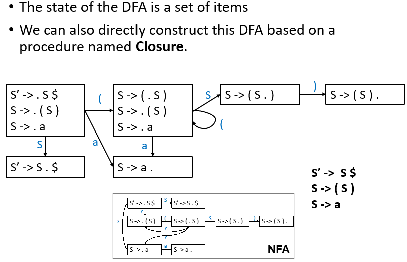

---
tags:
  - ZJU-Courses
---

# Chapter 3: Parsing

> [!abstract] 本节摘要
> CFGs are good at specifying programming language structure (in contrast to regular expressions)
> 
> We define parsers from simple classes of CFGs
> 
> LL(k), LR(k)
> 
> We can build a predictive parser for LL(k) grammars by
> 
> computing Nullable, First and Follow sets
> 
> constructing a parsing table from these sets
> 
> checking for duplicate entries, which indicate failures
> 
> creating a C program from the parsing table
> 
> If parser construction fails, we can
> 
> rewrite the grammar (left factoring, eliminating left recursion) and try again
> 
> try to build a parser using some other methods

## Introduction

语法就是不同单词的拼接后形成的短语、句子

输入源程序经过词法分析器后会得到一个词法记号的序列，这个序列作为语法分析其的输入，由语法分析按照一定的语法(*Grammar*)将其解析为一个树状的语法结构

语法分析可以用于识别语法错误，判断词法记号序列是否可以由定义的语言按照其语法生成

## Specifying Syntax With Context-Free Grammars

可以使用上下文无关语法(*Context-Free Grammars*)进行语法定义

> [!question] 为什么不能直接用正则表达式描述语法？
> 因为正则表达式无法表示所有的语言类型，比如
> 
> $$\{(^i)^i\mid i\geq0\}$$
> 
> 这个语言不是正则语言，无法使用正则表达式描述，但是这种递归的语法结构在编程语言中非常常见
> 
> 因此需要**一个语言来描述不同的词法记号如何构成语法**（这个语言就是上下文无关语言），以及**判定一个给定的词法记号流是否在这个语法的语言范围内**

上下文无关语法是一个四元组 $G=(T,N,P,S)$：

- 终结符的集合 $T$
- 非终结符的集合 $N$
- 起始符 $S\in N$
- 生成规则的集合 $P$

> [!example]- 以 $\{(^i)^i\mid i\geq0\}$ 为例
> - $T=\{(,)\}$
> - $N=\{S\}$
> - $S=\{S\}$
> - 生成规则两条
>     - $S\rightarrow(S)$
>     - $S\rightarrow\epsilon$

### Definitions

基于此，上下文无关语法 $G$ 定义的语言称为**上下文无关语言** $L(G)$：

$$\{a_1\cdots a_n\mid\forall_ia_i\in T\bigcap S\mathop{\rightarrow}\limits^{*}a_1\cdots a_n\}$$

其中 $a_i$ 是词法分析器返回来的词法记号，并且都是终结符

> [!example]+ 无控制流语句的语法规则定义
> 上下文无关语法定义如下：
> 
> - $T=\{\text{id},\text{print},\text{num},+,(,),\}$
> - $N=\{S,E,L\}$
> - 起始符 $S$
> - 生成规则
>     1. $S\rightarrow S;S$
>     2. $S\rightarrow\text{id}:=E$
>     3. $S\rightarrow\text{print(}L\text{)}$
>     4. $E\rightarrow\text{id}$
>     5. $E\rightarrow\text{num}$
>     6. $E\rightarrow E+E$
>     7. $E\rightarrow(S,E)$
>     8. $L\rightarrow E$
>     9. $L\rightarrow L,E$
> 
> 其中 $E$ 代表表达式，$L$ 是表达式的列表

这样，我们就定义了一个用于描述合法词法记号的语言

### Derivations

从起始符开始进行一步步推导的过程就是生成

一个字符串在上下文无关语言中，如果它能够经过起始符推导得到

推导的过程可以得到一个树结构，称为分析树(*Parse Tree*)，容易发现这个推导得到的分析树并不唯一

- 如果每次都选择最左侧非终结符子节点展开，就是最左推导(*Left-most Derivation*)
- 如果每次都选择最右侧非终结符子节点展开，就是最右推导(*Right-most Derivation*)
- 还有些推导既不是最左推导也不是最右推导

> [!tip] 注意
> 当语法没有二义性时，最左推导和最右推导可以得到相同的分析树

一个分析树的所有叶子节点都是终结符，非叶子节点都是非终结符

对树进行中序遍历可以得到原始输入

使用分析树可以表明操作的优先级，这与原始的输入串不同

一个分析树可以对应多个推导过程

### Ambiguity

> [!danger] 二义性(*Ambiguity*)
> 当一个语法可以从两个不同的分析树推导得到一个字符串时，这个语法是具有二义性的，这对编译来说非常麻烦，因此需要处理好二义性
> > [!note]+ 二义性的来源
> > 比如规则 $E\rightarrow E*E$ 和 $E\rightarrow E+E$，因为这两条规则的使用没有任何限制，所以既可以转化为乘法也可以转化为加法，这就会导致二义性，所以应该在生成规则上增加一些限制

最直接的方法就是把具有二义性的语法转化为没有二义性的文法，注意到我们想要实现

- 运算优先级，比如乘法运算优先于加法运算
- 左结合，如 $1-2-3$ 应该是 $(1-2)-3$ 而不是 $1-(2-3)$

基于此，可以引入新的非终结符，使得一些生成规则必须在特定的规则后使用，避免了随意使用带来的二义性

> [!example]+ 解决二义性
> 
> 
> 
> 
> 可以看到：
> 
> - 优先级：更高优先级的运算符只能在后面推导得到，而不是先于优先级低的运算符
> - 左结合：左递归的方式，生成规则中生成符号推导出的生成符号也在左侧

> [!note]- 判定是否具有二义性
> 判定一个上下文无关语法是否具有二义性这个问题是不可判定问题，但是可以通过给定的充分条件确保无二义性
> 
> - 自顶向下方法：LL(1)
> - 自底向上方法：LR(1), LALR(1)

有些语言的表达能力太强，不存在无二义性的上下文无关语法来定义，这些语言就不适合作为编程语言，比如自然语言，你无法用一个不含二义性的上下文无关语法来描述它

### EOF Marker

使用 `$` 来表示文件的末尾(*End Of File*)，并增加生成规则 $S\rightarrow E\$$

## Build Parser Based On CFG

由上下文无关语法定义了编程语言的语法规则后，就可以基于这个语法构建语法分析器了，常用的方法有自顶向下方法和自底向上方法

### Top-Down Parsing

自顶向下分析，每一步推导都需要做出两个选择：

- 替换哪个非终结符
- 应用哪个推导规则进行替换

**解析树是自顶向下、从左往右构造**

#### Recursive-Descent Parsing

自顶向下分析的通用解决方案，递归下降分析，最直观且简单，只有 $LL(k)$ 语法才能使用

1. 从根节点开始尝试应用一个生成规则生成一个语句
2. 递归下降到下一层，对句中的非终结符尝试使用一个生成规则
3. 如果发生语法错误，就尝试另一个生成规则
4. 如果所有生成规则都无法匹配而产生语法错误，就失败，回溯到上一层，由上层重新选择一个新的生成规则，并回到步骤2

> [!warning] 低效
> 注意到这个分析过程太过低效，如果不匹配就需要回溯分析，开销过大，所以需要一些更高效的方法

#### Predictive Parsing

自顶向下分析之**预测分析法**(*Predictive Parsing*)，接受 $LL(k)$ 语法

##### Background

> [!example] 自顶向下解析
> 
> 
> 可以手搓一个解析函数：
> ```c
> void L(void) {
>     switch(token) {
>         case END: eat(END); break;
>         case SEMI: eat(SEMI); S(); L(); break;
>         default: error();
>     }
> }
> ```
> 这里的 `{c}eat()` 表示吃掉当前的词法记号

只需要为每一个非终结符写一个递归函数，里面使用 `{c}switch - case` 语句来处理以这个非终结符为起始符的生成规则

1. 表示所有的词法记号，可以使用一个枚举类型表示所有的词法记号
2. 构造基本函数从词法分析器读取词法记号
3. 为每一个非终结符写函数

```c title:"Build a parser" fold:true
/* Step 1: Represent the token. */
enum token {
    IF, THEN, ELSE, BEGIN, END, PRINT, SEMI, NUM, EQ
};

/* Step 2: Build infrastructure for reading tokens from lexer. */
// Call lexer.
extern enum token getToken(void);
// Store the next token.
enum token tok;
void advance() {
    tok = getToken();
}
// Consume the next token and get the new one.
void eat(enum token t) {
    if (tok == t) advance();
    else error();
}

/* Step 3: Build a function for each non-terminal. */
void S(void) {
    switch(tok) {
        case IF:
            eat(IF); E(); eat(THEN); S(); eat(ELSE); S(); break;
        case BEGIN:
            eat(BEGIN); S(); L(); break;
        case PRINT:
            eat(PRINT); E(); break;
        default: error();
    }
}

void L(void) {
    switch(tok) {
        case END: eat(END); break;
        case SEMI: eat(SEMI); S(); L(); break;
        default: error();
    }
}  

void E(void) {
    eat(NUM);
    eat(EQ);
    eat(NUM);
}
```

> [!danger] 麻烦来了
> 可以看到，这个文法存在特殊之处，即它的生成规则的右边的第一个词法记号都是终结符，所以我们可以使用上述的分支开关语句进行情况分类并执行，但如果右边的第一个记号不是终结符的话就非常麻烦了
> 
> ```txt
> S -> E $
> E -> E + T
> E -> E – T
> E -> T
> T -> T * F
> T -> T / F
> T -> F
> F -> id
> F -> num
> F -> ( E )
> ```
> 
> 按照这个语法构造出来的函数应该是
> 
> ```c
> void S(void) { E(); eat(EOF); } 
> void E(void) {
>     switch(tok) { 
>         case ?: E(); eat(PLUS); T(); break;
>         case ?: E(); eat(MINUS); T(); break;
>         case ?: T(); break; 
>         default: error();
>     }
> }
> ```
> 
> 可以发现，这里如果当前词法记号是一个数字的话，就无法直接写出选择下一步的条件了

为了填补 `{c}?` 处的内容，需要引入新的工具

##### First And Follow Sets

给定 $G=(T,N,P,S)$，$\alpha\in(T\bigcup N)^*$，

- $\text{First}$集：可从 $\alpha$ 推导得到的串的首个终结符的集合

$$\text{First}(\alpha)=\{a\mid \alpha\Rightarrow^*a\cdots,a\in T\}$$

- $\text{Follow}$集：从 $S$ 出发，可能在推导过程中跟在 $A$ 右边的终结符集合

$$\text{Follow}(A)=\{a\mid(S\Rightarrow^*\cdots Aa\cdots,a\in T)\bigcup(S\Rightarrow^*\cdots ABCa\cdots,a\in T,B\Rightarrow^*\epsilon,C\Rightarrow^*\epsilon)\}$$

> [!tip] 如何选择
> 为了在分支语句处决定选择的条件，我们要知道生成规则 $X\rightarrow\gamma$ 右侧可能的第一个终结符，第一个非终结符的来源可能是
> 
> - $\text{First}(\gamma)$中的字符
> - 如果 $\gamma\rightarrow^*\epsilon$，那么 $\text{Follow}(\gamma)$ 中的字符

> [!note]+ $\text{First}$ 和 $\text{Follow}$ 的意义
> 使用这两个集合就是为了应对形如 $A\rightarrow\alpha\mid\beta$ 的情况的下一步选择可以唯一确定
> 
> 1. $\text{First}(\alpha)\bigcap\text{First}(\beta)=\emptyset$，此时**两条生成式 $\alpha$ 和 $\beta$ 无法推导出首单词相同的串**，那么下一步的选择就很清晰了，只看终结符就可以选择出下一步
> 2. 若 $\beta\Rightarrow^*\epsilon$，那么 $\alpha\nRightarrow^*\epsilon$ 且 $\text{First}(\alpha)\bigcap\text{Follow}(A)=\emptyset$，即 **$\alpha$ 和 $\beta$ 不同时推导出空串且 $\text{First}(\alpha)$ 不在 $\text{Follow}(A)$ 中**，此时后继终结符可以推导出空串，无法确定，需要从 $\text{Follow}$ 中看
>     1. 若下一个输入 $b\in\text{First}(\alpha)$，那么选择 $A\rightarrow\alpha$
>     2. 若下一个输入 $b\in\text{Follow}(A)$，那么选择 $A\rightarrow\beta$ （这对应于 $A$ 最终推导出空串并且后续紧跟 $b$ 的情况

基于此，可以通过以下流程实现 $LL(1)$ 的分析预测方法

- 计算 $\text{First}$ 和 $\text{Follow}$ 集


这里引入一个空集，表示当前非终结符经过任意推导最终是否会生成空串


使用一个例子来详细说明


- 构造预测分析表


构造过程如下：


可以看到，**如果表中有一个格是空的，那么就表明出现了语法错误**，没有对应的生成规则，如果有多个规则在一个格子中就表明有多重定义，这样在函数中还是没有办法继续选择下一步该怎么做，也就说明这个语法不是 $LL(1)$ 语法

**$LL(1)$ 语法就是基于此定义的一种新的语法，能够使得解析表中不存在多重定义的情况**

1. 无二义性
2. 无左递归
3. 无左公因子

> [!note]- 完整含义
> - 从左到右解析(*Left-to-right Parse*)
> - 左侧推导(*Left-most Derivation*)
> - 1个标志(*1 Symbol Lookahead*)

可以定义 $LL(k)$ 语法，就是每个表中有 $k$ 个终结符

| aa  | ab  | ba  | bb  | ... |
| :-: | :-: | :-: | :-: | :-: |
| ... | ... | ... | ... | ... |

> [!tip] 注意到
> 不难发现，所有的 $LL(k)$ 语法都是 $LL(k+n)$ 语法，其中 $n\geq0$

- 预测分析

有了这个解析表后，就可以用一些数据结构来实现这个语法解析器，如栈


原本的 `{c}?` 处的内容就由分析表决定了

##### Eliminate Left-Recursion

通过重写语法规则来消除左递归，以防止无限循环的递归下降分析


本质上是用右递归替换左递归，来实现不影响最左侧的终结符


重写后，这就是一个 $LL(1)$ 语法

##### Left Factoring

同一个非终结符的多个生成规则的生成式中有共同前缀，可能导致回溯，通过提取左公因子来延迟部分规则的生成


#### Error Recovery

在遇到错误时，通常的编译器会记录下这个错误，尝试恢复错误，并继续扫描来发现所有的错误，最终一次性报错，方便调试

错误可以通过删除、替换或插入词法记号实现，需要注意的是插入操作是比较危险的，因为可以一直保持插入而不终止编译过程，所以通常来说现代编译器采用删除的方式

### Bottom-Up Parsing

自底向上解析就是把串 $w$ 归约为语法开始符号 $S$ 的过程，与生成规则右侧的生成式匹配的子串被替换为该生成规则的左侧非终结符


> [!info] 不同于自顶向下
> 自顶向下预测分析必须看后续的 k 个词法记号来确定选择哪一条生成式，如果后续的 k 个词法记号完全相同就无法使用 $LL(k)$ 解析器进行语法分析；而自底向上是完全逆向来的

自底向上的新语法 $LR(k)$ 解析

> [!note]- 完整含义
> - 从左到右扫描(*Left-To-Right*)
> - 最右逆向推导(*Right-Most Derivation In Reverse*)
> - 向前看 $k$ 个字符

$LR(k)$ 语法的表达能力更强，是 $LL(k)$ 语法的超集（即 $LL(k)\subset LR(k)$），不要求无左公因式并且可以处理左递归文法，因此它被广泛采用

#### Shift-Reduce

移动规约，把字符串分为左侧 $\alpha$ 和右侧 $\beta$ 两个子串，其中右侧是未被检查过的，只包含未被处理解析的终结符；左侧是已经处理过的，包含终结符和非终结符


解析时，从左往右解析，如果没有生成规则替换，就移动(*Shift*)，如果有规则匹配，就归约(*Reduce*)

> [!tip] 最左规约
> LR 分析采用最右推导的逆过程：最左规约

使用一个栈来存储左侧字符串，如果有匹配的生成规则就弹栈并压入替换的生成符，否则只移动

#### LR(0) Parsing

若有规则匹配时是继续压栈还是直接替换归约呢，这就需要 $LR(0)$ 解析

**$LR(0)$ 解析就是只看栈的状态就能得知下一步是移动还是归约**，通过遍历所有的可能的和合法的解析步骤，并把它们之间的状态转移用有限自动机构建出来，基于这个有限自动机就可以对输入的串进行解析


> [!note] 如何转移
> - $A\rightarrow\cdot XY$ 在读入字符 $X$ 之后就可以转移为 $A\rightarrow X\cdot Y$
> - $X\rightarrow\alpha Y\beta$ 与 $Y\rightarrow\gamma$，可以直接从 $X\rightarrow\alpha\cdot Y\beta$转移为 $Y\rightarrow\cdot\gamma$

转换成 DFA



构造DFA的方法如下

首先计算 $\epsilon$ 闭包计算方法：

```txt title:"Closure"
Closure(I) = 
    repeat
        for any item A → α·Xβ in I
            for any production X → γ
                I ← I ∪ {X → ·γ}
    until I dose not change
    return I
```

这里的 $\epsilon$ 闭包称为项集(*Items*)

```txt title:"Goto"
Goto(I,X) = 
    set J to the empty set
    for any item A → α.Xβ
        add A → αX.β to J
    return Closure(J)
```

基于这两个结构，可以得到计算DFA的算法

```txt
Initialize T to {Closure({S' → .S$})}
Initialize E to empty
repeat
    for each state I in T
        for each item A → α.Xβ in I
            let J be Goto(I,X)
            T ← T ∪ {J}
            E ← E ∪ {I →X→ J}
until E and T do not change
```

> [!example] 使用栈
> 

使用一个表格决定每个状态如何走下一步


#### SLR(0) Parsing
