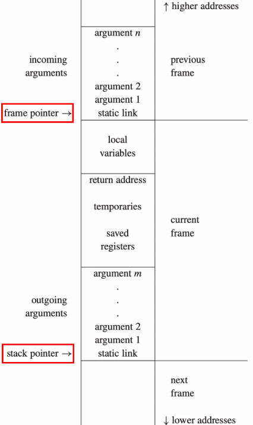
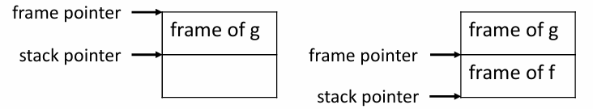
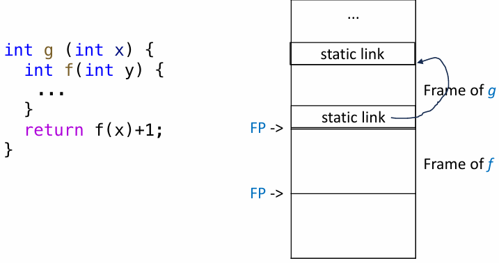
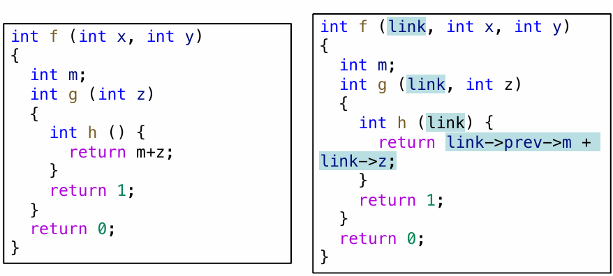
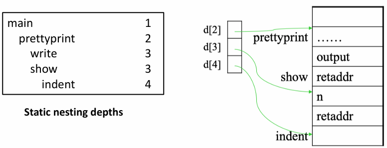
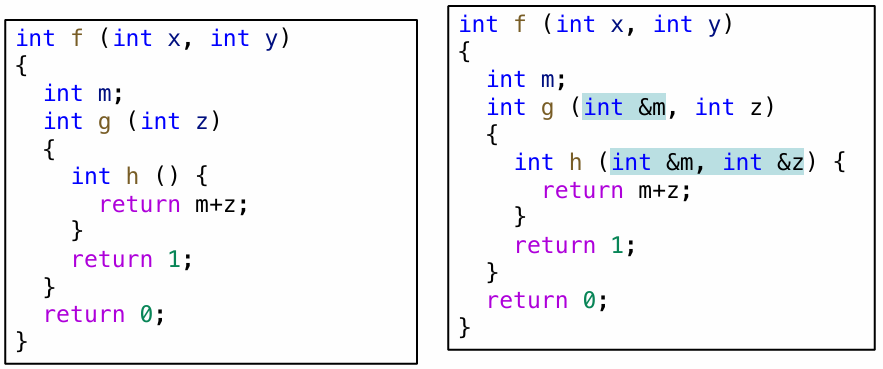
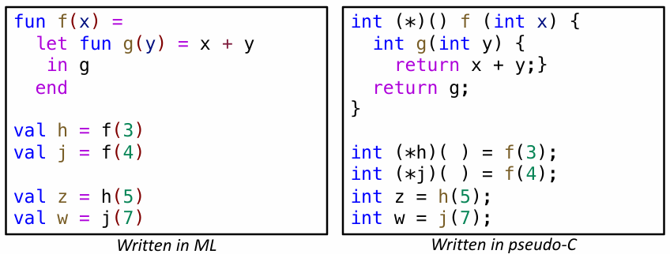

---
tags:
  - ZJU-Courses
---

# Chapter 6: Activation Record

> [!abstract] 本节摘要
> 活动记录是编译器维护的一组数据结构用于分析函数调用过程，主要关注函数调用过程中的参数传递、局部变量、返回地址与寄存器等信息

## Introduction

活动记录主要关注当一个过程被调用的时候，编译器需要在内存中创建和维护哪些数据结构

对函数或过程的调用称为一次活动(*Activation*)，每次活动时对应作用域内的局部变量都会被创造然后在退出时销毁，这样如果活动包含递归过程时，就会在内存中出现多个局部变量的实例

使用一个**控制栈**(*Control Stack*)来维护这样的活动过程，每次一个过程被调用时就压栈，为局部变量创造内存空间，然后在过程结束时弹栈

每个活跃的活动在控制栈上都有一个**活动记录**(*Activation Record*)，也称为**帧**(*Frame*)

## Stack Frames

通常来说，把控制栈看作是一个巨大的数组，使用一个特殊的寄存器保存栈顶指针

活动记录内的空间用于存储函数的局部变量、参数、返回地址等其它临时局部变量

典型的栈帧布局如下

### Frame Pointer

使用一个**帧指针**(*Frame Pointer*)加上一定的偏移量来便捷访问调用者(*Caller*)传给被调用者(*Callee*)的参数，当调用者调用被调用者时，栈顶指针指向第一个调用者传递给被调用者的参数，此时把帧指针移动到栈顶指针的一定大小来分配一个新的栈帧

1. 当进入被调用者 `{c}f` 时
    1. 在内存中保存旧的帧指针 `{c}FP`
    2. `{c}FP = SP`
    3. `{c}SP = SP - framesize`
2. 当退出被调用者 `{c}f` 时
    1. `{c}SP = FP`
    2. 从内存中取回旧的 `{c}FP`

> [!tip] 优势
> 这种做法适用于栈帧尺寸不固定时或栈帧分配不连续的情况

### Registers

当两个过程都要用到同一个寄存器来保存局部内容时，必须进行寄存器内容保存，保存好了才能进行下一个过程，在过程结束后要把内容恢复

- 如果寄存器内容保存与恢复是调用者做的，这个寄存器称为**调用者保存寄存器**(*Caller-Save Register*)
- 如果寄存器内容保存与恢复是被调用者做的，这个寄存器称为**被调用者保存寄存器**(*Callee-Save Register*)

> [!example] 典型示例
> 帧指针寄存器的保存与恢复是被调用者负责的

### Parameter Passing

参数传递有很多类型，教材中的语言采用**值传递**的方式，即把实参的值赋值给形参然后传递

注意到传递参数时可能有很多参数，寄存器里放不下，因此现代编译器的参数传递都遵循一个约定，即前 `{c}k` 个参数（通常 `{c}k = 4` 或 `{c}k = 6`）放在寄存器里传递，剩下的参数在内存中传递

> [!question] 是否冗余
> 在进行函数调用时，这个函数本身的传入参数占用了寄存器的位置，在这个函数内又进行了一次函数调用，对应的参数又要放入寄存器中，所以需要把前一个过程的参数从寄存器保存到内存中，然后传入新参数，进行新过程，在过程结束后再从内存恢复旧的参数到寄存器中，这里相当于还是要从内存存取函数参数，是否会造成冗余？不如直接在内存中传递参数？
> 
> > [!success]- 答案
> > 事实上，这样的调用过程和内存直接传递参数没有差别，但是有一些情况可以优化，减少内存存取，如
> > 
> > 1. 调用过程后后续不再使用旧函数参数，可以被丢弃
> > 2. 调用的函数不再调用新的过程，即叶子过程
> > 3. 有些包含优化过程的编译器会采用**过程间寄存器分配**分析每一次函数调用所需要的所有过程间寄存器信息
> > 4. 一些体系架构采用**寄存器窗口**，即每个函数调用都会分配新的寄存器组而不是重用旧过程的寄存器组

### Return Address

所有非叶子过程的函数调用都必须把返回地址保存在栈上，除非使用了过程间寄存器分配

调用过程的返回地址应当是调用指令的下一条指令的地址

现代体系架构通常有特定的寄存器来专门存储返回地址

### Frame-Resident Variables

局部变量在以下情况下必须存放在内存中：

1. 变量会被传递引用，所以必须有一个内存地址
2. 变量会被过程内嵌套的子过程访问，如嵌套函数
3. 变量的值太大不足以被寄存器放下
4. 变量是一个数组类型，必须通过地址访问其中的元素
5. 特殊类型变量，如函数参数
6. 一些不适合放入寄存器的变量必须溢出放到内存中

> [!note] 逃逸变量
> 一个变量是**逃逸的**(*Escape*)，如果它被传递引用、取地址或被嵌套子过程访问

### Embedded Procedures

对于嵌套过程的调用，可以有以下三种方法来访问外层过程的变量

#### Static Links

嵌套过程的子过程可以通过帧指针加上对应的偏移量来访问外层过程的局部变量，因为每个局部变量相对于帧指针的偏移量是可以在编译时刻确定的

对于非局部变量的外层访问，可以采用静态链接

当一个嵌套的子过程被调用时，把包裹它的父过程的最近一次活动记录被传递给子过程，这个指针就是静态链接

通过静态链接，内层函数有一个指向外层函数的指针，所以可以通过链表来访问外层函数的变量

#### Display

使用一个全局数组来标记不同嵌套深度的函数的活动记录，相当于把静态链接的链表形式改为数组形式，数组的第 `{c}i` 个元素就是嵌套深度为 `{c}i` 的最近一次调用的函数的活动记录

#### Lambda Lifting

对于嵌套函数，把内部嵌套所有需要用到的外层函数的参数以额外参数的形式传递给内层函数

## Higher-Order Functions

上文所述所有基于栈的活动记录分配都是基于**函数的局部变量在返回后都不会继续被使用**的场景，对于高阶函数的情况，即函数内的局部变量可以在后续被继续使用的情况就不能用栈来维护

