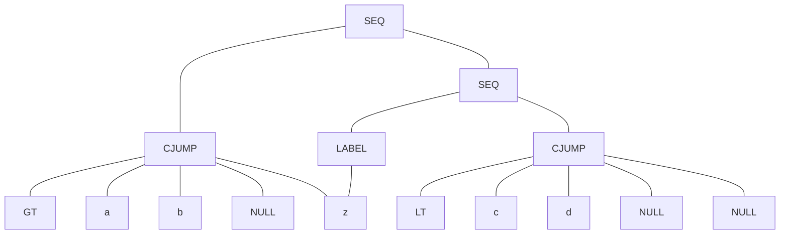
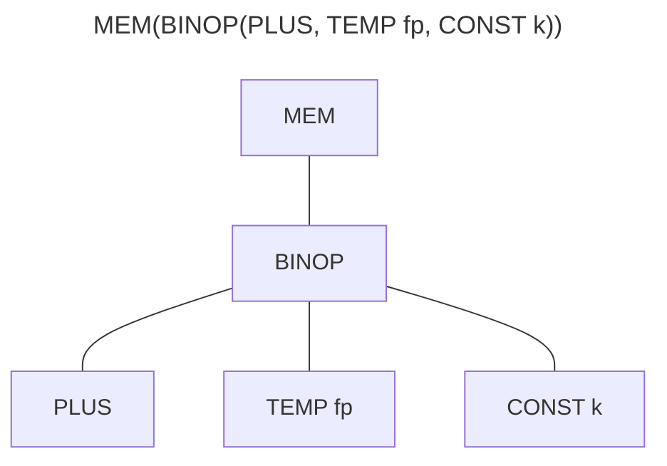
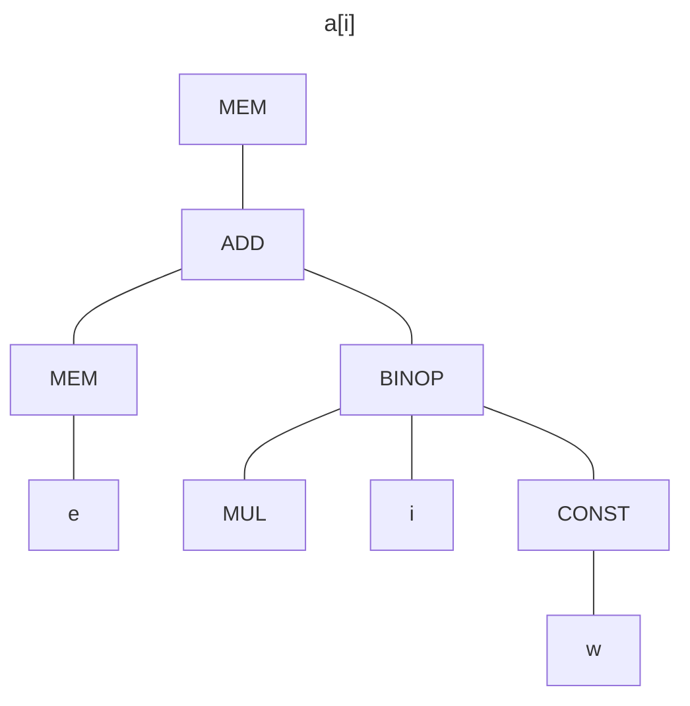
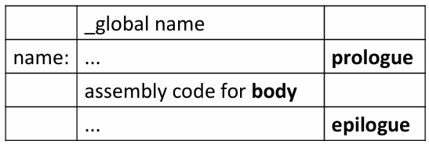

---
tags:
  - ZJU-Courses
---

# Chapter 7: Translate To Intermediate Code

> [!abstract] 本节摘要
> 中间表示是介于编译器前端和后端的中间部分，其略去了源语言的语法信息而生成机器无关的中间表示指令，用于后续的目标代码生成，通过一些中间表示结构来构建树形的中间表示

## Introduction

通常需要把源语言转换为中间语言，再转化为目标语言，而不是直接把源语言转化为目标语言，这样可以

- 模块化编程
- 可移植性更高

**中间表示**(*Intermediate Representation, IR*)是一种抽象语言，用于抽象表达目标语言而不暴露过多细节、同时又独立于源语言

有了中间表示后，编译器就可以划分为前端和后端

## Three-Address Code

**三地址码**的基本操作是

$$
x=y\text{ op }z
$$

即一个操作符和三个地址，其中地址可以是

- 源程序的名字
- 常量
- 编译器生成的临时变量

可以通过**四元组**来实现三地址码操作

> [!example] 四元组实现
> - `{c}t1 = x > 0` 可以实现为 `(gt, x, 0, t1)`
> - `{c}if _false t1 goto L1` 可以实现为 `(if_f, t1, L1, _)`
> - `{c}fact = 1` 可以实现为 `(asn, 1, fact, _)`
> - `{c}label L2` 可以实现为 `(lab, L2, _, _)`

## Intermediate Representation Trees

一个好的中间表示树应该能够

- 便于语义分析阶段生产
- 便于翻译为机器码
- 每个构造必须有简单的意义

抽象语法树可以表示很复杂的结构（如函数调用），但是转化为对应的机器码时不一定能够有一一对应的机器指令，所以中间表示应该能够有不同的部分分别表示一个简单的动作（如取、存、加、移动、跳转等），由这些简单动作拼成大的复杂结构

表达式结构 `{c}T_exp` 用于计算某些值，有返回值，可能有**副作用**

|          结构           | 意义                       |
| :-------------------: | ------------------------ |
|     `{c}CONST(i)`     | 常数 `i`                   |
|     `{c}NAME(n)`      | 常数变量 `n`                 |
|     `{c}TEMP(t)`      | 临时变量 `t`                 |
| `{c}BINOP(o, e1, e2)` | 二元运算                     |
|      `{c}MEM(e)`      | 从 `e` 地址开始的**字长大小**的内存内容 |
|    `{c}CALL(f, l)`    | 过程或函数调用 `f`，参数列表 `l`     |
|    `{c}ESEQ(s, e)`    | 先执行语句 `s`，然后返回表达式的值 `e`  |

> [!note] 副作用
> 副作用表示可能更改内存单元或寄存器的值，如语句 `{c}ESEQ(a = 5, a + 5)` 就是先执行 `{c}a = 5`，这里产生了副作用，然后返回了 `{c}a + 5 == 10`

语句结构 `{c}T_stm` 有副作用和控制流，并且无返回值

|             结构              | 意义                                                           |
| :-------------------------: | ------------------------------------------------------------ |
|    `{c}MOVE(TEMP t, e)`     | 计算表达式 `e` 并移到临时变量 `t` 中                                      |
|   `{c}MOVE(MEM(e1), e2)`    | 计算表达式 `e1`，获取地址 `a`，然后把表达式 `e2` 的结果存到从 `a` 地址开始的**字长大小**的内存中 |
|         `{c}EXP(e)`         | 计算表达式 `e` 的结果                                                |
|    `{c}JUMP(e, labels)`     | 跳转到地址 `e` 处，可以是标签                                            |
| `{c}CJUMP(o, e1, e2, t, f)` | 使用关系运算符 `o` 比较表达式 `e1` 和 `e2` 的结果，结果为真跳转到 `t` 处，否则跳转到 `f` 处  |
|      `{c}SEQ(s1, s2)`       | 两个连续语句                                                       |
|        `{c}LABEL(n)`        | 定义标签 `n` 作为当前机器码地址                                           |

## Translation Into Trees

### Expressions

抽象语法中的表达式 `{c}A_exp` 大致可以分为三类中间表示：

- 有返回值：`{c}T_exp`
- 无返回值：`{c}T_stm`
- 布尔类型：条件跳转

```c title:"Expressions"
// Using linked-list to represent.
typedef struct patchList_* patchList;
struct patchList_ {
    Temp_label *head;
    patchList tail;
};
static patchList patchList(Temp_label *head, patchList tail);

struct Cx {
    patchList trues;
    patchList falses;
    T_stm stm;
};
typedef struct Tr_exp_* Tr_exp;
struct Tr_exp_ {
    enum {
        Tr_ex, // Ex: an "expression", a tree expression.
        Tr_nx, // Nx: "no result", a tree statement.
        Tr_cx  // Cx: "conditional", a tree statement that may jump.
    } kind;
    union {
        T_exp ex;
        T_stm nx;
        struct Cx cx;
    } u;
};
// Convert tree modules to translating modules.
// T_ means tree modules, Tr_ means translating modules.
static Tr_exp Tr_Ex (T_exp ex);
static Tr_exp Tr_Nx (T_exp nx);
static Tr_exp Tr_Cx (patchList trues, patchList falses, T_stm stm);
```

对于表达式 `{c}a > b || c < d`，对应的中间表达树为



有些时候，我们不知道跳转的地址是什么，所以先用 `{c}NULL` 来表示，在后续知道对应地址后再填入

### Simple Variables

当前过程中的一个变量 `{c}v` 可以这样表示



其中 `{c}fp` 是当前栈帧寄存器，`{c}k` 是变量在栈帧中的偏移量

为了翻译变量 `{c}v`，还要知道字长

```c title:"Simple Variable"
Temp_temp F_FP(void);
extern const int F_wordSize;
T_exp F_Exp(F_access acc, T_exp framPtr);
```

### Array Variables

不同的编程语言处理数组变量会不同

### Structured L-Values

左值代表一个可以被赋值的位置，也可以当成右值使用

右值只能出现在赋值语句右侧

一般来说，整型变量和指针都视作标量，而结构化的左值（如 C 中的结构体）视作指向某个内存片段的指针，因此为了翻译结构化左值，需要传入结构化左值的大小

```c title:"Structured L-Values"
T_exp T_Mem(T_exp, int size);
```

### Subscripting And Field Selection

为了访问数组中的某个元素或记录中的某个域，需要知道这个数组或记录的基地址和对应元素的偏移量

> [!warning] 注意
> 有些编程语言中，取数组名操作代表不是数组基地址而是数组的内容，这样的话就不能做基地址加偏移量得到目标元素内容，即不需要从内存中取（MEM）这一步

教材中的 Tiger 语言的数组和记录都是指向实际内容的指针



其中 `{c}e` 代表数组 `{c}a[]` 的基地址，`{c}W` 代表字长

### Arithmetic

每一个算术操作对应树中的一个操作符

> [!tip] 单目运算符
> Tiger 语言不支持取负运算符

### Conditionals

使用运算符 `{c}&` 和 `{c}|` 可以把条件表达式结合在一起

为了避免生成的中间表达树过于臃肿，可以进行一些转化

```vb
if x < 5 then a > b else 0
if x < 5 & a > b then 1 else 0
```

### While Loops

循环体的大致结构如下：

```txt title:"Loop Pattern"
test:
    if not (condition) goto done
    body
    goto test
done:
```

如果循环体中有一个 `{c}break` 的话，简单来说就是直接直接翻译成 `{c}goto done`，但是如果循环体是嵌套的情况就需要跳转到最近的循环体结束的位置

具体实现上，在处理循环体时，都要标记当前循环体的结束位置，如果进入了新的内层循环体就要更新这个结束位置，否则不更新

### For Loops

可以通过把 `{c}for` 循环改写成 `{c}while` 循环实现

```cpp
for (int i = lower to high) {
    body;
}

int i = lo;
while (i < high) {
    body;
    i++;
}
```

> [!danger] 不等价情况
> 如果 `{c}high = MAXINT` 时， `{c}i = i + 1` 这句话会导致溢出，这是 `{c}while` 循环可能导致的问题，而 `{c}for` 循环不会有这样的问题
> > [!success] 解决方法
> > 在执行 `{c}i = i + 1` 前先判断 `{c}i == MAXINT` 是否成立，如果成立就直接退出
> 
> 除此之外，还需要在循环开始判断 `{c}lower < high`，如果不满足则直接退出循环

### Function Call

注意把[静态链接](../Chapter6/Chapter6.md#Static%20Links)显式添加到中间表达的参数列表中

```txt
CALL(NAME LAEBL_f, [sl, e1, e2, ..., en])
```

## Translation Of Declarations

- 当遇到函数体内的变量声明时，栈帧中的一段空间被保留用于这个变量
- 当遇到函数声明时，中间表达树的一个片段会被保留用于给函数体
- 对于变量初始化，需要在函数体之前执行这些赋值语句

### Function Declarations

一个函数体会在汇编语言代码中被翻译为三部分：

- 前言，用于函数调用的准备工作
    - 一些标记函数开始的伪指令
    - 为函数定义标签
    - 调整栈指针，用于分配空间
    - 保存逃逸参数到栈帧中和移动非逃逸参数到临时寄存器中
    - 保存调用者恢复寄存器
- 函数体，正常翻译函数体
- 后记，收尾工作
    - 保存返回值
    - 加载调用者保存的寄存器的值
    - 重置栈指针用于释放空间
    - 一个返回指令
    - 用于声明函数结尾的伪指令


