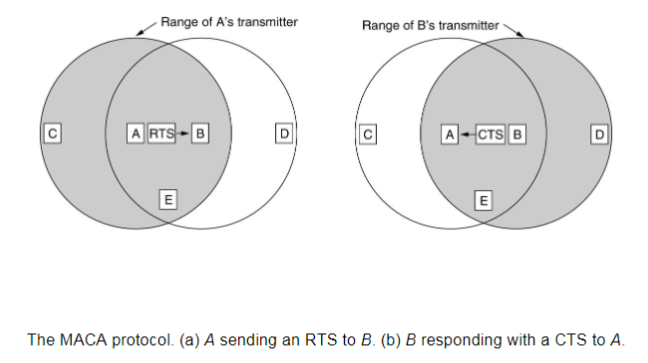
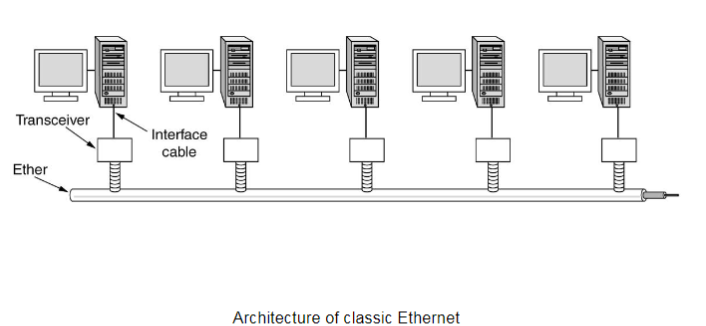
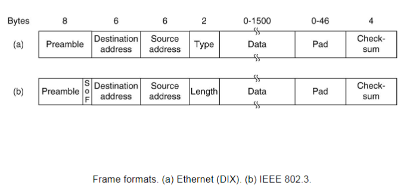
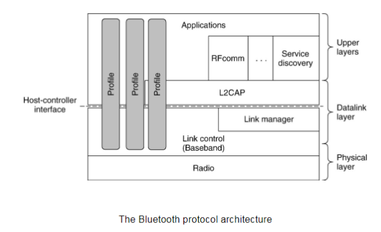

---
tags:
  - ZJU-Courses
icon: 4️⃣
---

# Chapter 4: The Medium Access Control Sublayer

> [!abstract] 本章概要
> 本章主要介绍数据链路层的介质访问控制子层(*MAC*)，重要的协议包括局域网的CSMA和CSMA/CD、无线局域网的MACA协议，其它内容作了解即可

## Introduction

我们讨论过的协议都是针对点对点连接的，但是在LAN等场景下，我们需要使用广播信道(*Broadcast Channels*)

广播信道也称为多路访问信道(*Multiaccess Channel*)或随机访问信道(*Random Access Channel*)

对于广播信道，关键的问题是保证在多方争用信道时确定谁可以使用信道，从而让他们都成功发送信息

OSI7层模型将数据链路层分为LLC(*Logic Link Control*)和MAC(*Medium Access Control*)两个子层，由LLC这一层进行统一和封装，给网络层提供一致的功能，而MAC这一层和物理层连接，可以有不同的实现

MAC主要是负责局域网的

现在主流的MAC协议是802.3，即以太网协议

---

## Multiple Access Protocols

这里主要介绍的是信道的动态分配相关协议

### ALOHA

现在通常是对讲机使用，只要发送的时候就直接发，不考虑其它信号源

可能存在多方信号发送的冲突问题

#### Slot ALOHA

为了避免多方信号发送的冲突，设计了时间槽(*Time Slot*)，把整个时间分成很多个小的时间片，所有信号只能在时间片的开头发，如果在一个时间片的中间那么就移到下一个时间片的开头发，这样可以避免一些信号在时间片的冲突，减少了冲突

> [!question] 成本增加
> 站点怎么知道什么时候是时间片的开始呢？这样需要增加一个统一的时钟源进行所有站点的控制，会增加成本，比较难做到

### CSMA

载波侦听多路访问(*Carrier Sense Multiple Access, CSMA*)协议，通常用于有线网络

相比于ALOHA，CSMA的所有站点会处在监听状态，如果有站点占用了那么就不再发送，保持监听，直到没有被占用

- 1-persistent：一直保持监听，直到空了才发
- Nonpersistent：如果线路非空闲时就处理本终端的其它事，直到所有的事处理完
- p-persistent：以上两者的折中，取一个概率$p$

> [!tip] 最佳选择
> - 如果采用*不坚持策略*，那么可能会带来不可预计的网络延迟，因为如果有占用就一直处理本机其它事务，导致一直没办法进行网络发送，对于局域网来说非常致命
> - 如果采用*p坚持策略*，每个终端的$p$可能都不一样，导致每个终端的优先权不同，难以维持统一
> 
> 综合以上，采用*1坚持策略*最简单实现，且最统一，为大多数CSMA协议所用

#### CSMA/CD

CSMA/CD(*CSMA with Collision Detection*)相比于CSMA加了一个冲突检测，不像ALOHA一样有冲突还接着发，加上CD之后的冲突检测使得发送到一半时如果检测到有冲突就停止发送，减少冲突的部分和浪费的部分

适合一个总线式的传播，主要用于局域网

总体上说，CSMA/CD的发送分为发送帧阶段和冲突检测阶段，即先发送帧，然后进行检测冲突

> [!danger] 特殊事件
> 如果两个终端相距特别远，其中一个终端发送了消息，发送到一半时此时对于另一个终端来说处于空闲状态，于是也开始发送消息，但是发到一半发现冲突了，等到反馈回第一个终端时它已经发完了，会导致无法检测到冲突，因此需要满足
> $$t_{\text{frame}}\geq2t_{\text{propagate}}$$
> 即每个帧的发送时间必须大于两倍的传输时间，这样才可以检测到远距离的冲突
> - $t_{\text{frame}}$由帧的大小和发送速率决定
> - $t_{\text{propagate}}$由信号的传输速度和传输距离决定

### Token Ring

令牌式，所有终端组成环状局域网，有中转站进行信息重新解码与编码

### Bit-Map Protocol

将整个时间分片，时间片数量与站点数量一致，然后相当于采取预约机制，哪个站点要发送了就先发一个比特的预约信号，然后开始发送

### Binary Countdown

每个站点有一个二进制地址，发送时先发送地址，然后检测冲突，检测到冲突时低位地址的站点马上退出，留给高地址站点发

---

## Wireless LAN Protocols

**隐蔽站点问题**：与CSMA不同，无线局域网中的两个站点可能无法互相知道对方是否在发数据，因为它们可能都不在对方的传播范围内，那么此时CSMA就无法检测到冲突

**暴露站点问题**：如果两个无线局域网中的站点互相覆盖，但是它们互相给不同的终端发送信息，此时两个站点都能检测到对方站点在发送数据，这里有冲突，但是不影响它们给各自的目标站点发送，这里简单套用CSMA是不行的

### MACA

MACA协议是一种避免冲突的协议

- RTS：站点要向目标终端发送数据时，先发送一个RTS信号，表明站点请求发送数据，RTS中标记有目标终端的信息
- CTS：目标终端收到站点的RTS且没有其它站点占用发送时，回复一个CTS给站点作为响应

站点接收到目标终端响应的CTS后才开始发送数据

此时，其它终端如果收到了CTS，那么就清楚当前终端正在接收其它站点的数据，则保持静默；其它终端收到了不是标记自身站点的RTS，则表明对方站点在向其它站点发送信息

### 802.11

---

## Ethernet

### Classic Ethernet

总线式以太网结构：

协议的帧结构：

- Preamble：违例编码，非曼彻斯特编码
- Pad： 填充字段，确保**发送帧的长度至少为$64$字节**，使得[帧的发送时间大于等于两倍的传输时间](Chapter4.md#CSMA/CD)
- Checksum：使用CRC编码的校验字段

---

## Bluetooth

蓝牙协议的协议栈如下

其中`profile`根据使用设备的需求而不同，如输入设备、输出设备等等

---

## Bridges

### Introduction

网桥最直接的作用就是连接不同的局域网，使得跨局域网通信成为可能

如果直接在两个不同的局域网之间连接网线，可能会导致

1. 不同局域网之间的信息交流其实没有那么多，此时会导致所有信息在多个局域网内都进行了传输，增大了传输的负荷
2. 不同局域网之间的距离如果过大很难实现
3. 不同局域网可能是不同类型的，很难直接连接

基于此，网桥产生，不同的局域网仍然是保持隔离的状态，但是网桥提供了跨局域网通信的途径

网桥可以隔离冲突域，所有连接在网桥的同一端口上的主机被划分在同一个冲突域中

### Spanning-Tree Bridges

为了避免数据包在交换机之间不断循环，需要把一些端口关闭

使用生成树网桥的方式，网桥之间可以避免形成环路

---

## Virtual LANs

把许多连在同一个交换机上的站点逻辑划分为多个虚拟局域网，每个虚拟局域网都是一个广播域，虚拟局域网内的数据不会溢出到其它区域而只会发给所在的虚拟局域网内，交换机不会发到其它站点中

> [!note] 结论
> 1. 不同虚拟局域网内的主机无法互相ping通
> 2. 同一个虚拟局域网下的主机的IP必须配置成子网一致
