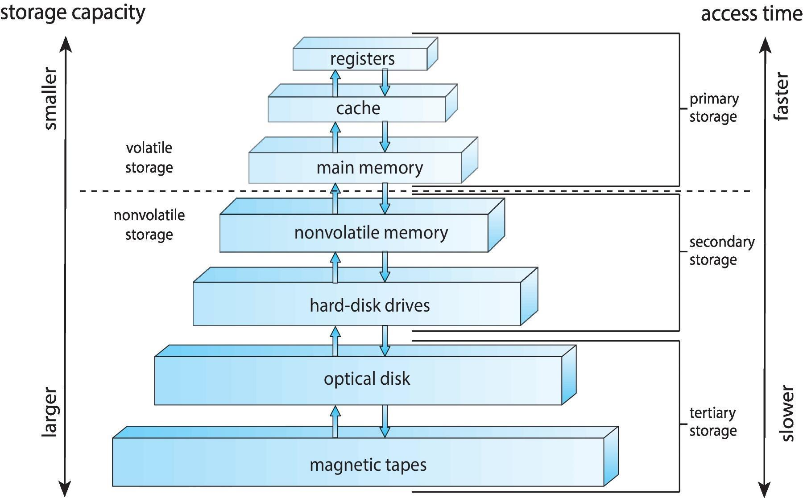

---
tags:
  - ZJU-Courses
  - OS
icon: 1️⃣
---

# Chapter 1: Introduction

---

## 1.1 What Operating System Do

操作系统是一组有效控制和管理计算机各种硬件和软件资源，合理地组织计算机的工作流程，以及方便用户的程序的集合

操作系统的目标：

- 执行用户程序，帮助解决问题
- 方便计算机的使用
- 高效使用硬件

---

## 1.2 Computer System Organization

### 计算机类型

* 总线结构：以总线为纽带构成计算机系统，CPU、存储器、I/O设备都挂在总线上
* 主机型：以存储器、CPU为中心

### 启动

计算机系统启动过程中，程序执行的顺序为

1. ROM中的引导程序
2. 硬盘（外存）引导程序
3. 分区引导程序
4. 操作系统的初始化程序

### 中断

**中断**(*Interrupt*)指系统发生某个异步/同步事件后,处理机暂停正在执行的程序,转去执行处理该事件程序的过程

**陷入**(*Trap*)是一种软件产生的中断，由错误(*Error*)或者用户请求导致

广义中断分为

- 中断：外中断或硬中断
    - I/O中断
    - 时钟中断
- 异常、陷入：内中断或软中断
    - 系统调用(Trap)
    - 缺页异常
    - 断点指令
    - 其它程序性异常

> [!note] 外部中断
> 外部中断(*Interrupt*)，即异步中断
> - 外部设备所发出的I/O请求 
> - 分为可屏蔽的和不可屏蔽的两类，由一些硬件设备产生，**可以在指令执行的任意时刻产生**

> [!note] 内部中断
> 内部中断，即异常(*Exception*)、陷入(*Trap*)，即同步中断
> - 由CPU（正在执行的进程）产生，**一条指令终止执行后CPU才会发出中断**
> - 常见的异常有除零、溢出及页面异常(*Fault*)等，另一种情况是使用 `int`指令(*Trap*)，Linux使用该指令来实现系统调用

### 存储结构

### I/O

---

## 1.3 Computer System Architecture

- 单处理器
- 多处理器

|       名词       |                         定义                         |
| :------------: | :------------------------------------------------: |
|   Processor    |   A physical chip that contains one or more CPUs   |
|      CPU       |      The hardware that executes instructions       |
|      Core      |       The basic computation unit of the CPU        |
|   Multicore    | Including multiple computing cores on the same CPU |
| Multiprocessor |           Including multiple processors            |

---

## 1.4 Operation System Operations

运行操作系统程序的情况：

- 硬件中断
- 软件错误或请求异常或陷入
    - 除零异常
    - 请求操作系统服务
- 其它进程问题
    - 死循环
    - 进程间互相影响或修改操作系统

> [!note] 特权指令
> 特权指令(*Privileged Instructions*)是不允许用户程序中直接使用的指令，而非特权指令是用户程序中使用的指令

基于此，双模式的操作系统(*Dual-mode*)提供了两种模式：

- 用户模式，即用户态，是执行用户程序时
- 内核模式，即内核态，是执行操作系统程序时

> [!info] RISC-V架构的模式
> RISC-V架构下提供的操作系统模式有以下4种
> 
> |Level|Encoding|Name|Abbreviation|
> | :--: | :--: | :--: | :--: |
> |0|00|User/Application|U|
> |1|01|Supervisor|S|
> |2|10|Hypervisor|H|
> |3|11|Machine|M|
