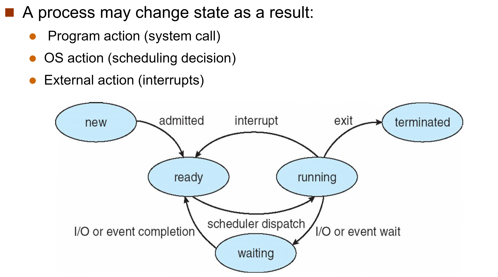

---
tags:
  - ZJU-Courses
icon: 3️⃣
---

# Chapter 3: Processes

---

## 3.1 Process Concept

进程是正在执行中的程序

### 进程控制块

每个进程在操作系统内用**进程控制块**(*Process Control Block, PCB*)表示，它包含于特定进程相关的许多信息：

- 进程状态
- 程序计数器
- CPU寄存器
- CPU调度信息
- 内存管理信息
- 计数信息
- 文件管理
- I/O信息

### 进程状态

进程包含五大状态：

- New：刚被创造出来的
- Running：正在运行的进程
- Ready：进程正在等待CPU的调度和指派
- Waiting：进程正在被一些事件阻塞而等待
- Terminated：进程终止

---

## 3.2 Process Scheduling

进程调度包含了以下队列：

- 进程队列(*Job Queue*)：所有系统中的进程
- 就绪队列(*Ready Queue*)：所有在内存中就绪、等待被执行的进程
- 设备队列(*Device Queue*)：所有等待I/O设备的被阻塞的等待进程

### 上下文切换

当CPU从一个进程切换到另一个进程时，需要

1. 保存旧进程的上下文
2. 加载新进程的上下文

进程上下文在PCB中保存

---

## 3.3 Operations on Processes

### 创建进程

父进程创建一个子进程，其中

- 父子进程共享所有相同资源
- 子进程共享父进程资源的子集
- 父子进程没有共享资源

### 执行进程

父子进程并发执行，父进程需等待子进程结束后才能结束

### 终止进程

引起进程终止的原因：

- 正常结束
- 异常结束
- 外界干预

父进程需要等待子进程的结束

---

## 3.4 Inter-Process Communication

进程间的地址空间是不同的，而且不同进程间通常无法直接干扰其它进程，否则会造成进程的错误

**进程间通信**(*Inter-process Communication, IPC*)允许进程间信息同步和共享，而不需要同样的地址空间

- 共享内存：在内存中进行信息共享
- 消息传递：通过内核缓冲区进行信息交换，由内核完成消息传递

IPC提供了一组编程接口用于进程间通信，包括信号(*Signal*)，共享内存区，管道，消息(*Message*)，套接字

---

## 3.5 IPC in Shared-Memory Systems

### 生产者-消费者问题

生产者进程产生信息给消费者进程使用

生产者将信息生产到两个进程中的共享内存区内，然后交由消费者清空

---

## 3.6 IPC in Message-Passing Systems

消息传递使得进程间无需共享变量

进行通信的流程：

1. 建立链路
2. 通过收/发进行消息传递

在实现上，通常操作系统不关心物理层面的实现，而是关注逻辑层面上的实现，即通信是：

- 直接 🆚 间接
- 同步 🆚 异步
- 自动缓冲区 🆚 显式缓冲区

---

## 3.7 Examples of IPC Systems

---

## 3.8 Communication in Client-Server Systems

### Sockets

每个进程都有一个套接字，由IP地址+端口组成
