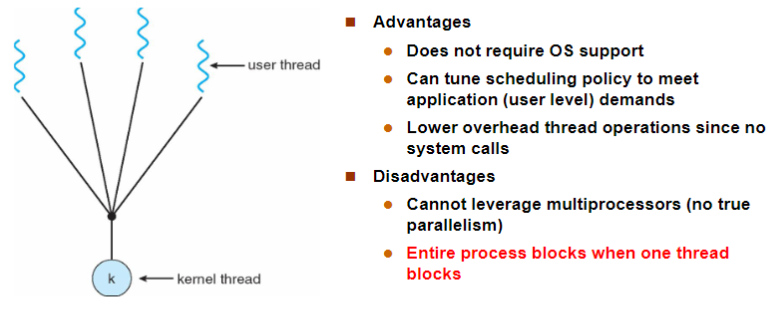
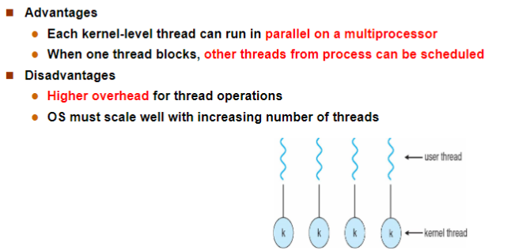

---
tags:
  - ZJU-Courses
icon: 4️⃣
---

# Chapter 4: Threads & Concurrency

---

## 4.1 Overview

资源拥有单元称为进程，调度的单位称为线程

线程只拥有其在运行中必不可少的资源（程序计数器、一组寄存器和栈），但它可与同一进程中的其它线程共享进程拥有的全部资源

- 共享的资源
    - 进程的地址空间
    - 代码段
    - 数据段
    - 堆
- 私有的资源
    - 线程栈
    - 线程局部存储(*Thread-Local Storage, TLS*)
    - 寄存器

**线程定义为进程内一个执行单元或一个可调度实体**

- 拥有少量的系统资源（系统分配给进程）
- 一个进程中可以有多个线程可并发执行
- 系统开销小，切换快（都在同一个进程的地址空间活动）

---

## 4.2 Multicore Programming

由多核并发执行所有线程

---

## 4.3 Multithreading Models

线程实现机制：用户级线程和内核级线程

### User Threads

不依赖于OS内核（内核不了解用户线程的存在），应用进程利用线程库提供创建、同步、调度和管理线程的函数来控制用户线程

### Kernel Threads

依赖于OS核心，由内核的内部需求进行创建和撤销，用来执行一个指定的函数

一个线程发起系统调用而阻塞，不会影响其他线程

时间片分配给线程，所以多线程的进程获得更多CPU时间

### Multithreading Models

多线程模型包含以下：

- 多个用户级线程对应一个内核线程
- 一个用户级线程对应一个内核线程
- 多个用户级线程对应多个内核线程

#### Many-to-One

用于不支持内核线程的操作系统，内核只有进程，线程不能并行运行在多个处理器，由每个进程自己管理

#### One-to-One

用于支持线程的造作系统，并发性好，多个线程可以运行在多个处理器中

#### Many-to-Many

并发性与效率兼顾，复杂性更高

### About Threads

线程的优点：

- 一个进程中可以同时存在多个线程
- 各个线程可以并发进程
- 各个线程之间可以共享地址空间和资源，通信方便

> [!note] 线程🆚进程
> 1. 进程是操作系统进行资源分配的最小单元，而线程是操作系统调度的最小单元
> 2. 进程拥有一个完整的资源平台，而线程只有一些必不可少的资源，如寄存器和栈
> 3. 线程同样具有就绪、阻塞、执行三种基本状态
> 4. 线程能减少并发执行的时间开销和空间开销
>     1. 线程的创建和终止比进程快很多，因为资源更少
>     2. 同一个进程内的线程切换比多个进程间的切换快很多
>     3. 同一个进程内的所有线程都共享资源，因此线程之间的数据传递都并不需要经过内核
> 5. 每个进程至少有一个线程（主线程），每个线程可以创建新的子线程

---

## 4.4 Thread Libraries

主流的线程库：

- Windows：内核级别
- POSIX Pthreads：内核级别和用户级别
- Java

---

## 4.5 Implicit Threading

多核系统多线程编程中，一个应用可能有几百上千的线程，这样的程序面临许多挑战：

- 编程挑战：任务分解、数据分割、数据依赖、测试与调试
- 程序执行顺序的正确性问题：同步，互斥

基于此，使用**隐式线程**(*Implicit Threading*)，将线程的创建与管理交给编译器和运行时库完成

- 线程池
- Fork Join
- OpenMP
- ...

---

## 4.6 Threading Issues

### Semantics

在某个线程中调用`fork()`时，新创建的进程会复制父进程的所有线程还是只复制当前调用的线程？

在某个线程中调用`exec()`时，是所有的线程被替换还是仅当前线程被替换？

取决于具体的系统调用的语义

### Cancellation

线程取消分为

- 异步取消，马上取消线程
- 同步取消，等待一起取消

### Signal Handling

进程中的信号应该发给哪个线程呢？

1. 发送信号到信号产生的线程
2. 发送信号到进程中的所有线程
3. 发送信号到特定的线程中
4. 创建一个专门处理信号的线程

### Thread Pools

线程池就是事先创建一批线程到线程池中等待工作时唤醒

### Thread Specific Data

线程特定数据是每个线程有数据的自己拷贝，如线程id
