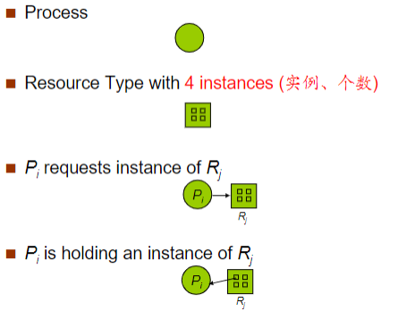
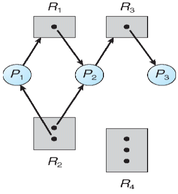
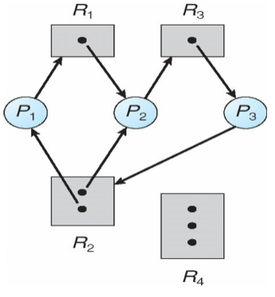
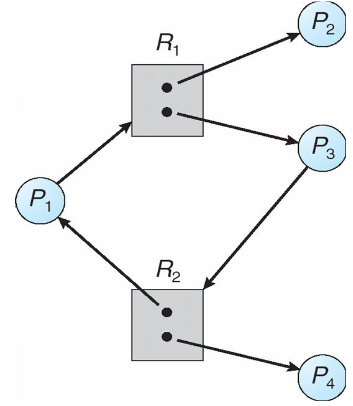
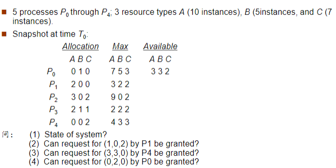
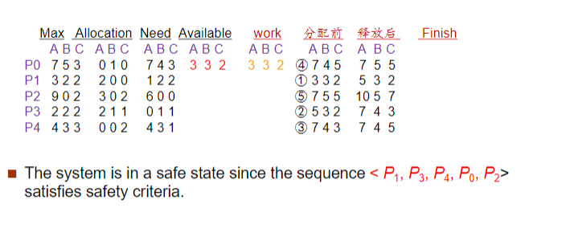
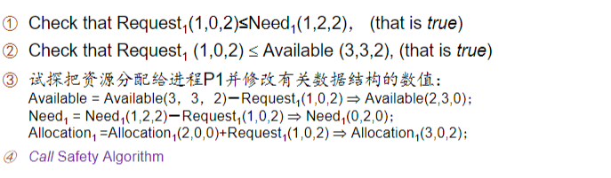
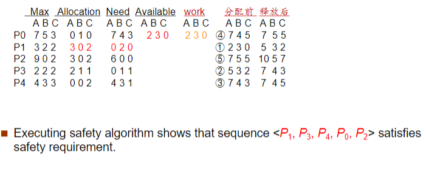
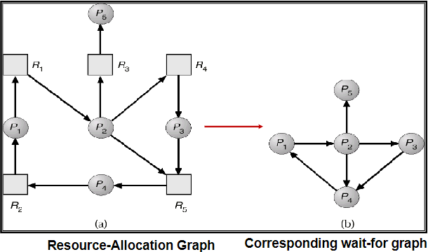

---
tags:
  - ZJU-Courses
icon: 7️⃣
---

# Chapter 7: Deadlocks

---

## System Model

死锁(*Deadlock*)是指多个进程因竞争共享资源而造成相互等待的一种僵局，若无外力作用，这些进程都将永远不能再向前推进

操作系统的资源类型为$R_1,R_2,\cdots,R_m$：

- CPU周期
- 内存空间
- I/O设备

每种资源类型$R_i$有$W_i$个实例：

- 单个CPU
- 单个键盘
- 多台打印机

每个进程使用系统资源都需要经过以下步骤：

- 申请(*Request*)
- 使用(*Use*)
- 释放(*Release*)

---

## Deadlock Characterization

### Deadlock Conditions

产生死锁的条件：

- 互斥：在一个时间内只有一个进程可以使用资源
- 占有且等待：进程已经占有至少一个资源，但又提出了新的资源要求，该资源被其它进程占有
- 不可抢占：被占用的资源不可被抢占，只有占用的进程主动释放才能空闲
- 循环等待：一组等待进程在互相循环地等待下一个进程

### Resource-Allocation Graph

使用图$G(V,E)$表示，其中边$V$分为

- $P=\{P_1,P_2,\cdots,P_n\}$代表系统中所有的进程
- $R=\{R_1,R_2,\cdots,R_m\}$代表系统中的所有资源类型

基于此，**请求边**(*Request Edge*)**为$P_i\rightarrow R_j$，分配边**(*Assignment Edge*)**为$R_j\rightarrow P_i$**



> [!example] 资源分配图实例
> 
> 有死锁：
> 
> 有环但没死锁：
> 

由上述实例可知，

- 如果资源分配图没有环，那么没有死锁发生
- 如果资源分配图出现环
    - 如果每种资源都只有一个资源实例，那么有死锁
    - 如果每种资源都有多个资源实例，可能没有死锁

**死锁定理：S为死锁状态当且仅当S状态的资源分配图是不可完全简化的**

资源分配图的简化：

1. 先看系统还剩下多少资源没有分配，哪些进程是不阻塞的，即有足够的空闲资源可以分配给它使用
2. 把不阻塞的进程的所有边去掉，形成一个孤立的点，再把系统分配给这个进程的资源回收回来
3. 看剩下的进程有哪些是不阻塞的，再把他们按照2形成孤立点
4. 如果最后所有的资源和进程都形成孤立的点，那么这个资源分配图就是可以完全简化的，如果可以完全简化，那么就不会产生死锁，否则会产生死锁

---

## Methods For Handling Deadlocks

死锁处理的策略：

- 防止系统进入死锁状态
    - [死锁预防](Chapter7.md#Deadlock%20Prevention)
    - [死锁避免](Chapter7.md#Deadlock%20Avoidance)
- 允许系统进入死锁状态然后恢复
    - [死锁检测](Chapter7.md#Deadlock%20Detection)
    - [死锁解除](Chapter7.md#Recovery%20From%20Deadlock)

---

## Deadlock Prevention

死锁预防，就要预防[导致死锁发生的条件](Chapter7.md#Deadlock%20Conditions)的发生

### Mutual Exclusion

互斥的条件无法改变

### Hold And Wait

当一个进程请求资源时，它必须不能占有其它资源

资源静态预分配方式：只有进程所需的全部资源都就绪了才执行进程，否则进程就不能占有任何资源

这可能导致资源利用率低，可能导致饥饿现象发生

### No Preemption

如果一个已经占有一些资源的进程正在请求一些当前无法立刻分配给它的资源时，这些被占据的资源马上释放，允许抢占

这些被抢占的资源被加入到这个进程正在等待的资源列表中，只有进程重新获得了这些旧的资源并且新的请求的资源后进程才重新启动

### Circular Wait

强制把所有资源类型进行排序，然后所有的进程在请求资源时必须按照递增的顺序进行，即资源的有序申请，破坏了循环等待的条件

> [!example] 有序申请
> - $F(\text{tape drive})=1$
> - $F(\text{disk drive})=5$
> - $F(\text{printer})=12$

---

## Deadlock Avoidance

每个进程事先声明所需每种资源的最大数量

死锁避免算法可以动态监测资源分配状态，以确保永远不会进入循环等待的状态

资源分配状态由可用资源数量、已分配资源数量、进程的最大资源需求决定

- 当资源类型只有一个实例时，使用资源分配图算法
- 当资源类型有多个实例时，使用银行家算法

### Safe State

安全状态指系统的一种状态，在此状态开始系统能按某种顺序（如$P_1, P_2,\cdots,P_n$）来为各个进程分配其所需资源，直至最大需求，使每个进程都可顺序地一个个地完成

序列$P_1, P_2,\cdots,P_n$是安全序列，如果此时对序列中的所有进程$P_i$，其所请求的资源可以由当前可用资源和被进程$P_j(j<i)$占用的资源满足

- 若系统当前不存在一个安全序列，则系统处于不安全状态，可能会发生死锁
- 若系统当前存在一个包含所有进程的安全序列，则系统处于安全状态，一定没有死锁

死锁避免就是确保系统永远不会进入不安全状态

### Recourse-Allocation Graph Algorithm

需求边(*Claim Edge*)$P_i\rightarrow R_j$表明进程$P_i$可能向资源$R_j$请求资源，用虚线表示

- 当进程请求需求时，需求边转化为请求边
- 当资源被分配给进程时，请求边转化为分配边
- 当资源被进程释放时，分配边转化为请求边

**只有在需求边$P_i\rightarrow R_j$变成分配边$Rj\rightarrow P_i$而不会导致资源分配图形成环时，才允许申请**

用算法循环检测：

- 如果没有环存在，那么资源分配会使系统处于安全状态
- 如果存在环，资源分配会使系统不安全，进程$P_i$必须等待

### Banker's Algorithm

银行家算法用于银行系统现金贷款的发放而得名

每一个新进程都要声明可能需要的资源的最大值，不能超过系统的资源最大值

当一个进程得到它所有的资源后必须在一定时间内归还

```cpp title:"Data Structures"
int n; // Number of processes.
int m; // Number of resource types.

int Available[m]; // Available[j] = k means k instances of resource type Rj available.

int Max[n][m]; // If Max[i,j] = k, then process Pi may request at most k instances of resource type Rj.
int Allocation[n][m]; // If Allocation[i,j] = k, then Pi is currently allocated k instances of Rj.
int Need[n][m]; // If Need[i,j] = k, then Pi may need k more instances of Rj to complete its task.
```

显然，`{C}Need[i][j] = Max[i][j] - Allocation[i][j];`

#### Safety Algorithm

判断当前系统的安全状态

1. 建立系统当前资源分配、可用、需求的副本
2. 循环查找未完成的进程，并统计它们的资源需求能否在剩余可用的系统资源中得到满足
    1. 如果可以满足，就标记为**可完成**，并把其已分配的资源标记为释放，加到原先的可用资源中
    2. 如果不可满足，先跳过这一个进程，遍历下一个进程
3. 如果所有的进程都遍历过了，并且没有满足资源分配要求的，则退出循环，进入下一步
4. 判断所有资源是否都是可完成的，如果都可完成则代表系统不会进入死锁状态

```cpp title:"Safety Algorithm"
// Utility function.
bool isSatisfied(int Need[], int Work[])
{
    for (int j = 0; j < m; j++) {
        if (Need[index][j] > Work[j]) // Cannot be satisfied.
            return false;
    }
    return true; // Can be satisfied.
}

bool SafetyAlgorithm(void)
{
    // Initialize.
    int Work[m];
    bool Finish[n];
    for (int i = 0; i < m; i++) Work[i] = Available[i];
    for (int i = 0; i < n; i++) Finish[i] = false;

    // Find unfinished process.
    int index = 0;
    int counter = 0; // Mark if all processes are checked.
    while (true) {
        if (!Finish[index] && isSatisfied(Need[index], Work)) { // Find 1 unfished process matches.
            Finish[index] = true;
            counter--;
            for (int j = 0; i < m; i++)
                Work[j] += Allocation[index][j]; // Return back.
        } else counter += Finish[index] ? 0 : 1;
        index = (index + 1) % n;
        if (counter == n) break; // No more matching process, quit the loop.
    }

    // Check if all processes can be finished.
    for (int i = 0; i < n; i++) {
        if (!Finish[i]) return false;
    }
    return true;
}
```

#### Resource-Request Algorithm

在安全状态判断的基础上试探当前资源是否允许请求的发生

1. 记录每个进程的需要的资源量
2. 如果此时请求的量超过了它预期需求的最大值那么抛出异常
3. 如果可用资源充足，那么继续下一步，否则进程必须等待有足够的资源
4. **假设**系统分配了资源，那么需要更新当前的**模拟状态**
5. 调用安全算法判定这个模拟状态下的系统的安全状态
    1. 如果安全，那么请求接受
    2. 如果不安全，那么请求不被允许，需要将矩阵回滚到模拟状态前的状态

```cpp title:"Resource-Request Algorithm"
void ResourceRequestAlgorithm(void)
{
    // Initialize.
    int Request[n][m];
    GetProcessRequests(Request);

    // Check.
    for (int i = 0; i < n; i++)
        for (int j = 0; j < n; j++)
            if (Request[i][j] > Need[i][j])
                throw "Process exceeds its maximum claim";

    // Simulate.
    for (int i = 0; i < n; i++) {
        for (int j = 0; j < n; j++) {
            if (Request[i][j] <= Available[i][j]) {
                Avaiablei][j] -= Request[i][j];
                Allocation[i][j] += Request[i][j];
                Need[i][j] -= Request[i][j];

                // Check safety.
                if (SafeAlgorithm()) {
                    PermitRequest();
                } else {
                    Rollback();
                }
            } else {
                ProcessWait(i);
            }
        }
    }
}
```

> [!example]- 银行家算法
> 
> 
> 
> 

> [!tip] 一个小公式
> 给定进程数$P$，每个进程所需某种资源的最大资源量$R_{max}$，则可以计算出该种资源的最小数量为
> $$R_{\text{min}}=(P\times(R_{\text{max}}-1))+1$$

注意到，实际当中，银行家算法并不会作为主流操作系统使用，因为其假设过于理想化，算法复杂度高，所以通常来说只是用作理论教学，而非实际使用

- Windows使用抢占机制和资源超时检测来避免和解决死锁
- Linux使用死锁检测基址而不是死锁避免机制

---

## Deadlock Detection

死锁检测允许系统进入死锁状态，因此需要死锁检测算法和恢复算法

### Single Instance Of Each Resource Type

使用**等待图**(*Wait-For Graph*)，资源分配图的变形



$P_i\rightarrow P_j$表明进程$P_i$在等待$P_j$

需要周期性检测图中是否出现环，算法复杂度为$O(n^2)$

### Several Instances Of A Resource Type

相关数据结构

```cpp title:"Data structures"
int n; // Number of processes.
int m; // Number of resource types.

int Available[m]; // Available[j] = k means k instances of resource type Rj available.

int Allocation[n][m]; // If Allocation[i,j] = k, then Pi is currently allocated k instances of Rj.
int Request[n][m]; // If Request[i,j] = k, then Pi may need k more instances of Rj to complete its task.
```

检测算法和[Safety Algorithm](Chapter7.md#Safety%20Algorithm)类似原理

```cpp title:"Detection Algorithm"
std::vector<int> DetectionAlgorithm(void)
{
    // Initialize.
    int Work[m];
    bool Finish[n];
    for (int i = 0; i < m; i++) Work[i] = Available[i];
    for (int i = 0; i < n; i++) {
        bool isFinish = true;
        for int j = 0; j < m && isFinish; j++) {
            if (Allocation[i][j]) isFinish = false;
        }
        Finish[i] = isFinish;
    }

    // Find unfinished processes.
    int index;
    for (index = 0; index < n; index++) {
        if (!Finish[index]) {
            bool isSatisfied = true; // Can be satisfied or not.
            for (int j = 0; j < m && isSatisfied; j++) {
                if (Request[index][j] > Work[j]) isSatisfied = false;
            }
            if (isSatisfied) {
                Finish[index] = true;
                for (int j = 0; i < m; i++)
                    Work[j] += Allocation[index][j];
            }
        }
    }

    // Check if all processes can be finished.
    std::vector<int> pids();
    for (int i = 0; i < n; i++) {
        if (!Finish[i]) pids.push_back(i);
    }
    return pids;
}
```

`{C}Finish[i] == false`表明进程`{C}i`被死锁了

算法的时间复杂度为$O(m\times n^2)$

### Detection-Algorithm Usage

死锁检测算法不能经常随意调用，因为这样可能导致资源图中出现很多环，而我们就无法判断多少进程、哪些进程导致了死锁的发生

---

## Recovery From Deadlock

检测到死锁后采取措施：

- 通知系统管理员
- 系统自行恢复

打破死锁的方法：

- 进程终止
- 抢占资源

### Process Termination

终止所有的死锁进程，或者一次终止一个进程直到死锁消除

> [!warning] 系统开销
> 终止死锁进程会诱发死锁检测，而[上文所述](Chapter7.md#Detection-Algorithm%20Usage)会导致很大系统开销

此外，选择哪个进程终止也需要考虑

### Resource Preemption

- 选择受害者进程进行抢占，使得代价最小化
- 回滚进程，回到一个安全状态，并从该状态重启进程

> [!warning] 饥饿
> 资源抢占可能出现饥饿，某些进程可能会一直作为受害者进程或回滚进程
