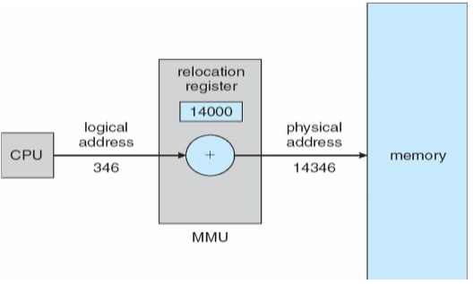
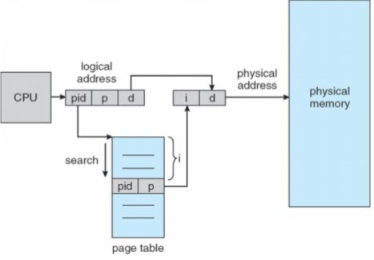

---
tags:
  - ZJU-Courses
icon: 8️⃣
---

# Chapter 8: Main Memory

## Introduction

逻辑地址，即相对地址、虚地址，编程的程序形成的目标代码通常采用相对地址的形式，首地址为0，不能用于在内存中读取信息

物理地址，即绝对地址、实地址，是内存中存储单元的地址，可以直接寻址

从逻辑地址到物理地址需要地址映射

基址寄存器存放了逻辑地址首地址，限长寄存器存放逻辑地址的结束地址或逻辑地址长度，以保护进程的地址不超过分配的空间

### Address Binding

- 编译阶段：如果预先知道内存的位置，绝对代码就可以生成
- 装载阶段：生成可定位代码
- 执行阶段

### MMU

内存管理单元(*Memory-Management Unit*)是硬件设备，用于管理从虚拟地址到物理地址的映射信息

- 动态重定位：在**程序运行中**把逻辑地址加上重定位寄存器中的地址信息得到对应指令的物理地址
- 静态重定位：在目标程序装入内存时进行程序物理地址的重定位，运行时不再重定位

动态装入(*Dynamic Loading*)：运行时装入内存，通常模块都存在磁盘上，是可重定位的，只有在用到时才装入

动态链接(*Dynamic Linking*)是只有在程序运行时才进行链接

---

## Swapping

交换技术是一个进程可以暂时移出内存到一个备份区(*Backing Store*)中，之后移回内存继续执行

- Linux、Unix中是交换分区
- Windows中是交换文件

因为交换比较耗时，所以在正常情况下，交换禁止发生，而空闲内存低于一定阈值时启用，空闲内存数量增加到一定阈值时，停止交换

> [!note] 移动设备
> 移动设备操作系统不支持交换技术，因为其
> 1. 存储是基于闪存
> 2. 空间小
> 3. 移动平台上闪存和CPU之间的吞吐量很低

---

## Contiguous Allocation

内存分配策略之连续分配

### Single-Partition Allocation

在单一连续分配中，内存通常分为操作系统区和用户程序区，用户应用程序独占整个用户区，只能有一个程序使用，适合单道系统

可能有很多内存碎片

### Multiple-Partition Allocation

分区式管理，将内存划分为若干个连续区域，每个分区只能放一个进程

#### Fixed Partitioning

固定分区，程序装入前需要提供最大存储大小

#### Dynamic Partitioning

动态分区，动态划分内存，在程序装入内存时把可用内存切出一个连续区域分配

分配出的分区大小和进程所需大小适配

操作系统维护空闲内存和已占用内存的信息

- 首次适应(*First-Fit*)：找到第一个能满足装入进程大小的分区，即优先使用低地址的空闲空间

    

- 最佳适应(*Best-Fit*)：找到最小的能满足装入进程大小的分区，即预留大分区给大进程

    

- 最差适应(*Worst-Fit*)：找到最大的能满足装入进程大小的分区，避免生成小的无法利用的内存碎片

    

- 下次适应(*Next-Fit*)：每次分区时总是从上次查找结束的地方开始，只要找到一个足够大的空闲区就划分出去

    

### Fragmentation

内存可能会因为分配导致产生碎片

- 内碎片：进程分区内部，不能被使用
- 外碎片：进程内存之间的碎片，导致可运行进程个数减少

可以通过紧缩(*Compaction*)或拼接(*Defragmentation*)进行减少碎片，把所有的空闲内存合并为一个大的块

> [!warning] 注意
> 拼接技术的开销非常大

---

## Paging

分页式管理，把物理内存分为固定大小的块，称为**帧**(*Frames*)

> [!example] 帧大小
> x86架构下的Linux和Windows的帧大小为$4K$

把逻辑内存分为固定大小的块，称为**页**(*Pages*)

通过分页式管理可以让进程放在不连续的物理地址上

**分页式管理是用户视角内存和物理内存分离的内存分配管理方案**

如果要运行一个需要$n$个页大小的内存的程序，就需要寻找$n$个空闲的**帧**，然后加载程序

**建立一个页表，用于转换页的逻辑地址和帧的物理地址**

> [!bug] 注意
> 分页式管理会产生内部碎片

### Address Translation Scheme

逻辑地址被分为页号(*Page Number*)和偏移(*Page Offset*)

其中逻辑地址的空间大小为$2^m$，页大小为$2^n$

### Paging Hardware

首先根据页号在页表中找到这个页，然后根据页表内存储的物理地址去物理内存寻找对应的帧，然后根据页内偏移得到内存中的数据

### Implementation Of Page Table

页表保存在内存中，页表的基址寄存器(*Page-Table Base Register, PTBR*)保存了页表的基址，页表的长度寄存器(*Page-Table Length Register, PTLR*)保存了页表的大小

基于这个模型，每个数据访问和指令都需要访存两次，一次是进入页表，一次是获取数据或指令

通过使用快表(*Translation Look-Aside Buffers, TLB*)直接保存逻辑页的实际内容，即建立页表副本，每次直接去快表查询

- 如果快表中找到了，就直接取出
- 如果快表中没有，再从内存的页表进行获取

> [!tip] 关于TLB
> TLB其实是硬件实现，比内存小且快，通常放在CPU的高速缓冲区中

> [!note] 有效访问时间(*Effect Access Time*)
> - 快表访问时间(*Associative Lookup*)为$\epsilon$
> - 内存访问时间为$t$
> - 命中率(*Hit Ratio*)：在TLB中找到页占总页数的比率，记为$\alpha$
> 
> 那么有效访问时间为
> 
> $$EAT=(t+\epsilon)\alpha+(t+t+\epsilon)(1-\alpha)$$
> > [!example] EAT实例
> > - $\alpha=80\%$
> > - $\epsilon=2\text{ns}$
> > - $t=100\text{ns}$
> >  
> > 所以$EAT=(100+2)\times0.8+(100+100+2)\times(1-0.8)=122\text{ns}$

### Memory Protection

引入保护位对每个帧进行保护，引入有效位确定进程的页是否有效

### Shared Page

分页管理的好处是可以共享代码，如果有代码是只读的，那么它可以在不同进程间共享

> [!example] 共享页
> - 窗口系统
> - 文本编辑器
> - 编译器
> - ...

### Structure Of The Page Table

#### Hierarchical Paging

> [!example] 考虑以下情况
> x86的逻辑地址空间有232Byte，如页面大小为4KB（212Byte），则页表项最多有1M（220）个，每个页表项占用4Byte，故每个进程的页表占用4MB内存空间 ，还要求是连续的，显然这是不现实的

因为页表表项太多导致占用空间过大，内存放不下，因此可以把页表进行分级，形成多级页表

基于此，页的逻辑地址被进一步划分，每次先在高级页表中查找，然后再去低级页表进一步查找

#### Hashed Page Tables

哈希页表，常见于地址空间大于32位的情况

页号的哈希值进入页表，具有相同哈希值的页形成一个链，每次先哈希查找到对应的链然后在链中查找

#### Inverted Page Tables

每个页表项都对应物理内存中的一帧，包含了页的虚拟地址和持有该页的进程的信息

---

## Segmentation

逻辑地址由段号和段内地址组成

提供了用户视角的内存管理方法，逻辑地址空间由一组段组成

当进程运行时，段被存放在段表中

> [!tip] 动态分配
> 因为段长是不定的，因此内存分配采用动态分配

需要做一个越段检测

---

## Segmentation With Paging

段页式存储管理，程序的逻辑内存首先划分为若干程序段，每一段用不同的分段标识符，然后对每一段又划分为固定大小的页

地址结构分为段号、段内页号和页内偏移量组成

> [!note] 注意
> 3次内存访问获取地址变换
