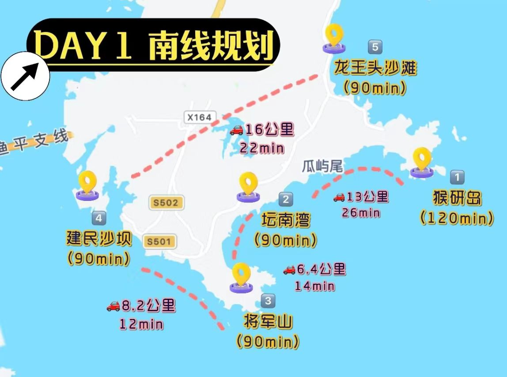
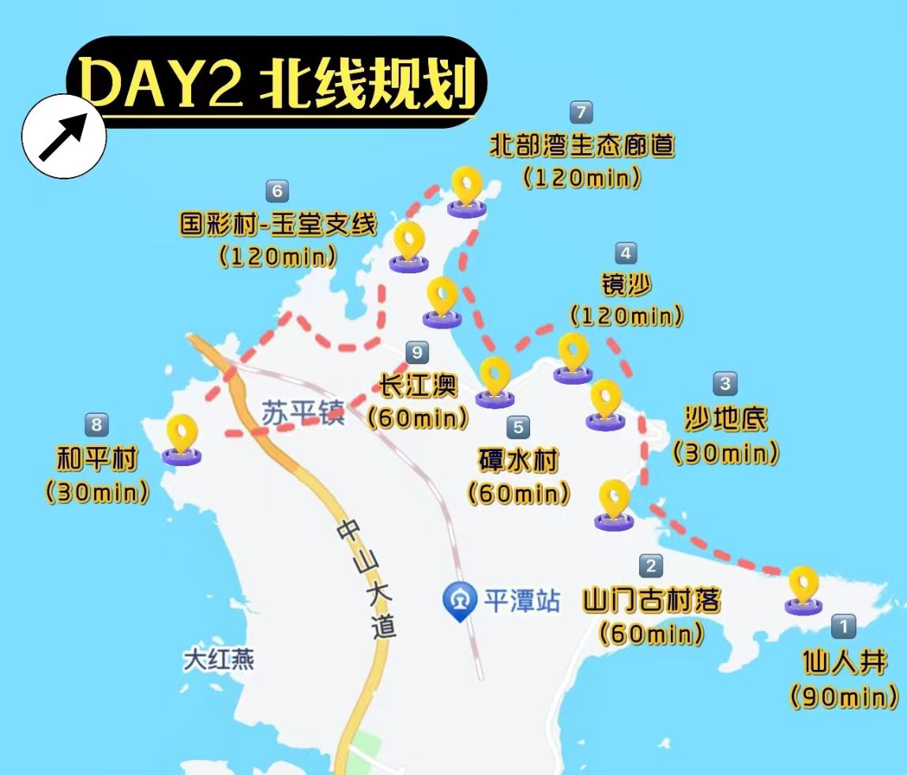

---
tags:
- Life
---

# 一起看海：平潭岛3日甜蜜双排

## Abstract

- 时间：`2024-08-31`~`2024-09-02`
- 地点：平潭岛-平潭县-福州市-福建省-中国-亚洲
- 人员：🐱 && 🦭
- 主题：甜蜜双排

---

## Financial Plans

- 交通：[高铁](20240831.md#交通)，$289.5\times2+358\times2=1292$
- 住宿：[海景民宿](20240831.md#住宿)，$292.20\times2=584.40$
- 饮食：[周边饮食](20240831.md#饮食)，预计$400\sim700$
- 门票：==TODO==
- 其它：==TODO==

---

## Details

### Day 0

!!! summary "总体路线"
    抵达 - 中线游玩

#### 启动

1. 早上大约8:00从浙江大学（玉泉校区）出发，打车/地铁前往杭州东站，行程预计30~45min
2. 乘坐[G1605](20240831.md#交通)出发前往平潭岛
3. 下午2时抵达平潭，前往[海景民宿](20240831.md#住宿)办理入住、放置行李、整理房间，完成时大约下午3时

!!! tip "建议"
    抵达平潭后租车🚲

#### 南线

由于是下午到达，所以游玩集中在平潭岛中线和南线，时间少也近

1. 自由休息与周边闲逛
2. 晚饭：就近周边
3. 龙王头沙滩 - 坛南湾 - 将军山 - 建民沙坝
4. 回城休息

!!! info "参考攻略"
    [小红书](http://xhslink.com/C/X8tEjk)

!!! warning "注意"
    不建议去古城

### Day 1

#### 起床

取决于起床时间，最好是早上起床出发

#### 北线

1. 仙人井 - 山门古村落 - 沙底地
2. 中饭或下午茶
3. 镜沙 - 潭水村网红秋千 - 北部生态湾廊道
4. 晚饭
5. 和平村 - 长江澳
6. 回城

### Day 2

### 返程

如果没有改签的话，回城

大约七点从酒店出发前往平潭站

!!! warning "注意时间！！！"

---

## References

### 交通

| 信息  | 出发                         |             返回             |
| :-: | :------------------------: | :------------------------: |
| 车次  | **G1605**                  |         **G1634**          |
| 站点  | 杭州东 -> 平潭                  |         平潭 -> 杭州东          |
| 时间  | `2024-08-31 09:04 ~ 14:23` | `2024-09-02 08:08 ~ 12:42` |
| 位置  | 14车 `16A & 16B`            |      11车 `16A & 16B`       |
| 检票口 | `10A & 10B`                |           二层检票口1           |

### 住宿

- 📌 [拾光小苑（龙王头海滨度假区店）](https://map.qq.com/?addr=%E7%A6%8F%E5%BB%BA%E7%9C%81%E7%A6%8F%E5%B7%9E%E5%B8%82%E5%B9%B3%E6%BD%AD%E5%8E%BF%E5%90%91%E5%AD%A6%E8%B7%AF%E4%B8%8E%E6%B5%B7%E5%9D%9B%E4%B8%9C%E8%B7%AF%E4%BA%A4%E5%8F%89%E5%8F%A3%E4%B8%9C%E5%8D%97%E6%96%B9%E5%90%9130%E7%B1%B3%E5%B7%A6%E5%8F%B3&isopeninfowin=1&markertype=1&name=%E6%8B%BE%E5%85%89%E5%B0%8F%E8%8B%91%28%E9%BE%99%E7%8E%8B%E5%A4%B4%E6%B5%B7%E6%BB%A8%E5%BA%A6%E5%81%87%E5%8C%BA%E5%BA%97%29&pointx=119.803&pointy=25.4937&ref=WeChat&type=marker)

### 饮食

- 🍗 美食：
	- 福建菜
	- 海鲜排挡
- 🛒 综合体：
	- 豪香购物商场
	- 台湾文化广场
	- 豪香购物广场
	- 平潭1号免税商城
- 🍸 奶茶：
	- 古茗
	- 喜茶
	- 陈文鼎
	- 柠厦手打柠檬茶

### 景点

- 68海里景区
- 平潭海上观光游
- 平潭台湾小镇
- 海坛古城
- 坛南湾度假村
- 月海湾蓝眼泪沙滩
- 平潭岛蓝眼泪景区
- 长江澳风力发电景观区
- ...

### 攻略

-  [小红书](http://xhslink.com/C/X8tEjk)
