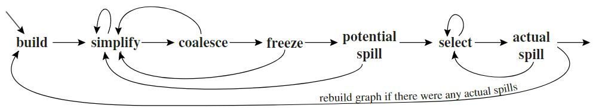

---
tags:
- ZJU-Courses
---

# Chapter 11: Register Allocation

!!! abstract "本节摘要"
    通过使用图染色算法来实现基本的寄存器分配，同时对于赋值语句还需要特殊处理，体系架构下特殊的寄存器也需要专门处理

## Introduction

实际的物理机器上的寄存器数量总是有限的，因此寄存器分配的工作是把中间表示的所有临时变量分配到物理机上的寄存器上

寄存器分配的策略有

- 基于图染色算法，有效但效率不高
- 基于线性扫描，有效且高效

## Coloring By Simplification

使用图染色算法的寄存器分配是一个 NP 完全问题

使用[冲突图](../Chapter10/Chapter10.md#Interference%20Graphs)来完成这个简化的图染色算法，**假设一个冲突图 $G$ 存在一个邻节点个数小于 $K$ 的节点 $n$，记 $G'$ 中除去节点 $n$ 以及所有与之相连的边得到的图，如果 $G'$ 能用 $K$ 种颜色染色，那么 $G$ 也可以**，这样，不断重复这个删除节点的过程，直到图为空，空图肯定可以被 $K$ 种颜色染色，所以这个过程就成立了

一种简单的基于栈的线性近似算法：

1. Build：构建冲突图
2. Simplify：如果图 $G$ 中存在一个邻节点个数小于 $K$ 的节点 $n$，将其及所有连边从图中删除，并将 $n$ 压入栈 $S$ 中，如果图中所有节点都能被移除则这个图是 $K$-colorable
3. Select：从栈顶依次弹出节点 $n$，将 $n$ 放回图中原位并分配颜色

当简化图后发现图非空，即图中只有邻节点数大于 $K$ 时，此时需要把这些变量存入内存中(*Spill*)，此时先继续把该节点删除、压入栈，这个节点成为 Candidate for spilling，这个操作是 Potential spilling

!!! tip "乐观着色"
    因为可能该节点的邻居不会把所有的 $K$ 个寄存器全部使用，可能其中一些变量被分配相同的寄存器而不需要实际把这个变量放入内存中

    当所有寄存器都被分配了，就需要实际进行存入内存的操作(*Actual Spilling*)，此时程序需要进行重写，添加一些访存操作，然后完成之后要对整个重写的程序重做一次图染色算法

## Coalescing

对于赋值指令，如果源寄存器和目标寄存器之间没有冲突边，那么可以把它们分配同一个寄存器

这样会出现诸如 `MOV t1, t1` 的指令，是多余的，因此这个指令可以合并，在冲突图上就是把这两个节点合并在一起，同时边也合并

合并可以提升图的可着色性

合并后因为新节点的边是原节点的边的并集，可能导致不满足图着色的限制，因此需要一些保守的策略进行安全的合并

- **Briggs** 策略：尝试合并两个节点，如果新节点的所有邻节点数量大于等于 $K$ 的邻节点数量小于 $K$，则可以合并
- **George** 策略：对于要合并的其中一个节点 $a$ 的每个邻居 $t$，如果 $t$ 与另一个节点 $b$ 冲突，或者 $t$ 的邻节点数量小于 $K$，那么这两个节点可以合并

综合上述，整个算法流程如下：

1. Build：构建冲突图，将节点按照是否是 Move 相关的指令进行划分，Move 相关的指令的边用虚线表示，计算邻节点度数时不计入
2. Simplify：删除临界点数量小于 $K$ 的非 Move 相关指令节点，压入栈中，直到无法简化
3. Coalese：在简化图上对 Move 相关指令进行合并，并重复2，直到无法继续简化
4. Freeze：如果发现不能继续简化或合并，寻找一个临界点数量大于 $K$ 的 Move 相关的节点，对相连的 Move 指令进行冻结操作，把表示 Move 关系的虚线去掉，然后重新开始简化和合并
5. Potential Spill：从冲突图中选择节点移出并压栈
6. Select：选择节点，弹栈，冲突图染色
7. Actual Spill：存入内存

## Precolored Nodes

有些机器保留的寄存器，如栈帧指针寄存器等，使用特定的临时变量来绑定，这些临时变量是需要预着色的，每个预着色节点之间互相冲突

**不能简化预着色的节点，并且预着色节点不应该溢出到内存中**

因此，前文的图染色算法需要修改终止条件为冲突图中仅剩预着色节点时停止

如果预着色节点的活跃范围很大，会导致寄存器利用效率降低，由于预着色节点不能溢出到寄存器，因此可以通过复制赋值来先保存再在后续使用时读取，这样就可以把这个值溢出到内存，当然如果寄存器完全够用就不需要这个操作

- 对于被调用者保存寄存器(*Callee Registers*)，在函数开始处将预着色寄存器的值存入新的临时变量中，在函数返回时读取，这样在寄存器分配时如果预着色寄存器没有被实际使用，就会由对应的临时变量合并入冲突图中的其它节点，如果它们被频繁使用，就会对应被溢出到内存中
- 对于调用者保存寄存器(*Caller Registers*)，在每次调用时标记它们为活跃状态，它们与所有活跃周期跨越了调用函数过程的寄存器和变量一起冲突，也会和所有被调用者保存寄存器分配的临时变量冲突

!!! tip "溢出原则"
    优先溢出不被经常使用、节点邻接度数较大的节点
