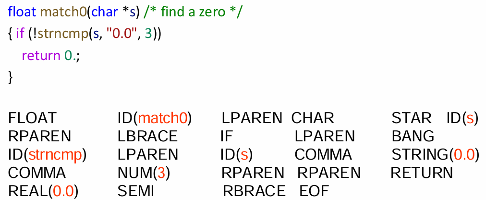
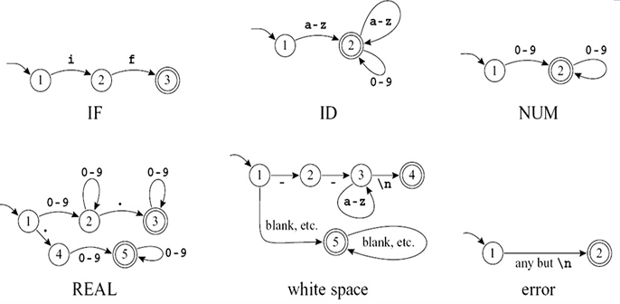
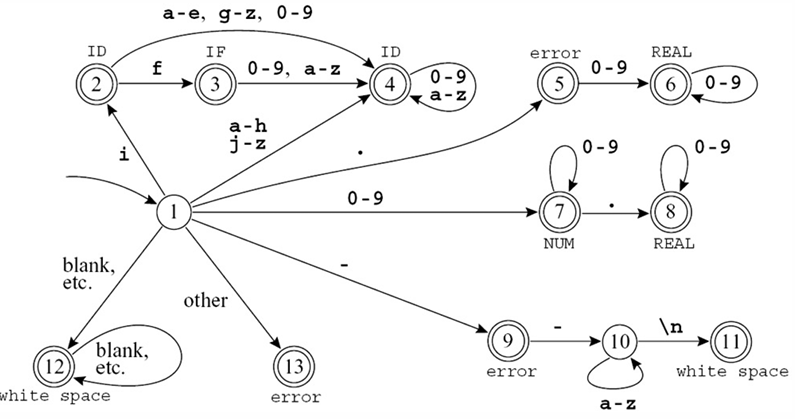
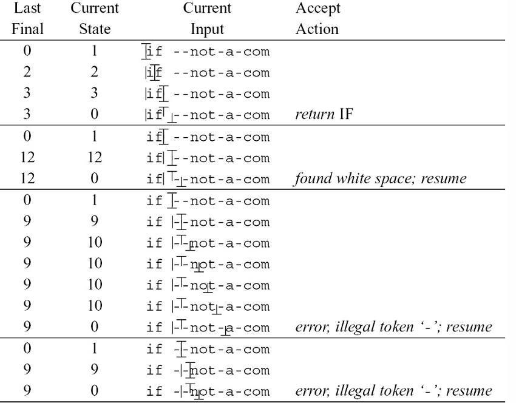
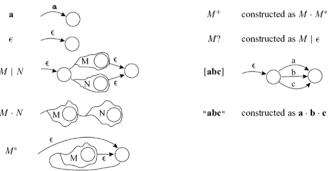
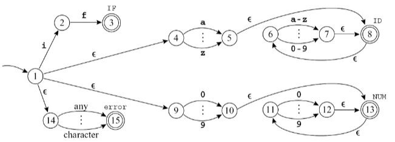
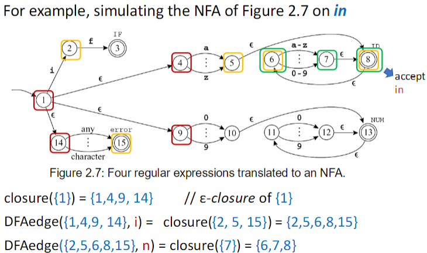
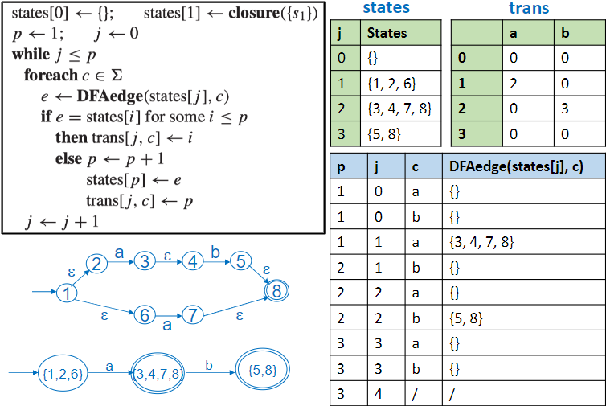

---
tags:
- ZJU-Courses
---

# Chapter 2: Lexical Analysis

!!! abstract "本节摘要"
    编译过程的第一步是词法分析，需要把输入源程序处理为词法记号序列，这个过程需要使用词法分析器进行词法分析；首先我们使用自然语言来描述词法记号的规则，然后使用正则表达式进行形式化描述，再使用非确定性自动机来实现正则表达式；为了便于计算机的实现，还需要把非确定性自动机构造为等价的确定性自动机；基于此，就可以用转移矩阵的方法来把有限自动机实现为一个词法分析器了

## Introduction

编译的过程是把一个程序语言转化为另一种程序语言，一个编译器首先把源程序分解开，理解每个分解出的部分的结构和意义，然后重新以另一种方式组合起来

- 前端负责分析
    - 词法分析：把输入分解为记号(*Tokens*)
    - 语法分析：解析程序语法
    - 语义分析：计算程序的语义
- 后端负责综合

词法分析器的输入是源程序的字符流，用于生成一系列的记号流，并删除空格和注释



## Lexical Token

词法记号就是一个字符序列，是一系列的程序语言中最基本的语法单元

输入的源程序字符流经过词法分析器之后会由预处理器删除掉非词法记号，转变为词法记号流，用于下一模块使用

| 常见记号类型 |   含义    |
| :----: | :-----: |
|   ID   | 函数名变量名  |
|  NUM   |   整型    |
|  REAL  |  实数类型   |
|   IF   | `if`关键字 |
| COMMA  |   `,`   |
| NOTEQ  |  `!=`   |
| LPAREN |   `(`   |
| RPAREN |   `)`   |

??? example "非记号类型"
    - 注释
    - 预处理指令
    - 宏定义
    - 空行空格

## Regular Expression

使用正则表达式可以很方便地描述词法记号的规则

- 语言是字符串的集合
- 字符串是有限长的字符序列
- 字符是从一个有限字符表中取出的

每个正则表达式 $r$ 都可以表示一个语言 $L(r)$

### Abbreviations

使用一些缩略语来简写

|    缩略语     | 含义                      |
| :--------: | ----------------------- |
| $ab\mid c$ | $(a\cdot b)\mid c$      |
| $(a\mid)$  | $(a\mid\epsilon)$       |
|  $[abcd]$  | $(a\mid b\mid c\mid d)$ |
|  $[b-g]$   | $[bcdefg]$              |
|    $M?$    | $(M\mid\epsilon)$       |
|    $M+$    | $(M\cdot M^*)$          |
|  $\cdot$   | 除换行符外任意字符               |
|  `"a.+"`   | 引号内字符串本身                |

### Disambiguation Rules

为了防止二义性，需要一些规则：

- 最长匹配(*Longest Match*)
- 规则优先级(*Rule Priority*)

## Finite Automata

使用有限自动机把正则表达式实现为计算机程序



把这些小的自动机进行合并，使得可以读取并判断任意的输入



!!! tip "规则优先级"
    不难看出，上图合并后的自动机实现了规则优先级

### Transition Matrix

自动机可以使用一个转移矩阵(*Transition Matrix*)实现，其中矩阵的列索引为输入的字符编号，行索引代表状态机的状态，根据列索引在当前状态行中得到下一个状态行的行号

如`#!c edges[2][2] = 4`表示在当前状态为`#!c 2`时读入字符为`2`的情况下，下一个状态为`#!c 4`

```c title="Transition Matrix"
int edges[][256] = {/* ... 0 1 2 ... e f g h i j ... */
    /* State 0 */ {0,0,...,0,0,0,...,0,0,0,0,0,0,...}, // Dead state.
    /* State 1 */ {0,0,...,7,7,7,...,4,4,4,4,2,4,...},
    /* State 2 */ {0,0,...,4,4,4,...,4,4,4,4,2,4,...},
    ...
};
```

再用一个终态数组(*Finality Array*)编码每个状态对应的记号类型

### Recognizing The Longest Match

为了实现最长匹配，需要两个特殊变量

- Last-Final：上一个最终状态
- Input-Position-at-Last-Final：上一个最终状态的输入位置

这样，当出现死状态时，就可以从这两个变量读出前面匹配到的记号类型，以及从该处出发继续进行



## Nondeterministic Finite Automata

直接把正则表达式转为DFA其实不那么直观，因为DFA中不接受空串，而NFA可以，并且DFA和NFA等价，所以先把正则表达式转化为NFA，然后再把NFA转化为DFA

### Thompson's Construction

把正则表达式转化为NFA是一个递归构造的过程，每个正则表达式转化为**一个有开始边和结束状态的子NFA**



以上实现了5种基本的NFA，这样所有的正则表达式都可以基于这5种基本NFA实现递归构造



### Subset Construction

因为NFA需要猜，所以为了计算机实现方便，需要把NFA转化为等价的DFA



计算从起始点出发的 $\epsilon$ 闭包，即从该状态出发不接受任何字符就能到达的状态的集合，然后不断用输入字符经过当前状态的闭包得到下一个状态的闭包，相当于做一个遍历

基于此，构造出的等价DFA的每一个状态其实对应NFA的一个状态集合

```txt
Input state: s[1], input string: c[0:k]
d <- closure({s[1]})
for i <- 1 to k
    d <- DFAedge(d,c[i])
```

!!! tip "动态规划"
    注意到这个自动机其实是确定的，为了避免每次都需要重新计算，可以把已经计算出的结果存储下来，下一次直接进行查表即可

    

如果最后得到的终态是一个包含多个NFA终态的集合，那么在这里使用规则优先级进行匹配
