---
tags:
- ZJU-Courses
---

# Chapter 3: Parsing

!!! abstract "本节摘要"

CFGs are good at specifying programming language structure (in contrast to regular expressions)

We define parsers from simple classes of CFGs

LL(k), LR(k)

We can build a predictive parser for LL(k) grammars by

computing Nullable, First and Follow sets

constructing a parsing table from these sets

checking for duplicate entries, which indicate failures

creating a C program from the parsing table

If parser construction fails, we can

rewrite the grammar (left factoring, eliminating left recursion) and try again

try to build a parser using some other methods

## Introduction

语法就是不同单词的拼接后形成的短语、句子

输入源程序经过词法分析器后会得到一个词法记号的序列，这个序列作为语法分析其的输入，由语法分析按照一定的语法(*Grammar*)将其解析为一个树状的语法结构

语法分析可以用于识别语法错误，并使用树形结构进行语法分析

## Specifying Syntax With Context-Free Grammars

可以使用上下文无关语法(*Context-Free Grammars*)进行语法定义

!!! question "为什么不能直接用正则表达式描述语法？"
    因为正则表达式无法表示所有的语言类型，比如
    $$\{(^i)^i\mid i\geq0\}$$
    这个语言不是正则语言，无法使用正则表达式描述，但是这种递归的语法结构在编程语言中非常常见

    因此需要**一个语言来描述不同的词法记号如何构成语法**（这个语言就是上下文无关语言），以及**判定一个给定的词法记号流是否在这个语法的语言范围内**

上下文无关语法是一个四元组：

- 终结符的集合 $T$
- 非终结符的集合 $N$
- 起始符 $S\in N$
- 生成规则的集合

??? example "以 $\{(^i)^i\mid i\geq0\}$ 为例"
    - $T=\{(,)\}$
    - $N=\{S\}$
    - $S=\{S\}$
    - 生成规则两条
        - $S\rightarrow(S)$
        - $S\rightarrow\epsilon$

### Definitions

基于此，上下文无关语法 $G$ 定义的语言称为**上下文无关语言** $L(G)$：

$$\{a_1\cdots a_n\mid\forall_ia_i\in T\bigcap S\mathop{\rightarrow}\limits^{*}a_1\cdots a_n\}$$

其中 $a_i$ 是词法分析器返回来的词法记号，并且都是终结符

???+ example "无控制流语句的语法规则定义"
    上下文无关语法定义如下：

    - $T=\{\text{id},\text{print},\text{num},+,(,),\}$
    - $N=\{S,E,L\}$
    - 起始符 $S$
    - 生成规则
        1. $S\rightarrow S;S$
        2. $S\rightarrow\text{id}:=E$
        3. $S\rightarrow\text{print(}L\text{)}$
        4. $E\rightarrow\text{id}$
        5. $E\rightarrow\text{num}$
        6. $E\rightarrow E+E$
        7. $E\rightarrow(S,E)$
        8. $L\rightarrow E$
        9. $L\rightarrow L,E$

    其中 $E$ 代表表达式，$L$ 是表达式的列表

这样，我们就定义了一个用于描述合法词法记号的语言

### Derivations

从起始符开始进行一步步推导的过程就是生成

一个字符串在上下文无关语言中，如果它能够经过起始符推导得到

推导的过程可以得到一个树结构，称为分析树(*Parse Tree*)，容易发现这个推导得到的分析树并不唯一

- 如果每次都选择最左侧非终结符子节点展开，就是最左推导(*Left-most Derivation*)
- 如果每次都选择最右侧非终结符子节点展开，就是最右推导(*Right-most Derivation*)
- 还有些推导既不是最左推导也不是最右推导

!!! tip "注意"
    当语法没有二义性时，最左推导和最右推导可以得到相同的分析树

一个分析树的所有叶子节点都是终结符，非叶子节点都是非终结符

对树进行中序遍历可以得到原始输入

使用分析树可以表明操作的优先级，这与原始的输入串不同

一个分析树可以对应多个推导过程

### Ambiguity

!!! danger "二义性(*Ambiguity*)"
    当一个语法可以从两个不同的分析树推导得到一个字符串时，这个语法是具有二义性的，这对编译来说非常麻烦，因此需要处理好二义性
    ???+ note "二义性的来源"
        比如规则 $E\rightarrow E*E$ 和 $E\rightarrow E+E$，因为这两条规则的使用没有任何限制，所以既可以转化为乘法也可以转化为加法，这就会导致二义性，所以应该在生成规则上增加一些限制

最直接的方法就是把具有二义性的语法转化为没有二义性的文法，注意到我们想要实现

- 运算优先级，比如乘法运算优先于加法运算
- 左结合，如 $1-2-3$ 应该是 $(1-2)-3$ 而不是 $1-(2-3)$

基于此，可以引入新的非终结符，使得一些生成规则必须在特定的规则后使用，避免了随意使用带来的二义性

???+ example "解决二义性"
    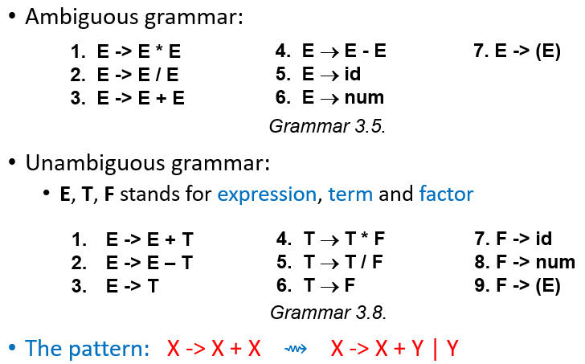

    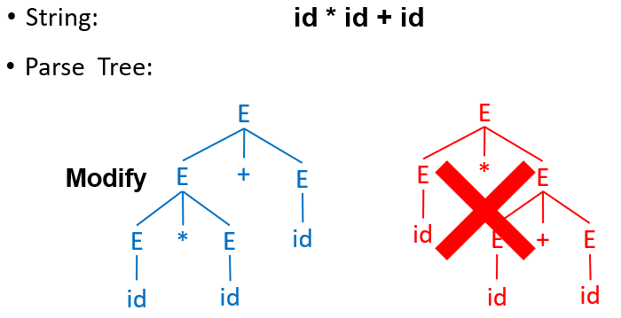

    可以看到：

    - 优先级：更高优先级的运算符只能在后面推导得到，而不是先于优先级低的运算符
    - 左结合：左递归的方式，生成规则中生成符号推导出的生成符号也在左侧

有些语言的表达能力太强，不存在无二义性的上下文无关语法来定义，这些语言就不适合作为编程语言，比如自然语言，你无法用一个不含二义性的上下文无关语法来描述它

### EOF Marker

使用 `$` 来表示文件的末尾(*End Of File*)，并增加生成规则 $S\rightarrow E\$$

## Build Parser Based On CFG

!!! tip "更高效的方法"
    注意到如果想要判断一个字符串是否在规定的语法内，一种最简单的方法就是基于上下文无关语法对字符串进行解析，如果匹配上了生成规则的某一条就按这一步继续向下构造，但是显然这种方法太过暴力，不高效，因此需要一些专有的解析方法

### Top-Down Parsing

自顶向下的解析，也称为预测式解析(*Predictive Parsing, LL(k) Parsing*)

解析树是自顶向下、从左往右构造

!!! example "自顶向下解析"
    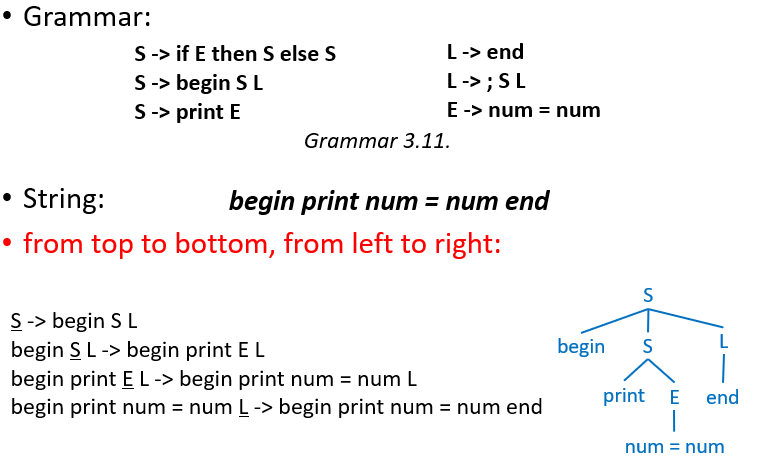

    可以手搓一个解析函数：
    ```c
    void L(void) {
        switch(token) {
            case END: eat(END); break;
            case SEMI: eat(SEMI); S(); L(); break;
            default: error();
        }
    }
    ```
    这里的 `#!c eat()` 表示吃掉当前的词法记号

只需要为每一个非终结符写一个递归函数，里面使用 `#!c switch - case` 语句来处理以这个非终结符为起始符的生成规则

1. 表示所有的词法记号，可以使用一个枚举类型表示所有的词法记号
2. 构造基本函数从词法分析器读取词法记号
3. 为每一个非终结符写函数

```c title="Build a parser"
/* Step 1: Represent the token. */
   enum token {
       IF,
       THEN,
       ELSE,
       BEGIN,
       END,
       PRINT,
       SEMI,
       NUM,
       EQ
   };

/* Step 2: Build infrastructure for reading tokens from lexer. */
// Call lexer.
extern enum token getToken(void);
// Store the next token.
enum token tok;
void advance() {
    tok = getToken();
}
// Consume the next token and get the new one.
void eat(enum token t) {
    if (tok == t) advance();
    else error();
}

/* Step 3: Build a function for each non-terminal. */
void S(void) {
    switch(tok) {
        case IF:
            eat(IF);
            E();
            eat(THEN);
            S();
            eat(ELSE);
            S();
            break;
        case BEGIN:
            eat(BEGIN);
            S();
            L();
            break;
        case PRINT:
            eat(PRINT);
            E();
            break;
        default: error();
    }
}

void L(void) {
    switch(tok) {
        case END: eat(END); break;
        case SEMI: eat(SEMI); S(); L(); break;
        default: error();
    }
}  

void E(void) {
    eat(NUM);
    eat(EQ);
    eat(NUM);
}
```

!!! warning "麻烦来了"
    可以看到，这个文法存在特殊之处，即它的生成规则的右边的第一个词法记号都是终结符，所以我们可以使用上述的分支开关语句进行情况分类并执行，但如果右边的第一个记号不是终结符的话就非常麻烦了

    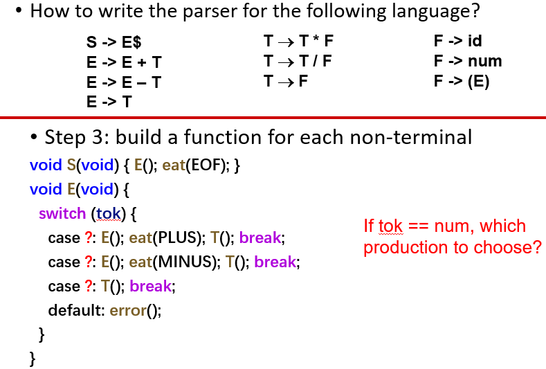

    可以发现，这里如果当前词法记号是一个数字的话，就无法直接写出选择下一步的条件了

预测式分析只适用于第一个终止符提供了足够多信息能够选择下一步生成规则的情况

#### First And Follow Sets

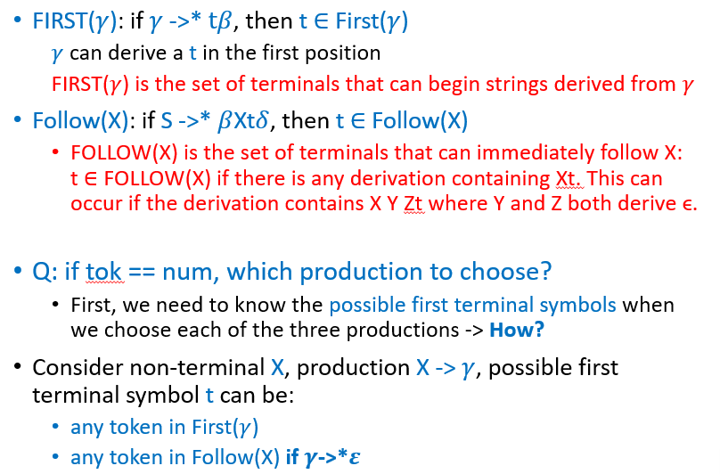

简言之，FIRST 集就是从当前字符串出发可以推导得到的所有串的第一个终结符的集合， FOLLOW 集就是从起始符出发推导得到的所有串中，紧随当前符号的第一个终结符的集合，或者有其它夹在二者中间的非终结符能够经过任意推导得到空串的

FIRST 集的计算方法：

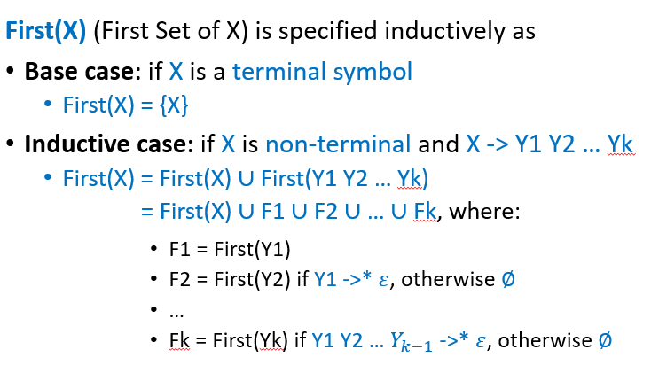

FOLLOW 集的计算方法：

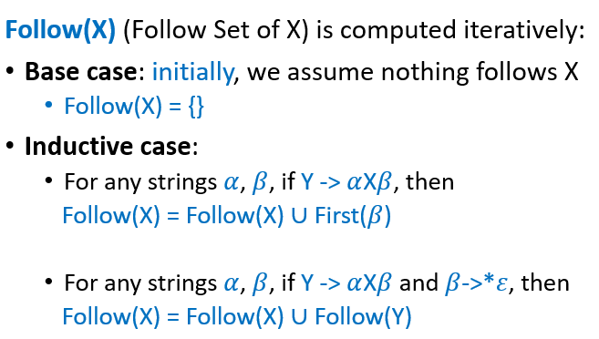

这里引入一个空集，表示当前非终结符经过任意推导最终是否会生成空串

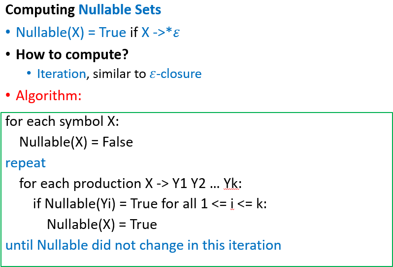

使用一个例子来详细说明

<object data="../assets/FirstAndFollowSetsExamples.pdf" type="application/pdf" width="100%" height="800px"><embed src="../assets/FirstAndFollowSetsExamples.pdf" type="application/pdf" width="100%" height="800px"></embed></object>

#### Predictive Parsing Tables

构造完上述表后，就可以构建一个预测式解析表

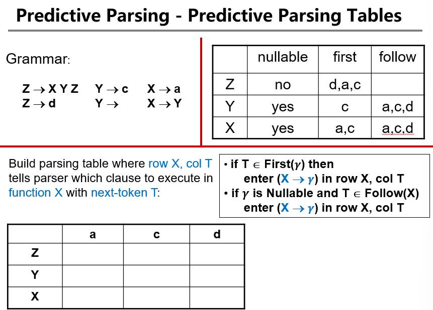

构造过程如下：

<object data="../assets/PredictiveParsingTablesExamples.pdf" type="application/pdf" width="100%" height="800px"><embed src="../assets/PredictiveParsingTablesExamples.pdf" type="application/pdf" width="100%" height="800px"></embed></object>

可以看到，如果表中有一个格是空的，那么就表明出现了语法错误，没有对应的生成规则，如果有多个规则在一个格子中就表明有多重定义，这样在函数中还是没有办法继续选择下一步该怎么做

$LL(1)$ 语法就是基于此定义的一种新的语法，能够使得解析表中不存在多重定义的情况

??? note "完整含义"
    - 从左到右解析(*Left-to-right Parse*)
    - 左侧推导(*Left-most Derivation*)
    - 1个标志(*1 Symbol Lookahead*)

可以定义 $LL(k)$ 语法，就是每个表中有 $k$ 个终结符

| aa  | ab  | ba  | bb  | ... |
| :-: | --- | --- | --- | --- |
|     |     |     |     |     |

!!! tip "注意到"
    不难发现，所有的 $LL(k)$ 语法都是 $LL(k+n)$ 语法，其中 $n\geq0$

有了这个解析表后，就可以用一些数据结构来实现这个语法解析器，如栈

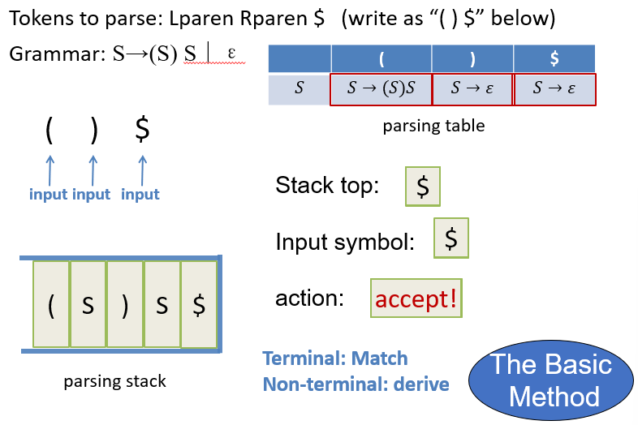

#### Eliminate Left-Recursion

通过重写语法规则来消除左递归

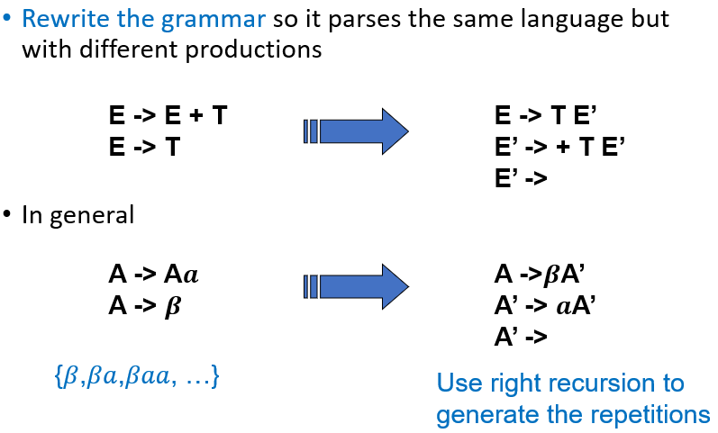

本质上是用右递归替换左递归，来实现不影响最左侧的终结符

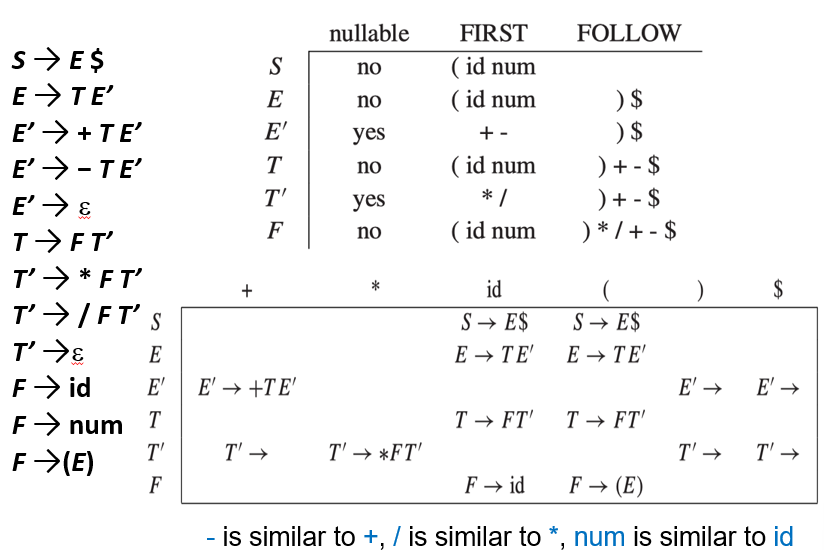

重写后，这就是一个 $LL(1)$ 语法

#### Left Factoring

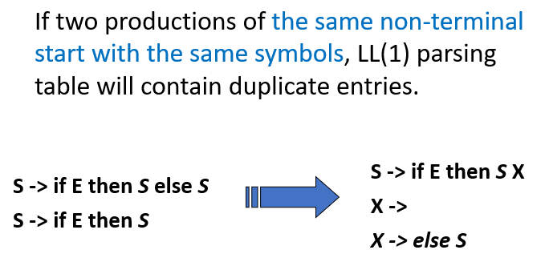

#### Error Recovery

在遇到错误时，通常的编译器会记录下这个错误，尝试恢复错误，并继续扫描来发现所有的错误，最终一次性报错，方便调试

错误可以通过删除、替换或插入词法记号实现，需要注意的是插入操作是比较危险的，因为可以一直保持插入而不终止编译过程，所以通常来说现代编译器采用删除的方式
