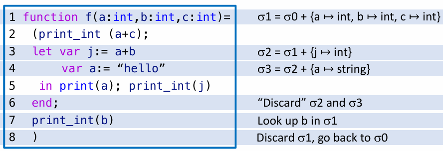

---
tags:
- ZJU-Courses
---

# Chapter 5: Semantic Analysis

!!! abstract "本节摘要"
    在语义分析阶段，编译器会构建符号表，检查程序中的符号作用域，进行类型检查，用来进一步检查不符合程序语义的错误，同时也用于后续中间代码生成

## Introduction

紧紧依靠语法分析是不足以完成所有事的

!!! example "语法分析局限性"
    - 变量声明类型是否和其值类型匹配
    - 数组是否超过访问范围
    - 变量应该存在堆上还是栈上

语义分析阶段主要负责

1. 确定程序的静态属性，如作用域、类型
2. 把抽象语法树转化为一个更适合生成机器代码的中间表示

## Symbol Tables

符号表的职责是把标识符进行类型值绑定和映射

编译器的语义分析就是在以特定的顺序遍历抽象语法树的同时构建符号表

!!! example "符号表实例"
    

在一个作用域结尾，符号表会销毁仅在当前作用域内生效的所有标识符

### Interfaces

符号表通常需要实现以下四个接口：

- 查找：在符号表中查找标识符
- 插入：在符号表中插入一个标识符
- 进入作用域：进入一个新的作用域
- 离开作用域：离开当前作用域并销毁当前符号表

### Implementation

符号表实现通常有两种：

- 命令式风格(*Imperative Style*)
- 函数式风格(*Functional Style*)

#### Imperative Style

使用哈希表实现高效查找，使用链表实现高效删除

```c title="Imperative Symbol Table"
// Hash table bucket: linked-list.
struct bucket {
    string key;
    void *binding;
    struct bucket *next;
};

#define SIZE 109

struct bucket *table[SIZE]; // Symbol table.

// Calculate hash value.
unsigned int hash(char *s0) {
    unsigned int h = 0;
    char *s;
    for (s = s0; *s; s++) h = h * 65599 + *s;
    return h;
}

// Construct a bucket.
struct bucket *Bucket (string key, void *binding, struct bucket *next) {
    struct bucket *b = checked_malloc(sizeof(*b));
    b->key = key;
    b->binding = binding;
    b->next = next;
    return b;
}

// Insert a new symbol.
// Insert into the head of the linked-list.
void insert(string key, void *binding) {
    int index = hash(key) % SIZE;
    table[index] = Bucket(key, binding, table[index]);
}

// Lookup a symbol.
void *lookup(string key) {
    int index = hash(key) % SIZE;
    struct bucket *b;
    for (b = table[index]; b; b = b->next)
        if (0 == strcmp(b->key, key))
            return b->binding;
    return NULL;
}

// Pop a symbol.
void pop(string key) {
    int index = hash(key) % SIZE;
    table[index] = table[index].next;
}
```

#### Functional Style

由于命令式风格会直接修改上一级符号表，因此可以通过函数式风格来保留上一级符号表

通过复制上一级符号表实现

## Symbols

```c title="Issue" hl_lines="5"
void *lookup(string key) {
    int index = hash(key) % SIZE;
    struct bucket *b;
    for (b = table[index]; b; b = b->next)
        if (0 == strcmp(b->key, b)) // Expensive string comparision.
            return b->binding;
    return NULL;
}
```

注意到上述实现存在一些开销问题，因此可以采用符号对象的实现来避免频繁的字符串比较

作用域的实现，对于函数式风格符号表可以用一个栈来维护，对于命令式风格符号表可以在链表中插入标记符来标记作用域边界，可以参考[符号表实现](https://compiler.pages.zjusct.io/sp25/lab/lab2/#_2)

## Type Checking

类型检查主要负责

- 确定表达式类型
- 判定两种类型是否等价
- ...

!!! question "常见问题"
    在处理递归类型定义时，可能会遇到类型还没有完整定义就被使用的情况，比如链表的定义，这里需要用一个占位符来实现，即先把类型的声明信息插入环境中，再分析类型定义的主体，同时需要注意占位符之间互相引用成环的情况，非法的引用环应该被类型检测器发现

在确定类型等价时，通常有

- 名字等价(*Name Equivalence, NE*)，两个类型名称一致
- 结构等价(*Structural Equivalence, SE*)，两个类型采用同样顺序的构造函数

!!! note "Tiger 编译器的命名空间"
    在书中的 Tiger 编译器中，类型单独一个命名空间，变量和函数一个命名空间，因此在一个作用域内可以有类型和变量同名的情况，但是不能有变量和函数同名的情况

    基于此，符号表实现需要两个单独的符号表，一个存类型，一个存变量和函数
