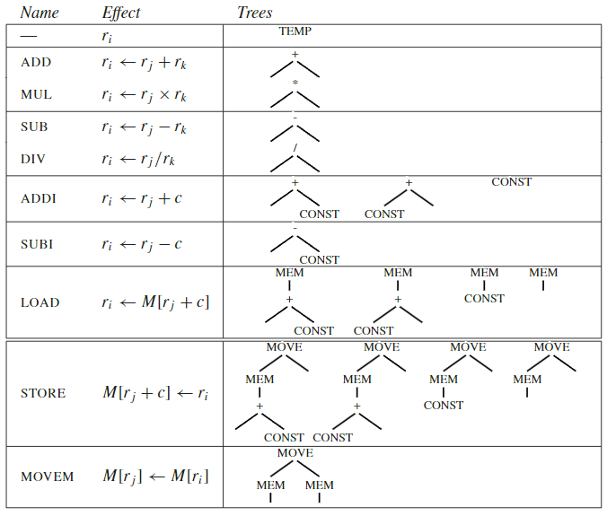

---
tags:
- ZJU-Courses
---

# Chapter 9: Instruction Selection

!!! abstract "本节摘要"
    指令选择阶段复杂将编译器中端生成的中间表达按照树形匹配的方式来选择对应体系结构下指令进行匹配以生成对应目标指令的过程，指令选择可以有多种方式，在这里介绍两种典型的方式（Maximal、动态规划），并简单介绍了切换指令架构为 CISC 的一些问题

## Introduction

中间表达树的每个节点仅仅只包含一个操作，而真正的机器指令通常包含多个基本操作，如中间表达 `#!c MEM(BINOP(+, e, CONST c))` 对应的机器指令可以是 `LOAD ri <- M[rj + c]`

指令选择阶段的工作就是找到合适的机器指令来实现中间表达树

## Tree Patterns

每个树形可以和一个机器指令匹配，指令选择就是用一组最小的机器指令集合来匹配和覆盖(*Tiling*) 整个中间表达树

### Jouette Architecture

!!! tip "适用于本教材 Tiger 编译器的指令集"

基于这里的基本树形和指令匹配表，可以通过遍历整个中间表达树以获得对应指令选择的结果

### Optimal And Optimum Tilings

一个中间表达树的指令选择结果可以有很多种

- 最好(*Best*)覆盖：使用最少数量的指令进行覆盖
- 最佳(*Optimal*)覆盖：任意两个相邻的覆盖指令都不能连接成一个代价更小的覆盖，**局部最优**
- 最优(*Optimum*)覆盖：覆盖的代价是最小的，**全局最优**

## Algorithms For Instruction Selection

### Maximal Munch

用于寻找最佳(*Optimal*)覆盖，认为瓦片越大越好

使用贪心法自顶向下遍历，从根节点开始，用最大的可匹配的瓦片匹配当前节点

最大瓦片是指拥有节点数量最多的瓦片

!!! success "总是可以找到局部最优解"

### Dynamic Programming

使用动态规划就可以找到全局最优解，基于暴力搜索，自底向上出发，先得到所有子树的最优解，然后将所有子节点的代价加上本节点的最低代价方案就作为当前节点的代价

在获得了最优解后，将匹配的指令进行发射(*Emission*)

### Efficiency

假设

- 平均每个瓦片匹配有 $K$ 个非叶子节点
- 给定子树，未确定匹配那个瓦片最多需要检查 $K'$ 个节点
- 每个节点对应于平均 $T'$ 个瓦片来覆盖
- 输入数的节点数量为 $N$

基于上述假设可以推断出

- 使用 Maximal Munch 算法平均只需要遍历 $\dfrac{N}{K}$ 个节点就可以覆盖整棵树，时间复杂度为 $O(\dfrac{(K'+T')\times N}{K})$
- 使用动态规划需要遍历 $N$ 个节点，时间复杂度为 $O((K'+T')\times N)$

由于 $K'$，$K$，$T$ 均为常数，所以两种算法均为线性时间复杂度

## CISC Machines

以下简单介绍了 CISC 体系结构下的一些问题以及对应的解决方法

!!! info "参考来源"
    [Ch9: Instruction Selection - Compiler-note](https://compiler-note-7908cb.pages.zjusct.io/CP9/#cisc-%E5%AF%BC%E8%87%B4%E9%97%AE%E9%A2%98%E7%9A%84%E8%A7%A3%E5%86%B3%E5%8A%9E%E6%B3%95)

|         问题         |                          解决办法                          |
| :------------------: | :--------------------------------------------------------: |
|    寄存器数量较少    | 引入大量虚拟寄存器，将任务交给 register allocator 来 spill |
|   寄存器分不同种类   |   使用move等指令，将操作数和结果显式地传送到相应的寄存器   |
|    指令仅有两地址    |     move 传送指令 + 问题迁移给后续 register allocator      |
| 操作数可以为内存相关 |   强制要求代码必须在运算前将数据加载到寄存器、运算后写回   |
|     复杂寻址模式     |            为常见的地址计算方式创建特殊 tile            |
|      指令副作用      |      直接忽略副作用 / 使用特殊匹配方法 / 放弃tree patterns，使用 DAG patterns等不同的指令算法/       |
