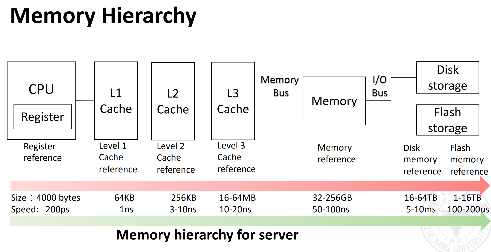
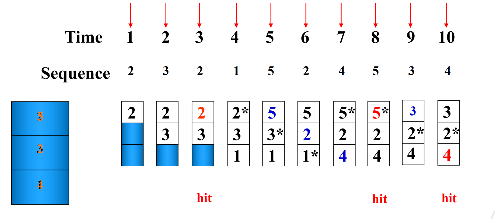
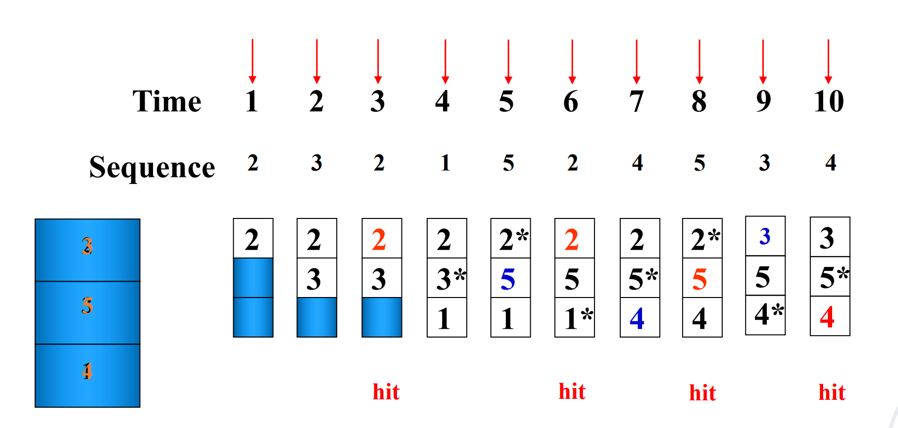
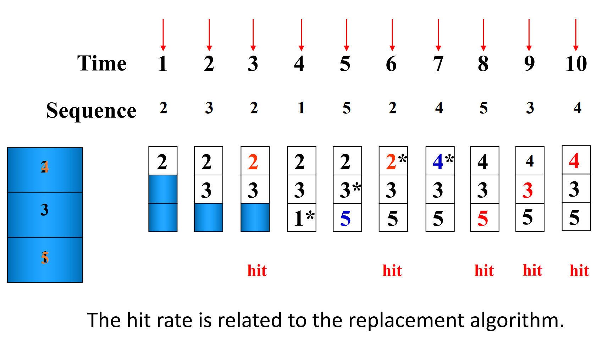
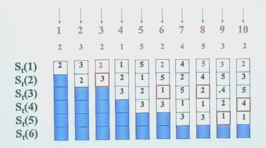
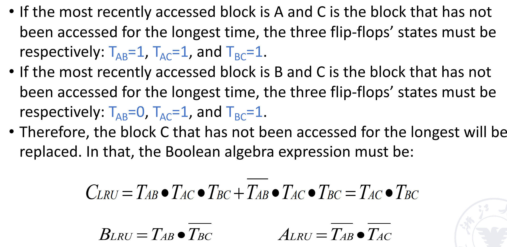
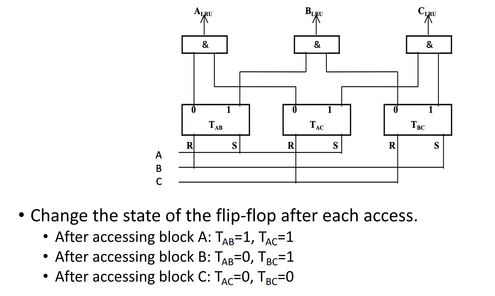
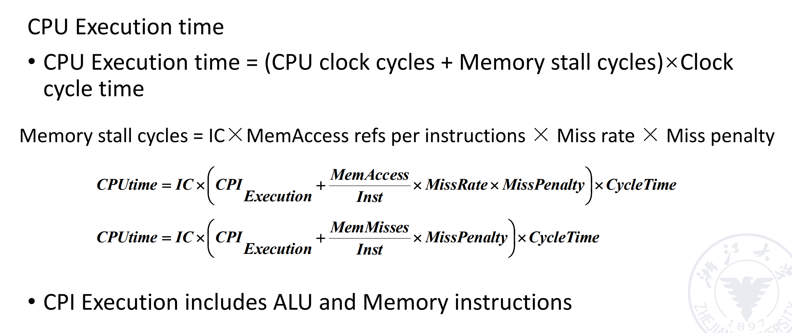

---
tags:
- ZJU-Courses
---

# Chapter 3: Memory Hierarchy

---

## Introduction

### Memory

- 寄存器
- 缓存
- 内存
- 外存

??? note "存储设备"
    - 机械内存
    - 电子内存
        - SRAM：适合做缓存
        - DRAM：适合做内存
            - SDRAM
            - DDR
        - GDRAM
            - GDDR
        - HBM
        - EEPROM
            - NAND
            - NOR
    - 光驱内存
    - ...

### Cache

- Cache Hit/Miss：Miss会导致额外的开销
- Cache Block/Line：读取信息的单位
- Cache Locality：局部性原理，访问过这个数据后的周边数据或这个数据本身可能被再次访问

---

##  Four Questions For Cache Designers

- [Block Placement](Chapter3.md#Block%20Placement): Where can a block be _placed_ in the upper level/main memory?
    - Fully Associative
    - Set Associative
    - Direct Mapped
- [Block Identification](Chapter3.md#Block%20Identification): How is a block _found_ if it is in the upper level/main memory?
    - Tag
    - Block
- [Block Replacement](Chapter3.md#Block%20Replacement): Which block should be _replaced_ on a Cache/main memory miss?
    - Random
    - LRU
    - FIFO
- [Write Strategy](Chapter3.md#Write%20Strategy): What happens on a _write_?
    - Write Back
    - Write Through (with Write Buffer)

### Block Placement

- 直接映射(*Direct Mapped*)：一个块在cache中有固定的位置，通常用取模得到
- 全相联(*Fully Associative*)：块可以在cache的任意位置，不好找
- 组相联(*Set Associative*)：块可以在一个组内的任何位置，组内可以放若干块

通常来说，组相联是另外两种方法的折中，通常取$n\leq4$

### Block Identification

- Tag：找到在哪一个块
- Index：找到在哪一个set

### Block Replacement

- 随机替换：随机选一个换
- LRU(*Least-Recently Used*)：最近最少使用的被替换
- FIFO(*First In, First Out*)

???+ example "替换策略"
    FIFO：
    
    LRU：
    
    OPT(理想的最佳情况)：
    
    OPT算法其实是从未来观察，未来哪个块需要用就留下这个块，这其实是一种理论的算法，而现实中不可能实现

!!! note "Thrashing"
    如果cache一直Miss导致不断替换，这种现象称为Thrashing

命中率与替换算法、访问数据的序列、cache的块尺寸有关

#### Stack Replacement Algorithm

有些算法随着$N$增大命中率非下降，这种算法称为栈替换算法

LRU是栈替换算法，FIFO不是

$B_t(n)$表示一个cache块内的数据的集合，cache块尺寸为$n$，时间为$t$

满足栈替换算法的算法满足$B_t(n)$是$B_t(n+1)$的子集

栈替换算法的好处就是随着cache块尺寸的变大，命中率提升

!!! example "LRU"
    通过把命中的提到栈顶，每次Miss时把栈底替换掉，使用了栈结构能够很好保持记录
    

    |          | 2   | 3   | 2      | 1   | 5    | 2        | 4     | 5         | 3         | 2         | HIT |
    | :------: | --- | --- | ------ | --- | ---- | -------- | ----- | --------- | --------- | --------- | :-: |
    | $S_t(1)$ | 2   | 3   | 2      | 1   | 5    | 2        | 4     | 5         | 3         | 2         |  0  |
    | $S_t(2)$ | 2   | 23  | **23** | 21  | 51   | 52       | 42    | 45        | 35        | 32        |  1  |
    | $S_t(3)$ | 2   | 23  | **23** | 231 | 251  | **251**  | 451   | **451**   | 351       | 352       |  3  |
    | $S_t(4)$ | 2   | 23  | **23** | 231 | 2315 | **2315** | 2415  | **2415**  | 2435      | **2435**  |  4  |
    | $S_t(5)$ | 2   | 23  | **23** | 231 | 2315 | **2315** | 23154 | **23154** | **23154** | **23154** |  5  |
    | $S_t(6)$ | 2   | 23  | **23** | 231 | 2315 | **2315** | 23154 | **23154** | **23154** | **23154** |  5  |

#### LRU Implementation

使用**比较对方法**(*Comparison Pair Method*)在硬件上实现LRU

让任何两个cache块之间两两结对，用一个触发器的状态来表示这两个块的先后访问顺序，如$T_{AB}=1$表示$A$比$B$更近访问

如果有$p$个cache块，就需要$C_p^2$个触发器实现，因此当$p\geq8$时，需要的触发器过多，就不适合这个算法了

### Write Strategy

- Write Hit：要写的数据在cache中
    - Write Through：直接写回内存，写回内存的时间较长，这个过程需要Write Stall，或者使用Write Buffer
    - Write Back：在cache中写，通过一个额外的dirty bit表示这个块已经被修改
- Write Miss：要写的数据不在cache中
    - Write Allocate：先将要写的块读到cache中，然后写
    - Write Around：直接写到内存

---

## Memory System Performance

---

## Virtual Memory

物理内存有限，可以使用虚拟内存让用户体验到一个抽象的更大的内存

虚拟内存可以让进程使用不连续的物理内存空间，而虚拟地址上都是连续的，以便更好地隔离不同进程，能够起到保护作用，防止进程间直接访问数据

虚拟内存的分配可以采用页分配(*Paged Virtual Memory*)和段分配(*Segmented Virtual Memory*)方法，其中页分配是固定大小的虚拟内存块，段分配是可变大小的虚拟内存块

### How Virtual Memory Works

虚拟内存的问题和[Cache的四个问题](Chapter3.md#Four%20Questions%20For%20Cache%20Designers)对应

- Q1: Where can a block be placed in main memory?
    - Miss的代价很高，因此采用**全相联**方式以降低Miss率
- Q2: How is a block found if it is in main memory?
    - 虚拟地址分为两部分，偏移量和页号，页号是页表的索引
- Q3: Which block should be replaced on a virtual memory miss?
    - LRU策略
- Q4: What happens on a write?
    - 采用[Write Back](Chapter3.md#Write%20Strategy)策略，使用dirty bit

### Page Table

页表通常很大，是虚拟内存管理中使用的数据结构，用于将虚拟地址空间映射到物理地址空间

!!! example "页表"
    32-bit virtual address, 4KB pages, 4 bytes per page table entry, page table size: $\dfrac{2^{32}}{2^{12}}\times2^2=2^{22}\text{ bytes}=4\text{ MB}$

正常来说页表需要两次访问内存以获取数据，一次是从页表获取物理地址，一次是从实际的物理地址上获取数据，因此这两次会导致访问效率低下

!!! tip "Cache思想"
    诶🤓☝️！可以借鉴Cache的思想，采用Cache Page Table，即TLB

#### Translation Lookaside Buffer

TLB通常称为快表，主要作用是加快虚拟地址到物理地址的转换速度，可以减少频繁的访存导致的性能下降

工作原理：

1. 当CPU需要访问内存时，它首先会检查TLB，看是否已经缓存了当前虚拟地址对应的页表项
2. 如果在TLB中找到了对应的页表项（TLB命中），CPU可以直接使用这个信息来获取物理地址，无需访问内存中的页表，这样大大加快了访问速度
3. 如果TLB中没有找到对应的页表项（TLB未命中），CPU则需要访问内存中的页表来获取转换信息，这个过程会增加访问延迟
4. 一旦从页表中获取了物理地址，这个映射关系就会被存储到TLB中，以便下次访问时能够直接使用

TLB通常采用全相联映射，提高了TLB利用率

### Page Size Selection

- 大页的好处
    - 大页，页更少，页表更小
    - 大页，遍历的页更少，Cache命中时间更短
    - 一次搬运更多数据，更高效
    - TLB Miss次数更少
- 小页的好处
    - 减少内存使用，内存碎片更少

可以采用二者结合的方法：多种页大小(*Multiple Page Sizes*)
