---
tags:
- ZJU-Courses
---

# Chapter 4: Instruction-Level Parallelism

---

## Introduction

指令之间存在一些依赖关系，每种依赖关系对应了一种可能的流水线冒险类型：

- 数据依赖可能导致数据冒险的RAW(*Read After Write*)，这种类型的冒险可以由[流水线前递和Stall](../Chapter2/Chapter2.md)解决
- 寄存器命名依赖可能导致
    - Anti-dependence可能导致WAR(*Write After Read*)
    - Output-dependence可能导致WAW(*Write After Write*)
- 控制依赖可能导致分支冒险

---

## Dynamic Scheduling

动态调度就是在运行时进行调度

!!! note "静态调度"
    静态调度在这里指由编译器进行的操作

### Scoreboard

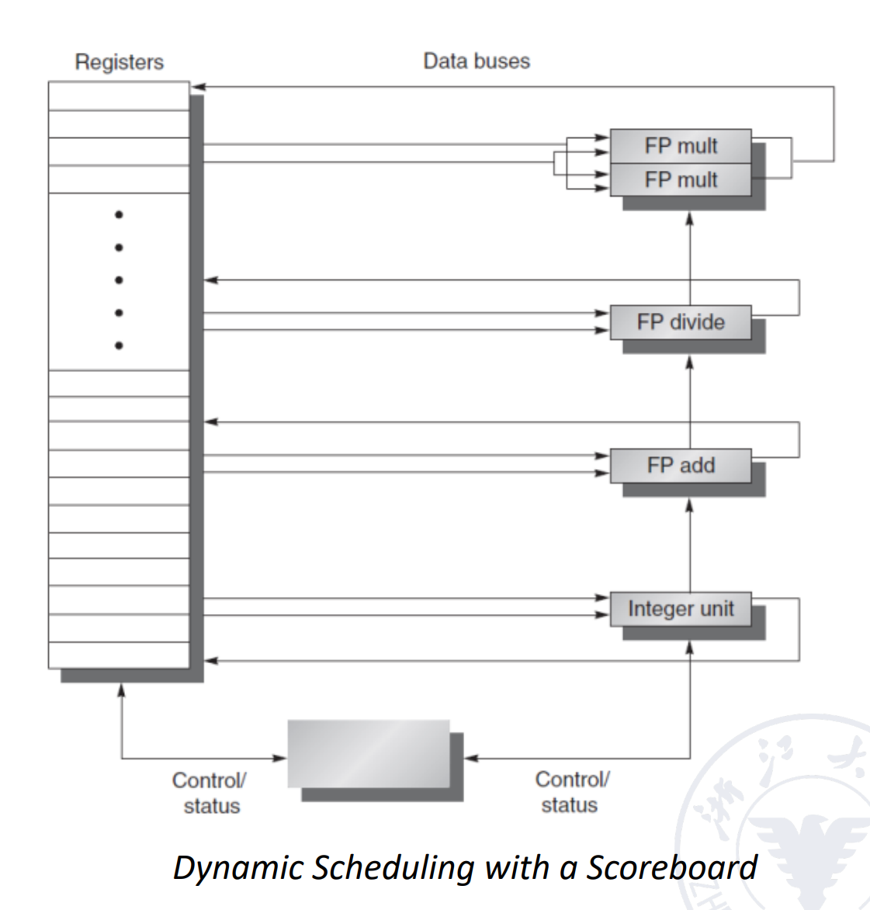

Scoreboard里面其实放了一堆表，用于记录CPU内部的信息

Scoreboard是一个集中式的控制结构，所有信息都要经过它

通常来说在原来的顺序五级流水线中，我们会在ID阶段进行结构冒险和数据冒险的检测，现在将ID阶段拆成两个子阶段：

- IS(*Issue*)：指令解码，检查结构冒险，没有结构冒险就进入，否则不进入
- RO(*Read Operands*)：数据冒险检查，没有数据冒险的指令可以先执行

其中IS一定是顺序取，RO可能会乱序，只要没有数据冒险就可以进行乱序

Scoreboard内部其实有很多张表用于记录信息，每个表在每个周期都会变化

- 指令状态表(*Instruction Status*)：记录每条指令执行到哪一步
- 功能部件表(*Function Component Status*)：记录每个功能部件的忙闲状态、源操作数和目标操作数、是否有依赖等情况
- 结果寄存器表(*Register Status*)：结果寄存器信息比较常用，所以专门从功能部件表中拉一个表

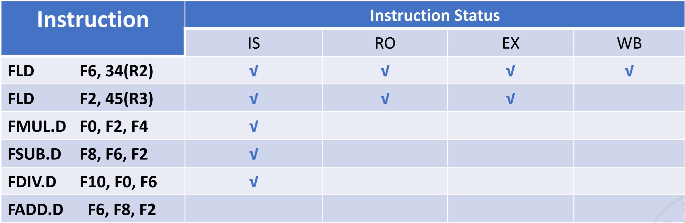

!!! example "指令状态分析"
    如上图，此时第一条指令执行完成，第二条指令执行完运算但还没写回

    - 第三条指令可以进入IS，因为MUL部件空闲，但是不能进入RO，因为F2还没写回
    - 第四条指令可以进入IS，因为ADD部件空闲，但是不能进入RO，因为F2还没写回
    - 第五条指令可以进入IS，因为DIV部件空闲，但是不能进入RO，因为F0还没计算完写回
    - 第六条指令不能进入IS，因为ADD部件非空闲

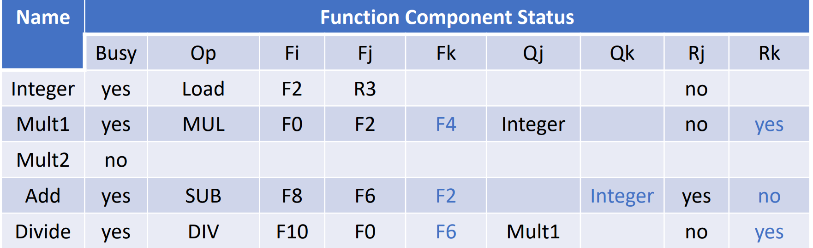

- `busy`代表当前单元是否有指令正在使用
- `op`表示这个单元被哪个类型指令使用
- `Fi`代表目的操作数，`Fj`和`Fk`代表源操作数
- `Qj`和`Qk`代表源操作数来自哪个部件
- `Rj`和`Rk`代表源操作数状态是否已经就绪以及是否取走
    - `#!Verilog "yes"`: 源操作数已经就绪但是还未读出，未读的原因通常是指令的另一个操作数还未就绪
    - `#!Verilog "no" && Qj == null`: 操作数已经就绪
    - `#!Verilog "no" && Qj != null`: 操作数还未就绪，等待`#!Verilog "Qj"`中的结果

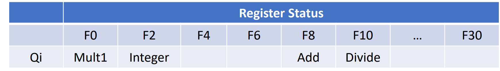

Scoreboard算法可以检测冲突，但没有解决冲突，还是通过阻塞的方式解决，且计分板上的信息较繁琐，效率不高

### Tomasulo's Approach

Tomasulo算法就是在计分板算法的基础上增加

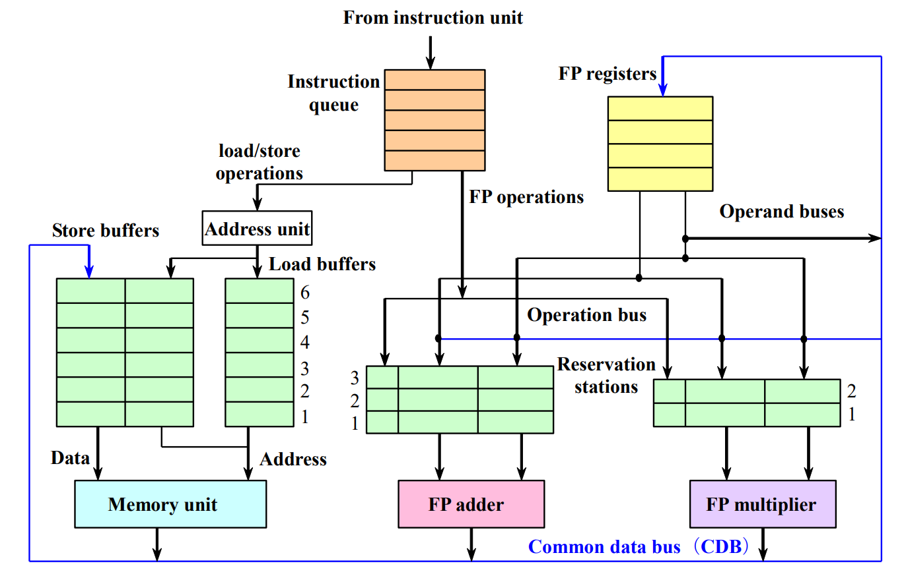

分布式控制结构，指令从队列中顺序出来，先进入绿色的buffer

如果绿色buffer有空位则下一条指令进入，否则需要阻塞等待，说明存在结构冒险

保留站(*Reservation Stations*)是用于一次性存放多条指令，然后在buffer内完成乱序，即buffer内哪条指令的操作室已经Ready了就先执行

此外，在保留站内完成寄存器重命名的工作

基本步骤：

- Issue：从队列中顺序取出指令，并放入对应的保留站内，进入保留站后进行寄存器重命名，
- Execute：当buffer内的操作数都Ready了就可以执行指令
- Write：写回寄存器，同时把结果发到所有已经标记了的保留站内

需要的表：

- 指令状态表(*Instruction Status Table*)：指令的执行状态表
- 保留站表(*Reservation Stations Table*)：记录有多少条指令在用
- 寄存器状态表(*Register Status Table*)：记录保留站的结果往哪里写

!!! example "保留站"
    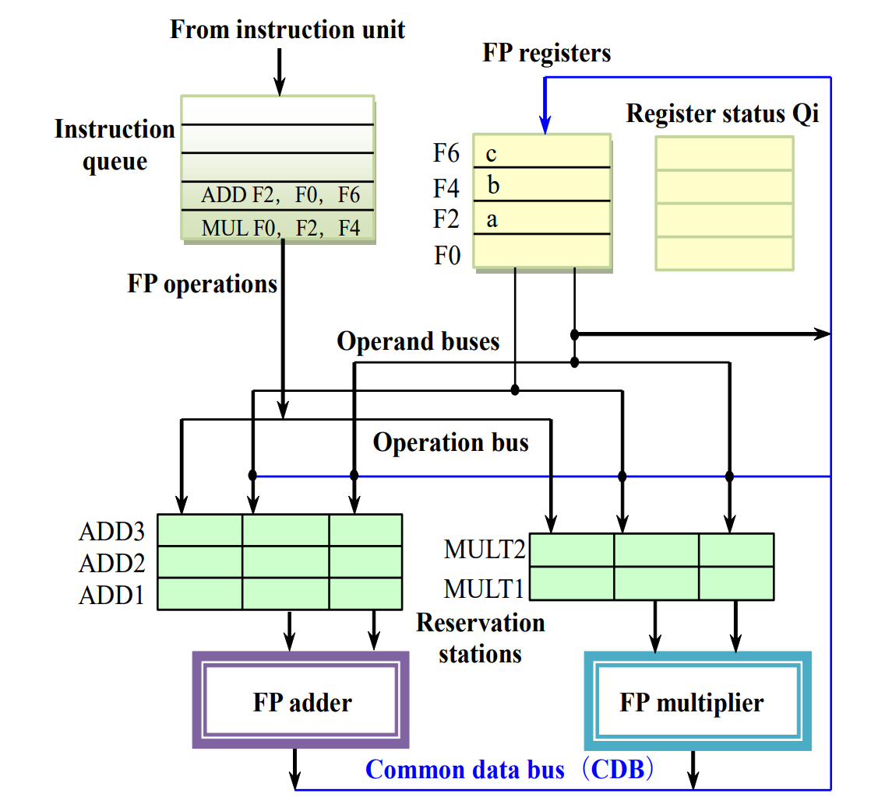
    指令进入保留站时，如果能直接读出数值就直接读，不使用寄存器，此时`{armasm}MUL F0, F2, F4`的保留站名称就是`MULT1`，同时更新寄存器状态表，在目标寄存器`Qi`中填入保留站名称
    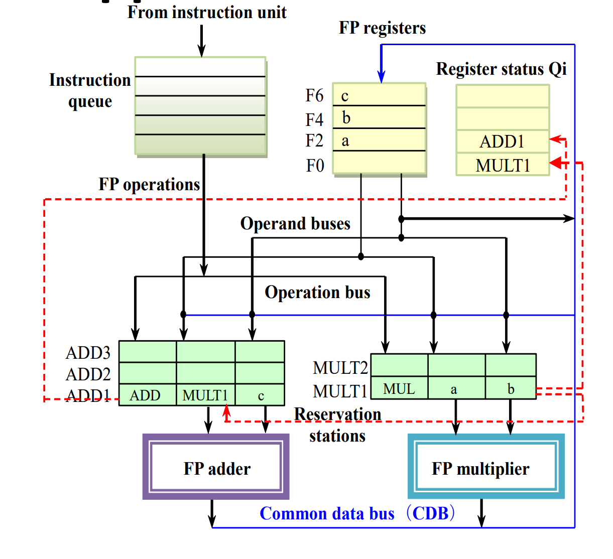
    这里`ADD1`不能直接计算，因为要用到`MULT1`的结果，还未就绪，此时如果还有`ADD2`或`ADD3`进入就可以先于`ADD1`执行
    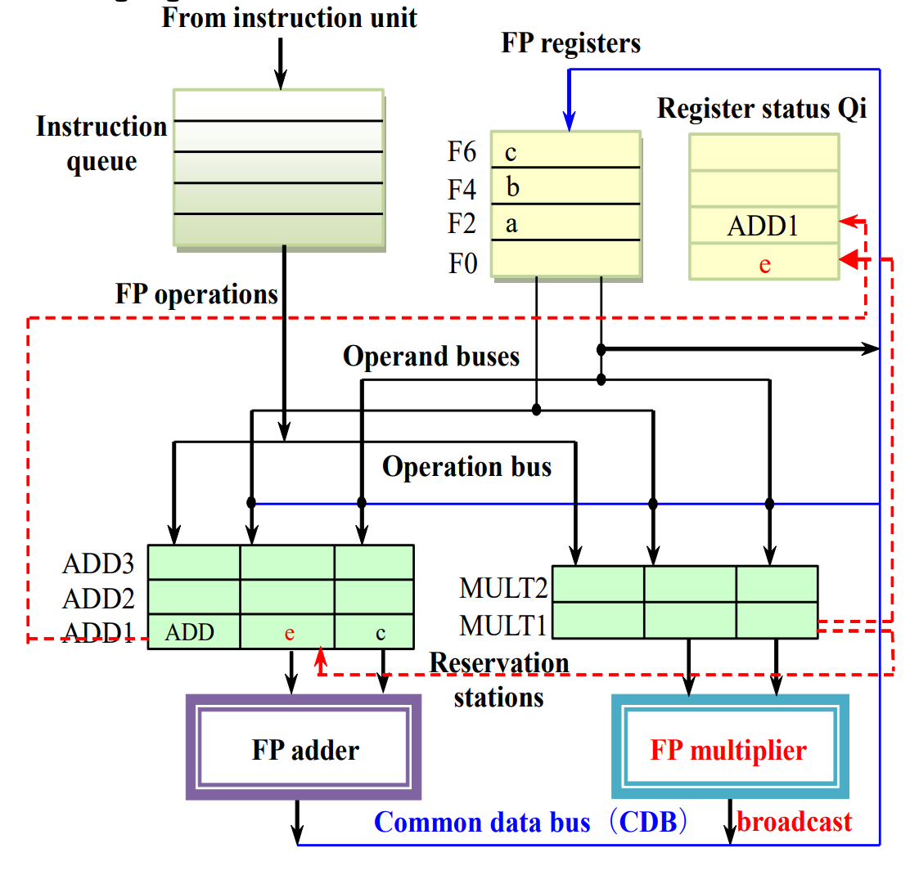
    最后执行完`MULT1`后就可以修改寄存器状态表，然后将结果**广播**到`ADD1`

!!! example "6条指令"
    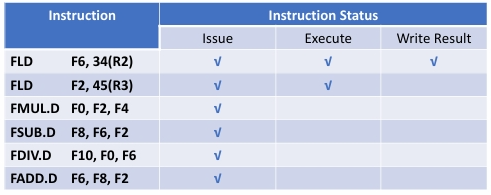
    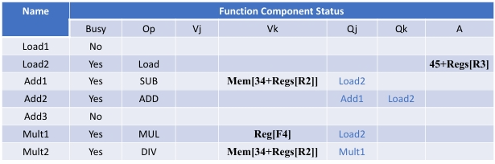
    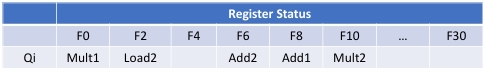

---

## Hardware-Based Speculation

为了让指令完成的顺序也是顺序的，添加一个Reorder Buffer，即ROB

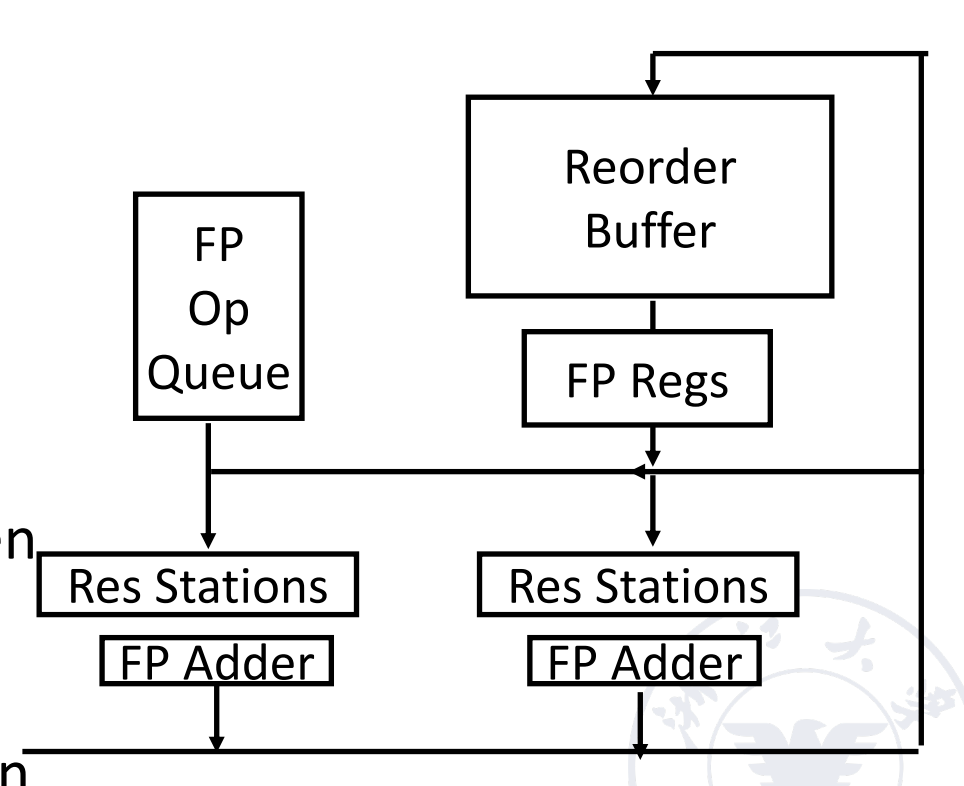

结果先写到ROB里，在其中按照指令流出顺序来写回寄存器组，因此在每个指令后面加上一个commit状态，只有**当前指令完成了写回操作**且**顺序靠前的指令都已经commit了**才commit

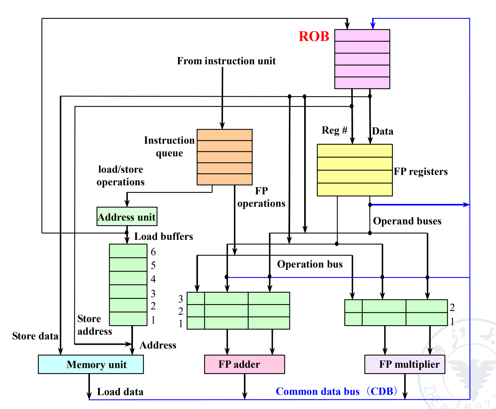

相比于[Tomasulo's Approach](Chapter4.md#Tomasulo's%20Approach)，多了一个Commit步骤，只有指令完成Commit之后才写回寄存器

对应的，记录状态的表格发生一点小变化，原来的结果寄存器换成`Dest`，即保留站的名称而不是寄存器的名称

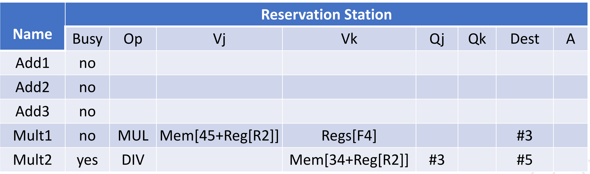

标busy的表示当前指令正在执行，还未Commit：

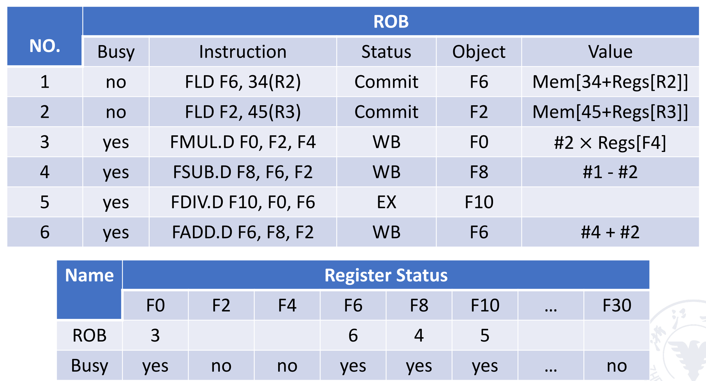

!!! example "ROB"
    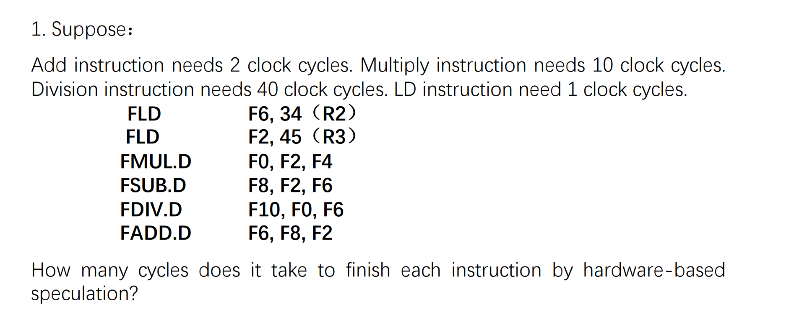
    ??? tip "答案"
        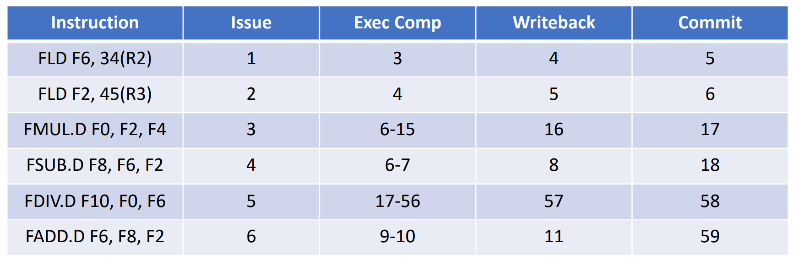

加了一道ROB，看似在指令执行时间和CPU设计成本上都增加了，但这是确保程序正确性必需的

总的来说，指令是顺序流入，但是执行过程是乱序的，结果流出是顺序的

---

## Exploiting ILP Using Multiple Issue And Static Scheduling

除了前述的单流出技术，可以在多核系统进行多流出以增强性能

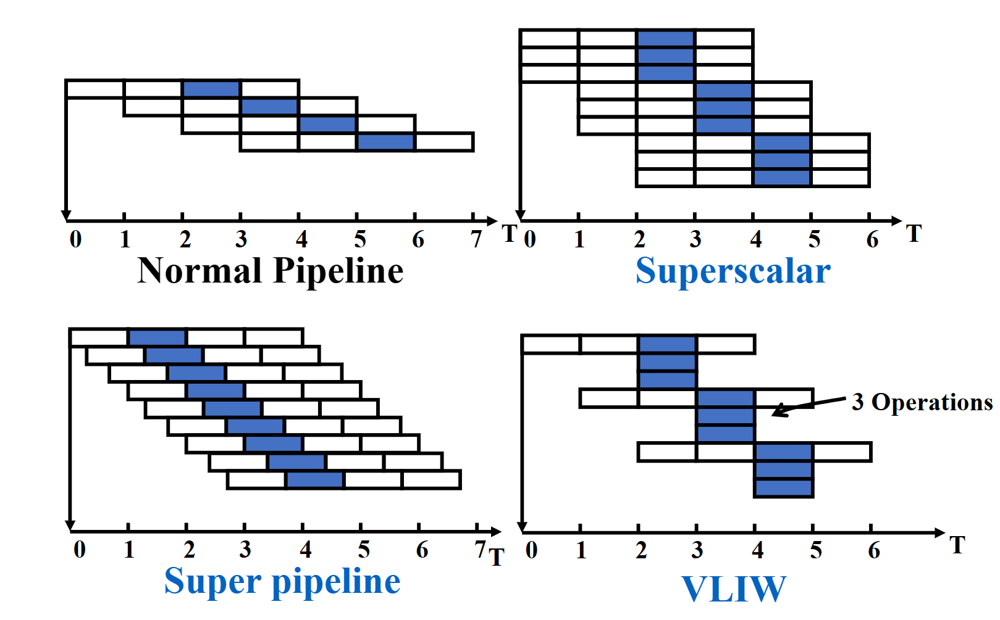

## Superscalar

多流出，一次流出多条指令

可以分为静态调度超标量和动态调度超标量

- 静态调度是通过编译器来完成的，需要进行结构冒险和数据冒险的检测，以及如果遇到了分支跳转的指令就只能流出一条，不能和其它指令一起流出
    - 如果处理器有分支预测，可以根据预测结果进行发射
    - 如果处理器无分支预测，那么必须等待分支结果
- 动态调度是通过硬件来完成的，即前述的指令按顺序进入保留站，分开处理

每个时钟周期发射的指令条数可以不一样

## Very Long Instruction Word

超长指令字(*VLIW*)，通过编译器完成，每个时钟周期发射的指令条数是固定的，它们组成一条长指令或指令包，它包含了很多操作部分

不同功能都放在同一个长指令里，而且硬件实现更加复杂，比较少用

## Super Pipelining

在一个很小的时间内就发射下一条指令，小于一个周期的用时，本质上是流水线的细分

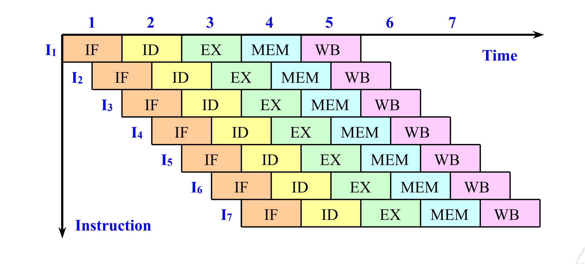

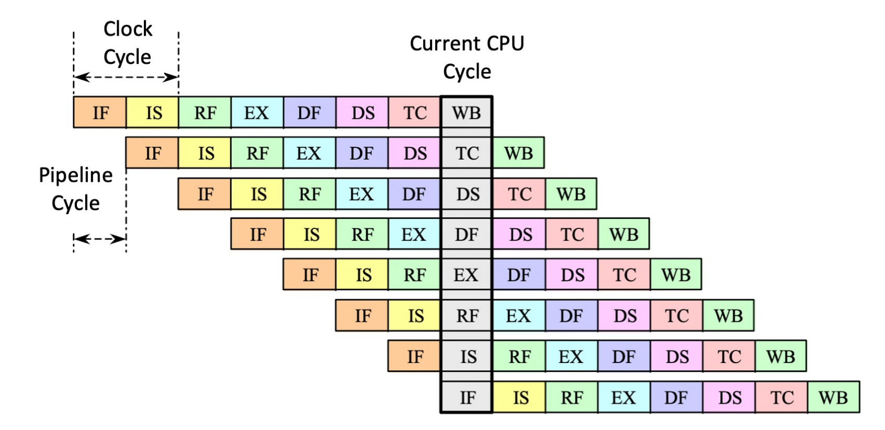
