---
tags:
- ZJU-Courses
---

# Chapter 5: DLP And TLP

---

## Introduction

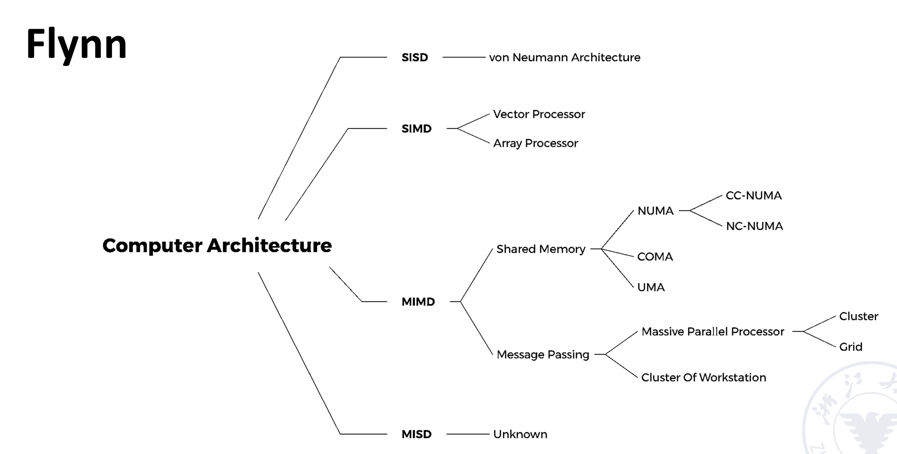

---

## SIMD

### Vector Process && Scalar Process

向量机，专门用于向量的处理

向量的计算可以分为

- 横向计算：从左到右逐个计算，计算完后进行下一行
- 纵向计算

静态的多功能流水线处理横向计算会导致效率低下，因为其中的数据依赖可能导致每次都需要排空才能进行分下一次运算

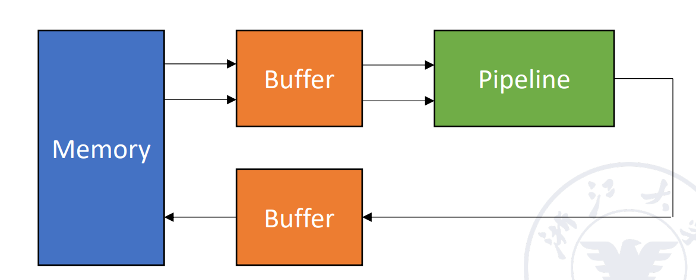

#### Improve Performance

- 增加硬件功能单元，使得并行
- 链接技术，如果有两条指令，第一条指令的结果是第二条指令的输入，就可以把两条指令链接起来，减少一次读写
- 循环开采技术：如果向量元素过多，分段处理
- 多处理器系统

!!! example "链接技术"
    计算下面的指令，其中指令从内存读到寄存器需要1拍，加法需要6拍，乘法需要7拍，从寄存器写回内存需要1拍，向量长度为$N$

    ```c
    V3 = A
    V2 = V0 + V1
    V4 = V2 * V3
    ```

    - 串行执行
        - $V2$的第一个元素经过$1+6+1$拍流出，到达$V2$
        - 第一个元素流出后，后续$N-1$拍每拍都会流出一个元素
        - 乘法计算用时为$1+7+1+N-1$
        - 总时长为$1+6+1+N-1+1+6+1+N-1+1+7+1+N-1=3N+22$
    - 并行执行
        - 因为第一条指令和第二条指令可以并行，所以总时间为$\max\{[1+6+1+N-1], [1+6+1+N-1]\}+1+7+1+N-1=2N+15$
    - 链接技术
        - $V4$的第一个元素需要$1+6+1+1+7+1=9$拍出结果，后续还有$N-1$条指令，因此总时间为$\max\{(1+6+1), (1+6+1)\}+1+7+1+N-1=N+16$拍

### Array Processor

阵列处理器，不同阵列之间需要相互通信和协作以完成一项任务

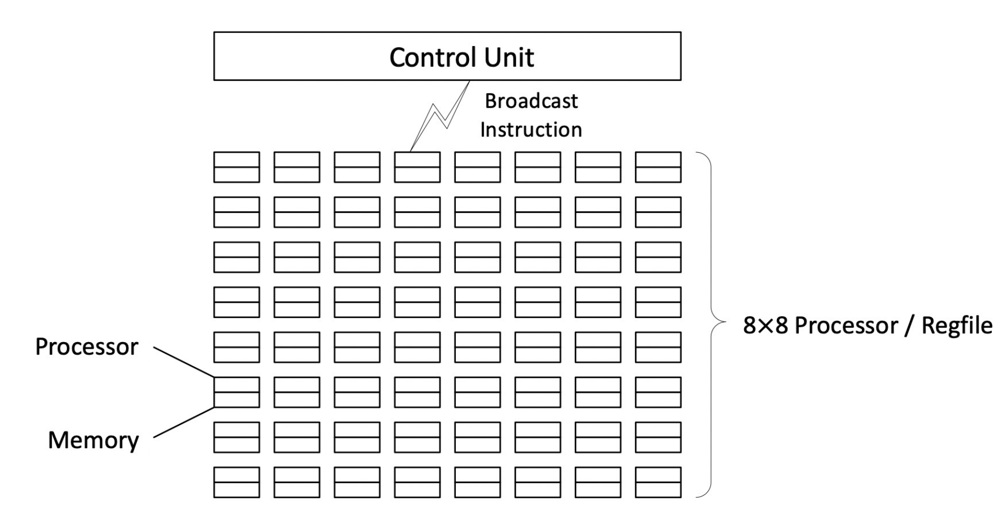

- 分布式内存(*Distributed Memory*)：每个单元都自己的内存，并且由一个共同的互联网络(*ICN*)连接

    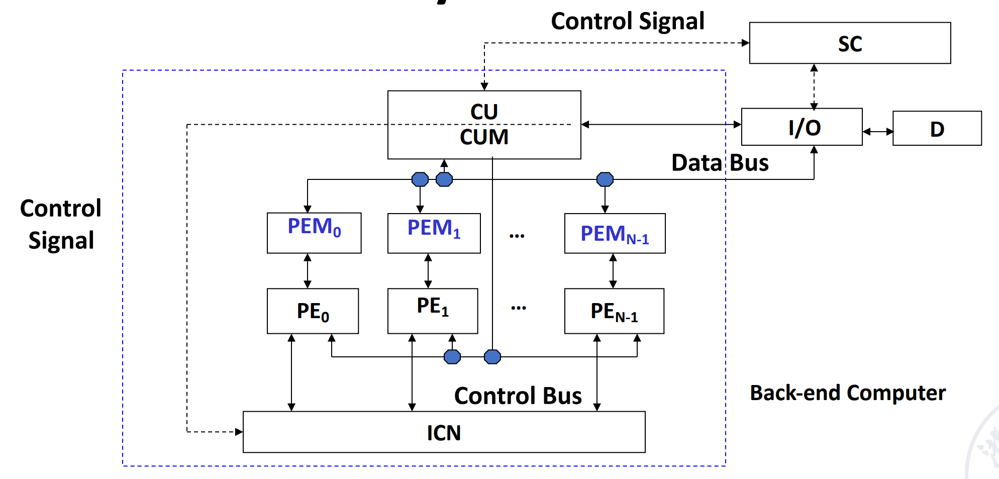

- 集中共享式内存(*Centralized Shared Memory*)

    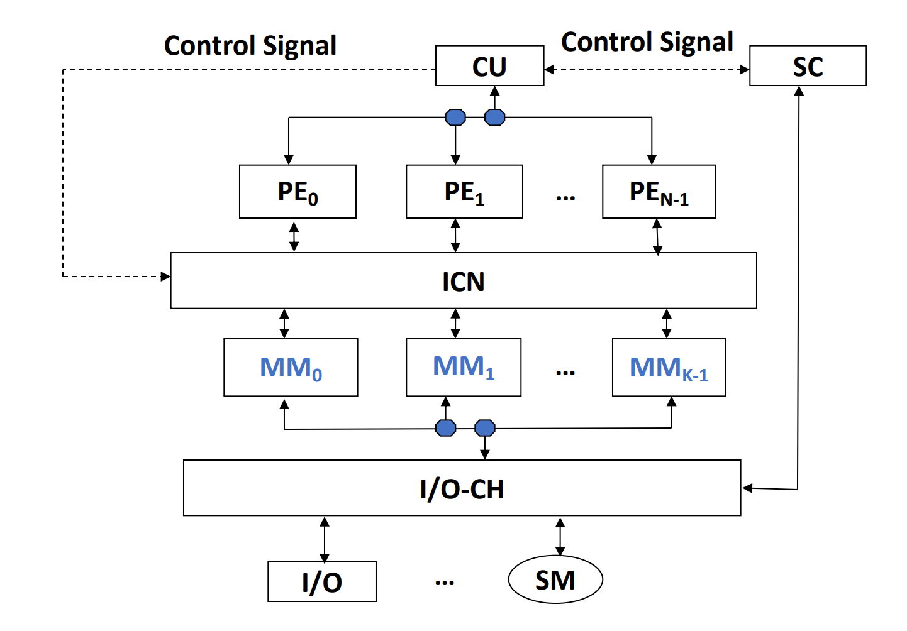

并行网络的设计分为

- 单级网络：一个单元和一个单元连接
- 多级网络

设有$N$个处理器单元，那么要实现两两互通就需要$C_N^2$个连接

在互联网络中，每一个处理器被认作一个节点，每一个连接被视作一条边，并且连接的通路越段连接的效率越高

#### Single-Stage Interconnection Network

##### Cube

有$N$个入端盒和出端，$n=\log_2N$，则有$n$个Cube函数：

$$\text{Cube}_i(P_{n-1}\cdots P_i\cdots P_1P_0)=P_{n-1}\cdots\overline{P_i}\cdots P_1P_0$$

??? example "Cube函数"
    当$N=8$，即$n=3$，则有$3$个Cube函数，分别是
    1. $\text{Cube}_0(P_2P_1P_0)=P_2P_1\overline{P_0}$
    2. $\text{Cube}_1(P_2P_1P_0)=P_2\overline{P_1}P_0$
    3. $\text{Cube}_2(P_2P_1P_0)=\overline{P_2}P_1P_0$
    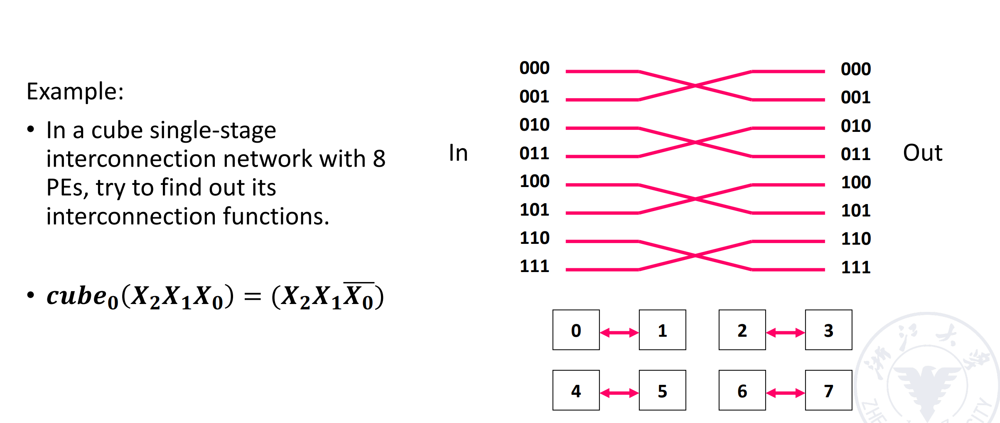
    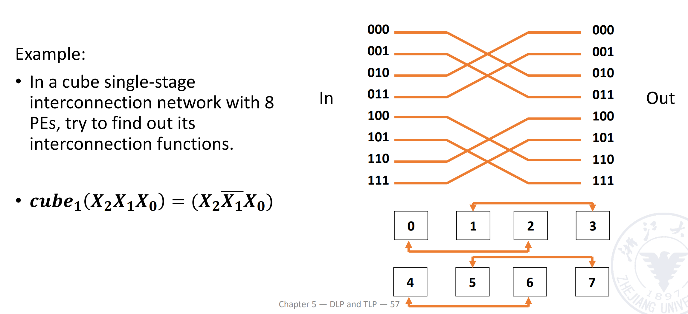
    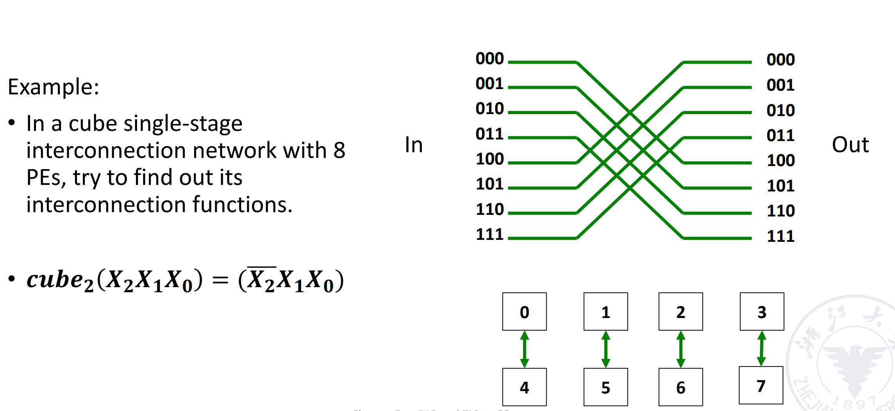
    最后形成的效果是
    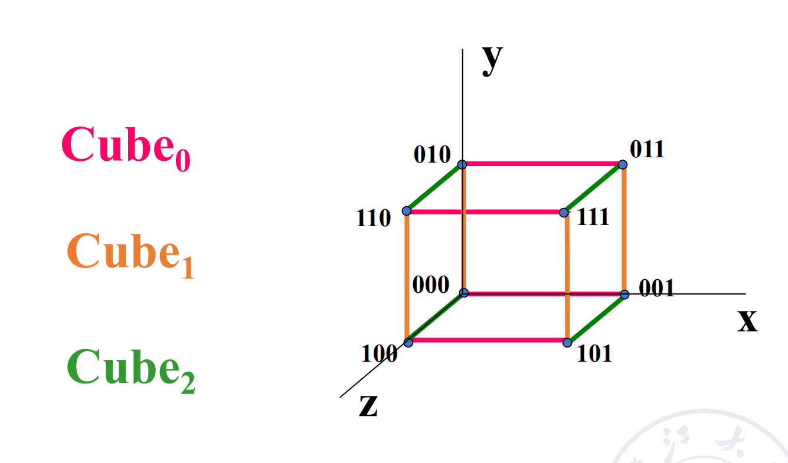

!!! tip "重要结论"
    对于$N$个节点的互联，采用Cube网络的最远步数为$n=\log_2N$

##### PM2I

对于有$N$个入端的网络，PM2I有

$$\text{PM2I}_{+i}(j)=(j+2^i)\mod N\tag{1}$$

$$\text{PM2I}_{-i}(j)=(j+2^i)\mod N\tag{2}$$

其中$0\leq j\leq N-1$且$0\leq i \leq\log_2N-1$

!!! tip "容易发现"
    PM2I是节点与循环左右移$0\leq i\leq\log_2N-1$步的节点互联

!!! example "PM2I"
    $N=8$时：
    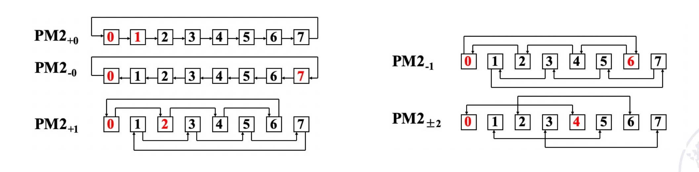
    可以发现，以节点0为例，它
    - 1步内可以连接到12467节点
    - 2步内可以连接到35节点

    至此，就可以全部互联了，所以只要2步即可，性能上比Cube优化

##### Shuffle Exchange Network

混洗交换网络，由混洗(*Shuffle*)和交换(*Exchange*)两个网络组成

混洗就是把最高位放到末尾：

$$\text{shuffle}(P_{n-1}\ldots P_1P_0)=P_{n-2}\ldots P_1P_0P_{n-1}$$

其中$n=\log_2N$

!!! tip "可以发现"
    经过$N$次混洗后所有节点都变成原样，且全0节点和全1节点始终都没有参与互联

为了解决这个问题，加入交换网络，即下图中的红色部分，实际上是通过$\text{Cube}_0$实现的

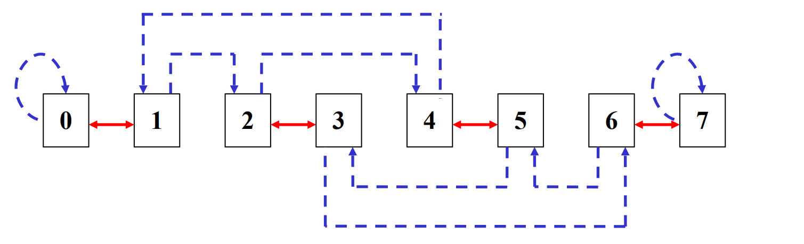

可以看到，至少需要$n$次交换和$n-1$次混洗才能全联通，即最小步长为$2n-1$

#### Multi-Stage Interconnection Network

上述都是静态互联网络，而通过交叉开关可以实现动态互联网络

一般的双功能开关(0,1)无法满足，所以可以使用四功能开关

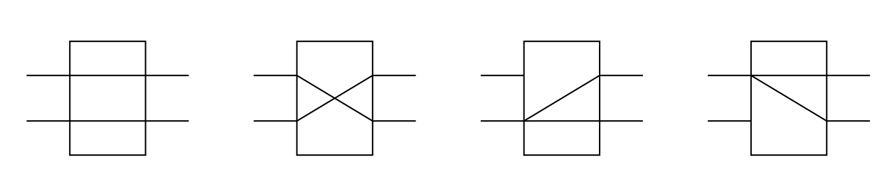

基于此，多级互联网络可以通过交叉开关控制每个单极互联网络实现

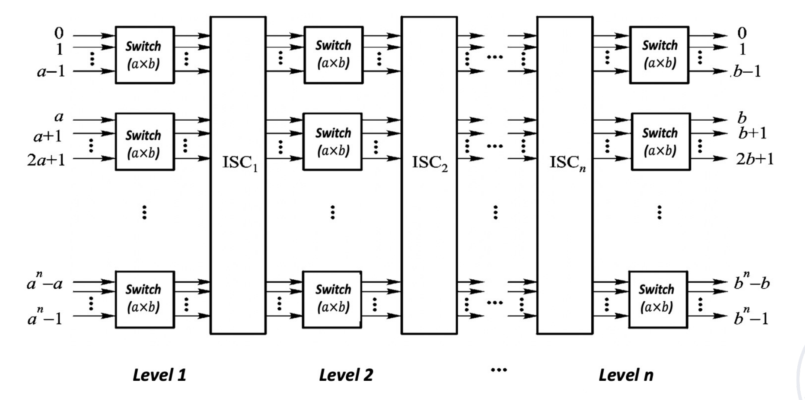
