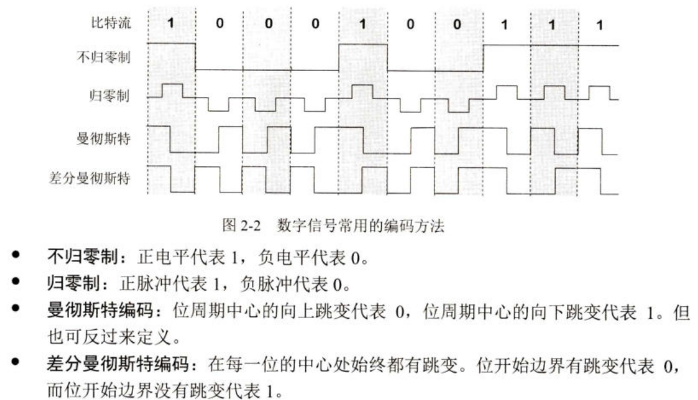
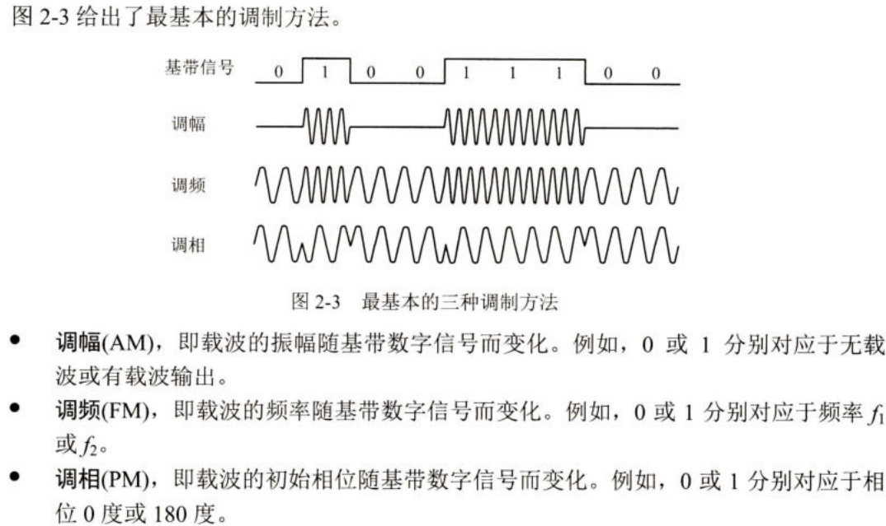
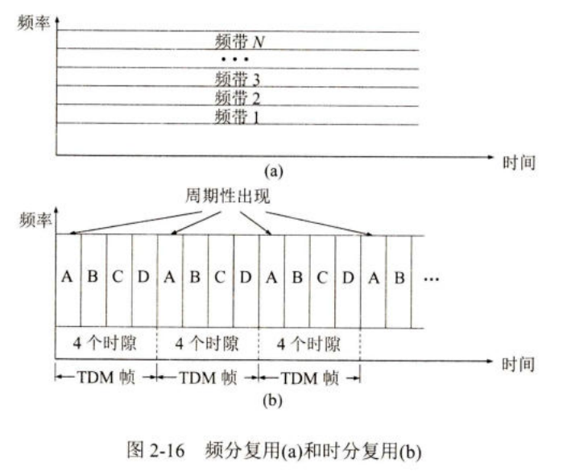
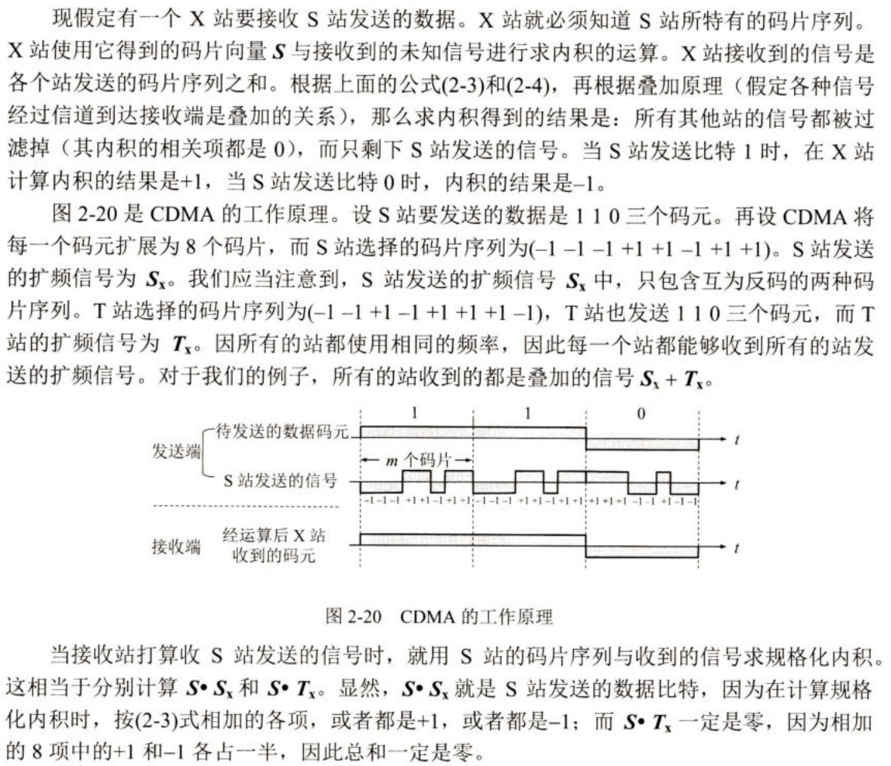
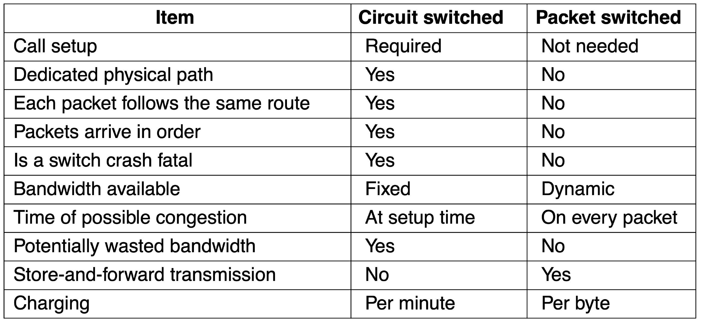

---
tags:
- ZJU-Courses
- Network
---

# Chapter 2: The Physical Layer

!!! abstract "本章概要"
    本章主要介绍了计算机网络的物理层，从数据与信号的传输到复用到到电话网络到交换到蜂窝数据网络等等，总体上粗略介绍了人类的通信网络的演变和物理层实现的大致原理，其中重点需要注意[两个传输公式](Chapter2.md#最大传输率)和[码分复用](Chapter2.md#码分复用)的相关内容，其它部分仅做了解即可

---

## Introduction

物理层考虑的是怎样才能在连接各种计算机的传输媒体上传输数据比特流，而不是具体的传输媒体

---

## Transmission Media

### 有线传输

- 双纽线(*Twisted Pairs*)
- 同轴电缆(*Coaxial Cable*)
    - 总线结构(*Bus*)
- 电线(*Power Lines*)
- 光纤(*Fiber Optics*)
    - 光的全反射原理
    - LED/激光

### 无线传输

- 电磁波谱(*Electromagnetic Spectrum*)
- 短波/微波通信
- 卫星通信

---

## From Waveforms to Bits

!!! warning "前提条件"
    所有信道(*Channel*)上的带宽(*Bandwidth*)是有限的，即信号频率满足一个区间值，不在带宽所对应的区间值内则无法进行传输

通信的目的是传送消息，如语音、文字、图像等等，而**数据**是运送消息的实体，是使用特定方式表示的信息，通常是有意义的符号序列，**信号**则是数据的电气或电磁表现

!!! tip "数据🆚信号"
    数据就是存储在计算机上的数据，而传输需要使用信号代表数据进行传输

来自信号源的信号称为**基带信号**，如计算机输出的各种代表文字或图像的数据都属于基带信号，而基带信号里通常包含了许多低频分量甚至直流分量，无法被信道直接传输，因此必须对基带信号进行**调制**(*Modulation*)

调制分为两大类：

- **基带调制**：仅仅对基带信号的波形进行变换，使得其与信道特性相适应，变换后的信号仍然是基带信号即把原来的数字信号变为另一种形式数字信号，也称为**编码**(*Coding*)
- **载波**(*Carrier*)：把基带信号的频率范围搬迁到较高的频段，并转化为模拟信号，这样就可以更好地在模拟信道中传输，这样的使用载波的调制称为**带通调制**

### 编码

常见的编码方式如下：

!!! tip "注意"
    通常来说比特流为`0`对应的信号不为0，否则无法区分是传输`0`比特还是没有传输

### 调制

!!! example "例题"
    To calculate the percent overhead for T1 and E1 carriers, we need to understand the structure of these carriers.
    ??? tip "T1 Carrier"
        - **Total Bit Rate**: 1.544 Mbps
        - **Structure**: 24 channels, each 64 kbps
        - **Framing Overhead**: 8 kbps

        **User Data Rate**:

        $$24 \times 64 = 1536 \text{ kbps}$$

        **Overhead**:

        $$\text{Overhead} = 1.544 \text{ Mbps} - 1.536 \text{ Mbps} = 0.008 \text{ Mbps} = 8 \text{ kbps}$$

        **Percent Overhead**:

        $$\frac{8}{1544} \times 100 \approx 0.52\%$$

    ??? tip "E1 Carrier"
        - **Total Bit Rate**: 2.048 Mbps
        - **Structure**: 32 channels, each 64 kbps
        - **Framing Overhead**: 1 channel used for framing

        **User Data Rate**:

        $$31 \times 64 = 1984 \text{ kbps}$$

        **Overhead**:

        $$\text{Overhead} = 2.048 \text{ Mbps} - 1.984 \text{ Mbps} = 0.064 \text{ Mbps} = 64 \text{ kbps}$$

        **Percent Overhead**:

        $$\frac{64}{2048} \times 100 \approx 3.13\%$$

### 最大传输率

#### 奈氏准则

奈氏准则(*Nyquist's Theorem*)指出，**在带宽为$W(\text{Hz})$的低通信道中，如果==不考虑噪声的影响==，那么数据传输的最高速率是$2W$，传输速率超过此上限就会造成严重的码间干扰问题，使得信号接收端对收到的数据的判别出现严重问题**

$$C=2B\log_2V$$

其中：

- $C$为信道的最大数据传输率，单位为$\text{bits/sec}$
- $B$为信道的频率带宽，单位为$\text{Hz}$
- $V$为信号等级数(*Signal Level*)

!!! example "奈氏准则实例"
    Television channels are 16 MHz wide. How many bits/sec can be sent if 32-level digital signals are used? Assume a noiseless channel.
    ??? tip "答案"
        - $B=16\text{MHz}=16\times10^{6}\text{Hz}$
        - $V=32$
        - $C=2B\log_2V=160\times10^6=160\text{Mbps}$

#### 香农公式

!!! note "信噪比"
    噪声会对接收端的信号判别产生影响，因此定义信噪比(*Signal-to-Noise*)为**信号的平均功率与噪声的平均功率之比**，常记作$S/N$，用分贝作为度量单位，即
    $$\text{信噪比(dB)}=10\log_{10}(S/N)(\text{dB})$$

香农公式(*Shannon*)指出，信道的极限信息传输速率为

$$C=W\log_2(1+S/N)(\text{bit/s})$$

其中$W$为信道的频率带宽（单位$\text{Hz}$），$S$为信道内传输信号的平均功率，$N$为信道内的高斯噪声功率

香农公式表明，**信道的带宽或信道中的信噪比越大，信息的极限传输速率就越高；只要信息的传输速率低于信道的极限传输速率，那么就一定存在某种办法能够完成信息的无差错传输**

对于带宽已经确定的信道，如果信噪比也不能提高了，那么码元的传输速率也达到了上限值，那么提高信息的传输速率的办法就是**用编码的方式让每一个码元携带更多比特的信息**

- 如果直接传输数据，一个码元携带的信息量为1bit
- 将信号中的3个比特编为一个组，使得一个码元携带3bit的信息，这样以同样的速率传输码元，同样的时间内信息的传输量就达到了原来的3倍

!!! warning "注意"
    编码的数量不是越大越好，因为非常大的编码会导致接收端从信号中提取并准确识别码元对应的信息的难度大大增加

---

## Multiplexing

复用(*Multiplexing*)是通信技术中的基本概念，在计网中就是使用一个共享的信道传输多个通信数据

最基本的复用方式为

- 频分复用(*Frequency Division Multiplexing, FDM*)：利用调制将各路信号搬迁至不同的频率使互相之间的信号不干扰
- 时分复用(*Time Division Multiplexing, TDM*)：将时间划分为一段段等长的时间间隔给不同的用户在不同的时间间隔传输数据
- **码分复用**(*Code Division Multiplexing, CDM*)：信道被多个不同地址的用户共享，每一个用户可以在相同的时间用相同的频带进行通信，由于个用户使用经过特殊挑选的不同码型，各用户之间不会造成干扰
- 波分复用(*Wavelength Division Multiplexing, WDM*)：光的分频复用

复用时使用复用器(*Multiplexer*)和分用器(*Demultiplexer*)成对使用，二者作用相反

### 码分复用

码分复用信道被多个不同地址的用户共享时，称为**码分多址**(*CDM Access, CDMA*)

在CDMA中，一个比特时间被划分为$m$个短的间隔，称为**码片**(*Chip*)，通常$m$取值为64或128

使用CDMA的每一个基站被指派唯一一个$m$比特的码片序列，相当于每个基站的ID，如果要发送比特1，则发送自己的码片序列；如果要发送比特0，则发送自己的码片序列的二进制反码

!!! example "CDMA"
    取$m=8$，码片序列为$00011011$，如果要发送比特1，则发送序列$00011011$；如果要发送比特0，则发送序列$11100100$

!!! note "惯例"
    把码片中的0记作-1，把1记作+1

码片序列间要满足

1. 互不相同
2. 互相正交

其中互相正交就是两个不同的码片序列的**规格化内积为0**：

$$\textbf{S}\cdot\textbf{T}=\dfrac{1}{m}\sum_{i=1}^mS_iT_i=0$$

!!! tip "推论"
    很容易得到，一个码片向量和自身的规格化内积为1，和自身反码的规格化内积为-1，而和其它码片及其反码的规格化内积都为0

一个大的通信就是所有的码片序列求和的结果

现在，一个大系统开始工作，有若干的基站进行通信，那么一个基站想要接收到另一个基站的信号并获取通信内容只需要知道对方基站的码片序列，然后从接收到的所有信号中求规格化内积，即可从所有信号中过滤出对方基站的信号

---

## Telephone System

- DSL && ADSL
- FTTX
- SONET/SDH

---

## Switching

电话的连接和计算机网络的连接有略微区别，主要体现在环路交换和包交换上

---

## Cellular Networks

- 1G
- 2G
    - GSM
- 3G
- 4G
- 5G
