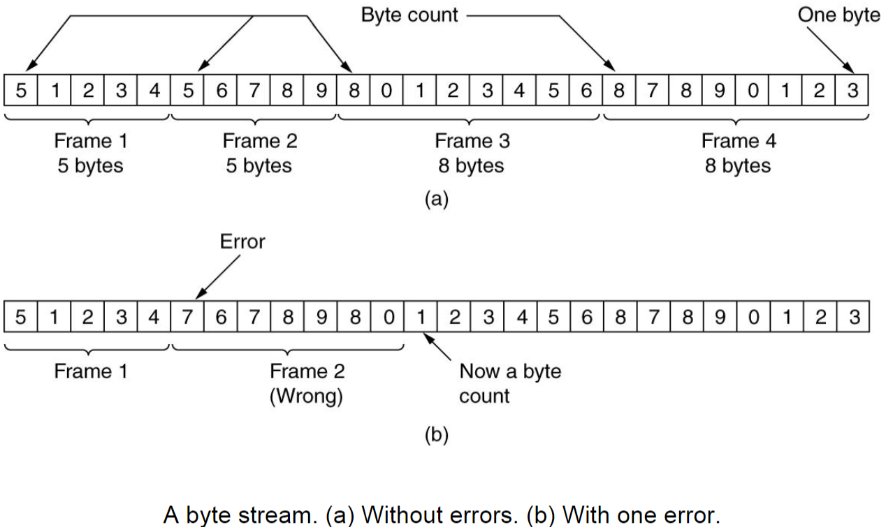
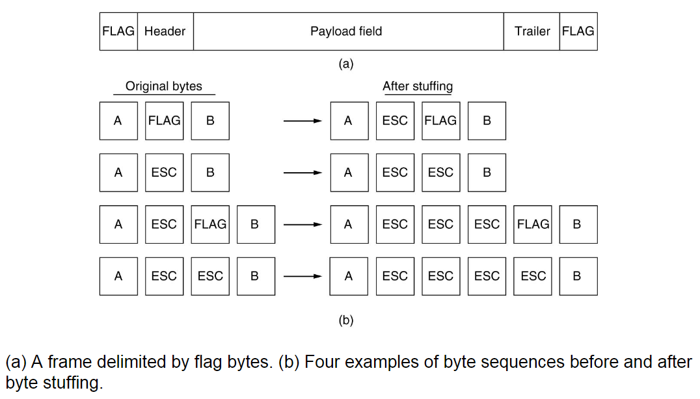
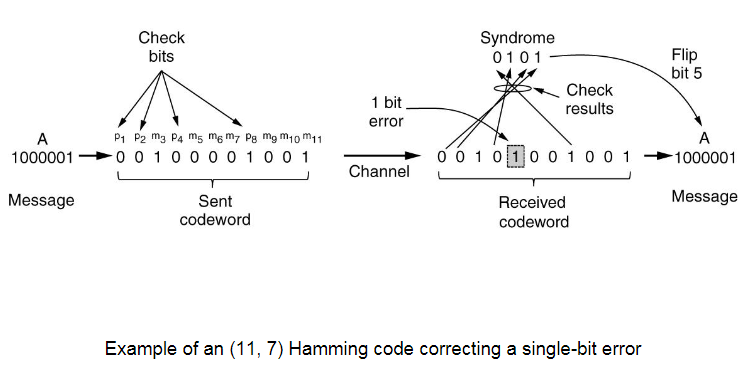
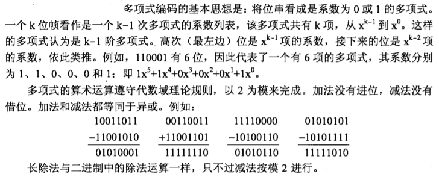
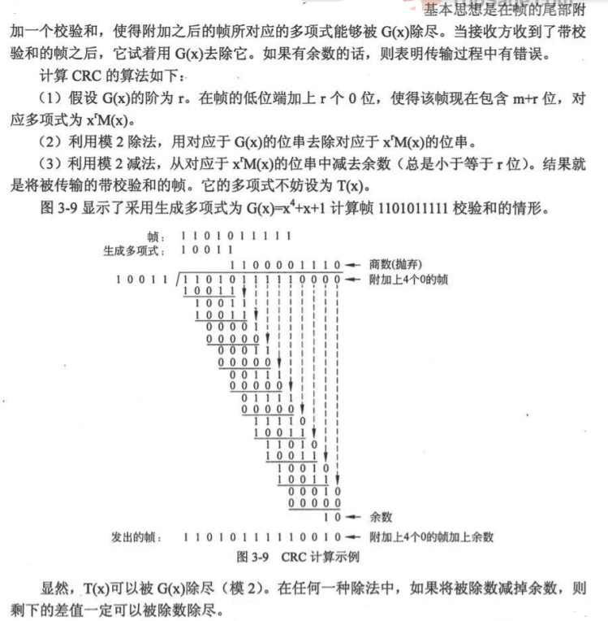
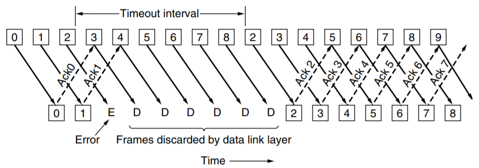

---
tags:
- ZJU-Courses
- Network
---

# Chapter 3: The Data Link Layer

!!! abstract "本章概要"
    本章主要介绍数据链路层，介绍了数据链路层如何成帧的方式，以及数据链路层关心的核心问题：差错控制和流量控制，其中有一些重要的算法和概念需要重点关注

---

## Introduction

数据链路层要实现的就是将发送方的网络层数据包通过物理层提供的服务将数据传输给接收方的数据链路层

- 差错控制：在传输过程中，如果物理层发生差错，数据链路层需要进行差错控制
- 流量控制：不同的计算机的发送和接收速度不同，数据链路层需要处理这个差异

数据链路层将网络层提供的每个数据包通过增加和修改封装成**帧**(*Frame*)，相当于封装一个数据结构

数据链路层向网络层提供的可能的服务类型：

- 无确认的无连接服务(*Unacknowledged Connectless Service*)
- 有确认的无连接服务(*Acknowledged Connectless Service*)
- 有确认的面向连接服务(*Acknowledged Connect-Oriented Service*)

---

## Framing

成帧的核心任务是设计一种能够使接收方很容易找到每个帧的起始从而将物理层传输的比特流还原成一个个帧的方案，同时这些方案还必须减小成本

通常来说，为了实现这个目的，成帧除了原始的数据之外还需要加上一些控制数据；为了达成差错校验，还需要一个校验字段

### Byte Count

字节计数法(*Byte Count*)就是在帧的开头记录包含这一个记录字节在内的帧的所有字节数

!!! note "注意"
    可以看到，字节计数法会导致出现差错时无法查找错误点，且差错会一直传递下去导致连环错误，因此通常不采用这种方法

    通常来说，字节计数法可以用在运输层上，因为运输层提供了纠错机制(TCP)，可以保证数据的无差错性

### Flag Bytes

标志字节法通常适用于使用ASCII码作为传输数据的成帧方式，可见字符通常是作为数据进行传输，不可见字符作为区别帧的开头结尾的控制字符使用

使用特殊的字节作为帧的开始和结束的标记使用，用于区分帧

标志字节法如果出现差错，不会发生错误的传导，只会丢弃这个错误帧

如果传输的数据中需要包含控制字符，需要对这些数据中的控制字符作**转义**处理

这里采用了**字节填充法**(*Byte Stuffing*)

### Flag Bits

和标志字节法类似，可以用特殊的比特组合来作为控制字符，更加减少传输成本

和转义类似，但是这里进行的是**比特填充**(*Bit Stuffing*)，即连续若干个`1`后填充`0`代表转义，以区分传输数据和控制字符

---

## Error Control

信号在物理层传输时可能出现差错或丢失，这时数据链路层需要在协议中要求接收方在接收到帧后发送一个确认(*Acknowledgement, ACK*)帧，发送方要得到确认帧后才能发送下一帧，如果超时没收到则要重新发送

差错控制主要任务为**错误检查**(*Error Detection*)和**错误纠正**(*Error Correctness*)

为了实现差错控制，需要一些额外的信息进行校验

### Error Correctness Codes

称一帧中包含$m$位数据和$r$位校验的$n=m+r$位数据块为一个**码字**(*Codeword*)

两个等长的码字中不相同的位的个数称为两个码字的**海明距离**(*Hamming Distance*)，表示一个有效码字需要出现$d$位的差错才会变成另一个有效码字

如果我们想要可靠地**检测**可能的$e$个错误，需要海明距离为$e+1$的编码方案，即任意两个有效码字之间的海明距离不小于$e+1$，这样任意的$e$个错误不可能将一个有效码字变成另一个有效码字

如果我们想要可靠地**纠错**可能的$e$个错误，需要海明距离为$2e+1$的编码方案，因为这样任意的$e$个错误发生后，原来的有效码字仍然是现在的码字距离最近的那一个

当出现了非法码字时，表明出现了错误

#### Hamming Code

海明码可以进行一个比特的纠错

!!! example "海明码实例"
    
    需要检验时，对上述并非2的幂次方位置的数字再做一次计算，如果一致则没有错误；如果位置为1、2、8的位错误，则1+2+8=11的位出错了，其他错误情况与此类似

### Error Detection Codes

#### Parity Bit

奇偶校验法，1位校验位，纠错能力只有1比特

- 奇校验码：加上校验位后1的个数为奇数
- 偶校验码：加上校验位后1个个数为偶数

#### CRC

循环冗余码(*Cyclic Redundancy Code*)，又称多项式码(*Polynomial Code*)，由发送方和接收方事先约定一个多项式，称为生成多项式$G(x)$(*Generator Polynomial*)，**最高位和最低位一定是1**，然后按照多项式除法的方式计算

需要注意这里的运算是模2运算，因此实际上就是异或操作

**运算结果的余数位数一定比生成多项式位数少1**

**接收方接收发出的帧，然后使用同一个生成多项式也进行除法，计算出来结果一定余数为0，否则就发生出错**

循环冗余的原因是在发送数据时一边计算一边发送，计算出来直接附在数据结尾即可，算完也就发完了

硬件上，位运算非常快，因此容易且快速；在软件上，通常使用查表法，以实现加速，否则在软件上一位一位算非常慢

---

## Flow Control

流量控制主要分为**反馈流量控制**和**速率流量控制**

### Stop-And-Wait Protocol

停止等待协议

发送方发出一个帧后设置计时器，计时器时长为两倍的传输时间

??? tip "两倍传输时间"
    帧发送到对方为一个时间，对方的确认帧的返回也是一个时间，因此二者加起来为两倍的传输时间

接收方收到这个帧后返回一个确认帧(ACK)，发送方接收到这个确认帧后再发送下一个帧

可能出现的错误情况：

- 接收到的帧出现错误：此时接收方在收到一个帧后进行正确性校验，如果出现错误则直接丢弃该帧，并返回一个错误码，等待重传，错误码被发送方收到后进行重发
- 发送方帧丢失：此时接收方完全没有收到这个帧，因此不会做出任何响应，发送方接收确认帧超时，进行重发
- 接收方确认帧丢失：此时发送方没有正确接收到确认帧，因此超时，进行重发，而接收方已经收到了正确的帧，此时它**期望收到**下一个帧，但是又收到了发送方重发一次的正确帧，此时出现重复帧，对重复的帧进行丢弃，同时重发确认帧

### Piggybacking

上面的停止等待协议中，两条信道被用于传输，一条传送数据帧，一条传送确认帧

实际中，为了增大信道的利用率，往往是双向通信，因此可以使用**捎带确认**协议，即将确认帧包含在返回发送数据帧的帧头中，以实现双向通信

### Sliding Window Protocols

注意到上述所讲的停止等待协议中，一帧的发送需要经历发送-确认这样一个来回，其中有很多时间消耗在等待上而没有很好利用起来，导致信道利用率很低，因此引出滑动窗口协议

在等待确认帧的过程中，发送方发送一组下一波要发送的帧，即一次性发送一组帧，称为**发送窗口**(*Sending Window*)，接收方维护一组接收的帧，称为**接收窗口**(*Receiving Window*)，这两个窗口大小不必相等，但是是固定的

发送方每收到一个确认帧，就把发送窗口向前滑动一个位置，如果没有可以发送的帧了（帧发完了或这一组发完了但是还没收到确认帧）就停止发送

接收方每接收到一个帧，如果在接收窗口内就接收，否则丢弃

!!! tip "注意到"
    停止等待协议可以视作发送窗口和接收窗口大小均为1的滑动窗口协议

#### Go-Back-N

回退N协议(*GBN*)是一种滑动窗口协议，其中$N$代表发送窗口的大小，而这种协议中的**接收窗口大小始终为1**

引入这种协议是为了应对滑动窗口协议出现错误的情况

当当前发送窗口的第一帧发送后，启动第一帧的计时器，如果这个计时器超时后还没有接收到确认帧，那么所有这一组里面后续发的帧全部退回，重新发送

注意发送帧的序号都是循环滚动使用的，即序号取值为$0\leq\text{seq}\leq\text{MAX\_SEQ}$，那么**发送窗口的大小最大为$\text{MAX\_SEQ}-1$**，否则新一轮帧发送出来的时候，接收方没有办法判别新一轮的第一帧是来自新的一轮还是旧一轮的重发

!!! note "发送帧序号"
    发送帧的Sequence number field length如果是3bit，那么$\text{MAX\_SEQ}=2^3-1=7$

#### Selective Repeat

选择重传协议(*SR*)，是GBN的一种优化，因为当错误频发时，全部退回会导致效率低下，因此使用这种协议

发现哪一帧没有正确接收，接收方就返回一个NAK，发送方接收到这个帧后就重传对应的帧，而其它正确发送的帧不受影响

在选择重传协议中，**接收窗口大小和发送窗口大小一致**，需要保证接收方移动窗口前后的序号没有重叠，因此**接收窗口的大小不能大于$\dfrac{1}{2}(\text{MAX\_SEQ}-1)$**

---

## Protocols

### HDLC

HDLC是一种比特传输协议，每个帧的开始和结束使用序列`01111110`标识，同时发送方的数据链路层在数据中每连续5个`1`就填充一个`0`，接收方在数据字段中发现`111110`后就丢弃最后一个`0`

### PPP

点对点传输协议(*Point-To-Point Protocol*)，其实源自于HDLC协议

HDLC支持多用户，而PPP显然是点对点，所以其地址字段改为`0xFF`，表示广播

PPP是字节传输协议，标志字节沿用HDLC的`0x7E`，但填充方式略有不同

在数据字段中发现`0x7E`会被转义成`0x7D 0x5D`

Internet使用PPP作为点到点线路的主要数据链路层协议，PPP提供了无连接的无确认服务，错误检测采用[CRC](Chapter3.md#CRC)
