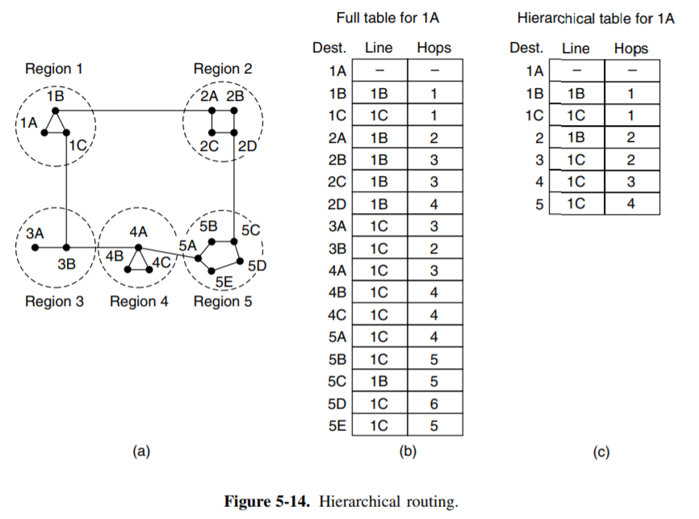

---
tags:
- ZJU-Courses
---

# Chapter 5: The Network Layer

!!! abstract "本章概要"
    本章主要介绍网络层，重点需要关注不同的路由算法，IP协议特别是IPv4，以及一些IP相关的技术如NAT、CIDR，还需要关注一些网络控制协议，如ARP和ICMP，除此之外还有MPLS，剩下的部分大多都是了解即可，如流量管理和服务质量的部分

---

## Introduction

链路层完成了在同一个网络中如何把帧从一个节点传输给另一个节点，或者从线路的一边传送到另一边，而网络层则考虑如何将数据包从发送方一路发送到接收方，在这个过程中，数据包可能会跨越不同的网络

使用一些中间设备可以把两个不同的网络连接起来，在链路层中介绍到的网桥、交换机等中间设备，实际上只是扩大了网络，并没有连接不同的网络，因此这部分任务实际上留给了网络层

在网络层，新的中间设备被引入：**路由器**(*Router*)，负责连接不同的网络，为跨网络传输的数据报根据其目的地找到一条路径，并对应转发

进行数据包的传输可以分为数据报网络(*Datagram Network*)和虚电路网络(*Virtual-Circuit Network*)：

- 数据报网络主要是面向无连接的传输，每个数据报保存其目标地址，每个路由器根据该目标地址进行寻路
- 虚电路网络主要是面向连接的传输，虚电路希望选择一个固定的路径，建立一个连接，为数据包选择一条路，每个数据包保存一个连接标识符而不是目标地址，因为连接已经建立

路由器内部会维护一个路由表，维护的方式分为静态维护和动态维护

- 静态维护：由管理员设置路由器的连接表
- 动态维护：路由器之间互相通信，自动建立连接表

除了连接不同网络和实现路由转发外，网络层还关心拥塞控制(*Congestion Control*)和服务质量(*Quality Of Service*)

!!! note "存储-转发(*Store-And-Forward Switching*)"
    一台终端将数据包发送给最近的路由器，无论通过局域网还是网络应用供应商(*ISP*)提供的点对点链路

    数据包保持存储，直到这个数据包发到了下一个路由器并且完成数据校验，这时数据包才沿着路由往前传播，直到达到最终目的地

    

---

## Routing Algorithms

路由器的功能是**路由**(*Routing*)和**转发**(*Forwarding*)

- 路由是指根据特定的路由算法构造出路由表，同时不断进行更新维护
- 转发是指根据到来的数据包的内容查询路由表并从合适的端口转发出去。

### Shortest Path

最短路算法，通常为Dijkstra算法

### Flooding

把所有的包全部发出去，适合广播路由，使得网络中每个角落都有数据包

广播路由可能导致网络中有很多重复的包，基于此的路由拓扑图中有环，因此最终状态应该是形成一个广播树，树根为路由源点，这样的树形结构避免了环的出现，也就避免了重复包的出现

### Distance Vector Routing

距离向量算法，考虑到路由器之间并不是都互相邻接的，因此每个路由器维护一个到其它路由器的距离的表

如上图所示，每个路由器内部有一个表，表示其到其它路由器的距离

最开始每个路由器的表是空的，此时路由器刚刚开机，路由器发送一个广播包或多播包，用于与周边其它直连或同一子网内的路由器进行通信

!!! note "广播🆚多播"
    - 广播(*Broadcast*)就是向周边所有终端发送消息
    - 多播(*Multicast*)就是向周边一部分终端发送消息

其它路由器接收到这个开机的广播包或多播包后做出一个响应，告诉这个路由器其表的信息，这些数据经过交换后用于新开机的路由器建立自己的距离向量表

通过不断的交换数据，新的路由器就逐渐建立了自己的距离向量表，并在之后每过一定时间重新互相通信，以更新路由表

!!! danger "距离向量的问题"
    
    如上，可以注意到如果出现了新的路由器，非常快就能够重新更新整个网络内的距离向量

    但是如果网络中某个路由器发生错误，这会导致需要大量的数据交换才能更新，根源是因为数据交换时，距离向量表内并没有告诉其它路由器这个距离所经过的路由器是哪个，而只告诉对方到该路由器的距离
    !!! tip "被动防护"
        为了防止这样的问题发生，可以设置一个Holding Time，即每次不马上进行路由器之间的信息交换，而是隔一段时间再交换，以防止路由器之间一直在兜圈子交换包

### Link State Routing

每个路由器与其邻接路由器交流，了解对方网络地址和交流成本，将这些信息构造成数据包，发送给其它所有路由器，也接收其它路由器的数据报，根据这些数据包在本地构造出整个网络的拓扑，并利用最短图算法算出到每个路由器的最短路径

1. 与邻居交流
2. 计算连接成本
3. 建立链路状态数据包
4. 分发链路状态数据包
5. 计算新路径

!!! note "问题处理"
    

### Hierarchical Routing

当网络非常大时，分区治理，减少路由器大量的多播

- 在区域内，一切正常
- 在区域外，整个区域被看作一个路由器

---

## Internet Protocol

### IPv4

Internet上的每个host和router都有IP地址，但是IP地址指向的不是一台机器，而是一个网络接口界面，如路由器有多个接口，每个接口都有一个IP地址

IP数据报的报头最小长度为20字节

- Identification：每个IP包全球唯一，不会变，唯一标识这个IP包
- Total Length：16位，表示整个IP数据报的长度，包括首部和数据之和，单位为字节
- MF(*More Fragments*)：MF是Flags字段中的最低位，用来指示一个数据报是否还有后续的分片
    - MF=1表示后面还有分片的数据报
    - MF=0表示这是数据报片中的最后一片。
- Fragment Offset：占13位，用来表示较长的分组在分片后，**某片在原分组中的相对位置**。这个字段以8个字节为偏移单位，也就是说，每个分片的长度一定是8字节的整数倍；对于第一个分片，其fragment offset值为0

#### IP Address

IP地址具有层次性，**每个32位地址都由网络部分和主机部分组成**，网络部分称为前缀(*Prefix*)

!!! warning "特殊地址"
    主机部分全0和全1这两个主机地址是特殊地址，全0代表这个网络本身，全1代表这个子网的广播地址，因此在配置ID时需要保留

同一个网络下的所有主机的网络部分都相同

主机部分的长度由**子网掩码**(*Subnet Mask*)决定

!!! example "确定IP范围"
    135.46.56.0/22的IP范围的确定方式如下：

    - 子网掩码为`255.255.252.0`，即主机部分的长度为$32-22=10$位，所以网络地址为前22位，即`135.24.56.0`
    - 这个子网下的所有主机都是这个网络内的，即最后10位从`#!Verilog 10'b0`到`#!Verilog 10'b11_1111_1111`，即`135.46.56.0 - 135.46.56.255`

#### Classful Addressing

IP地址的分层

这种固定的网络划分方法后来出现了一些弊端，因此使用子网掩码在主机部分进行进一步划分，将主机部分划分成子网部分和主机部分

特殊的IP地址：

#### Private And Public

公网IP就是整个互联网中唯一的IP地址，可以被全球任何地方的设备识别和访问，而私网IP只在局域网内部使用

因为公网IP数量有限，因此为了保证全球唯一性，需要使用NAT技术来扩展

私网IP有特定的范围

- A类：`10.0.0.0 - 10.255.255.255`
- B类：`172.16.0.0 - 172.31.255.255`
- C类：`192.168.0.0 - 192.168.255.255`

这三种私网地址不会出现在公网上

公网IP地址和私网IP地址之间的转换通常使用路由器上的NAT技术实现，当私网中的设备需要与互联网通信时，路由器会将私网IP映射到一个公网IP地址上

### NAT

简单来说，NAT(*Network Address Translation*)就是网络地址转换，它允许在本地网络中使用私有地址，在连接到互联网时使用全局IP地址

广义的NAT是地址转换和端口转换的结合

NAT路由器在两个访问方向上完成两次地址的转换或翻译，出方向做源信息替换，入方向做目的信息替换。

NAT的映射方法包括静态映射和动态映射，静态映射为内部地址一对一转换成内部全局地址，动态转换是指将内部网络的私有IP地址转换为公用IP地址时，IP地址是不确定的，是随机的

### CIDR

无类域间路由(*Classless Inter-Domain Routing*)，为了解决路由表过大的问题而在路由器上进行IP的合并

CIDR引入了可变长度的子网掩码(*VLSM*)，使用前缀长度来表示IP地址的网络部分的位数

IP转发主要通过路由表实现，而路由表的原理是对于每一个得到的IP地址，将其与之子网掩码进行按位与运算，得到其网络部分，然后决定路由器的下一跳的目的

子网掩码的长度越长，优先级越高

为了防止路由表过大，将可以合并的路由表进行合并

!!! example "合并路由"
    将`10.0.0.0 - 10.0.255.0`合并为`10.0.*.*`，这样对于每次进来的IP，不需要进行24位运算而只需要比较前面16位即可，加快了运算

### IPv6

IPv6的地址都是16字节

IPv6为了兼容IPv4，在中间字段设置IPv4

---

## Internet Control Protocols

### ARP

地址解析协议(*Address Resolution Protocol*)是一种用于建立IP与MAC的映射的TCP/IP协议，在局域网中，数据传输依赖于MAC地址，而ARP协议的作用就是将网络层的IP地址转化为数据链路层的MAC地址，以便在网络中正确地传输数据帧

ARP的工作流程：

1. 当一台主机需要向另一台主机发送数据时，它首先会检查自己的ARP缓存表，看是否已经有了目标IP地址对应的MAC地址
2. 如果ARP缓存表中没有目标IP地址的条目，或者条目已经过期，主机就会发送一个ARP请求的广播包，询问网络上的所有主机，以获取目标IP地址对应的MAC地址
3. 网络上的所有主机接收到ARP请求后，会检查请求中的目标IP地址是否与自己的IP地址匹配
4. 如果匹配，主机就会发送一个ARP应答包给发送请求的主机，应答包中包含了自己的MAC地址
5. 发送请求的主机收到ARP应答后，会将目标IP地址和对应的MAC地址存入自己的ARP缓存表中，以备将来使用

跨路由器的ARP请求

如上，经过一个路由器后，IP地址和MAC地址可能会发生变化，这时中间的路由器进行转发导致的

### ICMP

互联网控制消息协议(*Internet Control Message Protocol*)，用于在IP主机、路由器之间传递控制消息，用于提供有关网络通信的反馈

---

## Inter-Connect

在异构网络中如何实现转发呢，可以通过**隧道**(*Tunnel*)技术和MPLS实现

!!! note "MTU"
    MTU(*Maximum Transmission Unit*)是数据链路层能够传输的最大数据帧的大小，如果要发送的数据包超过了其最大值，就需要对报文进行分片
    ??? example "MTU实例"
        > Suppose that host A is connected to a router R1, R1 is connected to another router, R2, and R2 is connected to host B. Suppose that a TCP message that contains 900 bytes of data and 20 bytes of TCP header is passed to the IP code at host A for delivery to B. Show the Total length, MF, and Fragment offset fields of the IP header in each packet transmitted over the three links. Assume that link A-R1 can support a maximum frame size of 1024 bytes including a 14-byte frame header, link R1-R2 can support a maximum frame size of 512 bytes, including an 8-byte frame header, and link R2-B can support a maximum frame size of 512 bytes including a 12-byte frame header.
         
        Solution:
        - **A → R1**：不分片，总长度 = 940 字节，MF = 0，Fragment Offset = 0
        - **R1 → R2（片段 1）**：总长度 = 504 字节，MF = 1，Fragment Offset = 0
        - **R1 → R2（片段 2）**：总长度 = 456 字节，MF = 0，Fragment Offset = 60
        - **R2 → B（片段 1）**：总长度 = 500 字节，MF = 1，Fragment Offset = 0
        - **R2 → B（片段 2）**：总长度 = 44 字节，MF = 0，Fragment Offset = 60

### Tunnel

!!! warning "注意"
    实现隧道的前提是两端的网络是同一种网络类型，否则解包后无法理解

上图是一种隧道技术，实现了两个IPv6的IPv4中介转化，使得两个IPv6的网络能够互相基于IPv4进行通信，本质上是由中间方进行协议包的套壳，将IPv6包套上一个IPv4的壳

VPN也是采用隧道技术，使用VPN软件将外网的包封装起来，然后登录到路由器上进行解包，其实就是得到了一个分配的内网IP，相当于有了一个内网的IP，就可以在内网通行

### MPLS

多协议标签交换(*Multi-Protocol Label Switching*)为网络提供了更高效灵活的数据包传输方式

MPLS数据包的格式其实就是在数据链路层的字段和网络层的字段中间插入一个MPLS字段

每个进来的数据包需要对IP地址和子网掩码进行查看再转发，因此速度不快，而MPLS相当于给每个数据包贴一个标签(*Label*)，这样每次每个路由器对每个数据包查看标签，再根据标签进行转发，就会快很多

MPLS网络的模式如下

通常来说，MPLS适用于骨干网络，在骨干网络中路由器数量很少，因此每次对每个包查看IP地址和子网掩码做运算后再转发不如直接针对标签进行转发

---

## Routing Protocols

不同的路由协议主要决定了如何确定路由路径，它们的算法、度量方式是如何实现的

### OSPF

开放式最短路径优先(*Open Shortest Path First*)，也称为IGP(*Interior Gateway Protocol*)，是一种广泛使用的动态路由协议，属于链路状态路由协议，能够实现动态路由选择、快速重构路由、路由优化和管理等功能

OSPF使用最短路径算法（即Dijkstra算法），当网络拓扑结构发生变化时，可以迅速计算新的路由，从而避免产生路由环路

OSPF支持多种距离度量，支持多种路径之间的负载平衡

OSPF支持根据IP包的不同服务使用不同的路由方式，从而更好地传输实时流量

OSPF支持层次区域划分

OSPF支持安全认证功能，路由器之间的报文必须经过配置经过认证才能进行交换

### RIP

路由信息协议(*Routing Information Protocol*)是一种基于距离向量算法的动态路由协议，主要用于小型网络

RIP协议通过广播方式进行网络拓扑发现，周期性地广播自己的距离向量表给相邻的节点，并通过不断的广播与更新，节点可以逐渐了解整个网络的拓扑结构

RIP的工作原理如下

- RIP路由器首先学习到自己的直连路由，并更新到路由表中
- RIP协议以30秒为周期向相邻的其他路由器发送路由表信息，同时接收邻居路由器发来的路由信息，并根据这些信息更新自己的路由表
- **RIP使用“跳数”作为路由度量，认为经过越少的路由器即为最优路径**，RIP规定最大跳数为15跳，超过15跳的路由将被标记为不可达，16跳则表示无限大或不可达

---

## Traffic Management

拥塞(*Congestion*)就是当流量达到一定程度时会出现堵塞

- 流量感知路由(*Traffic-Aware Routing*)：对每条路由进行流量感知，以防止出现拥塞
- 控制许可(*Admission Control*)：当路由拓扑中出现拥塞时，把拥塞的部分从拓扑图中剪去，选择其它没有拥塞的路由
    - 实现的前提是部分建立连接，否则无法感知整个拓扑的结构
- 流量整形(*Traffic Shaping*)：当流量拥挤时，进行整型，可能输入的流量速率会远大于输出的速率
    - 相当于在一个高速水龙头下放一个水桶进行输出速率限制
    - 流量过大可能会造成流量溢出
- 显式拥塞通知(*Explicit Congestion Notification*)：拥塞后告诉主机发生了拥塞，主机知道后就降低发送量以减少拥塞

---

## Quality of Service

### QoS

不同的应用程序的服务质量及其要求如下

根据不同的服务需求提供不同的服务质量

- 电话要求恒定速率
- 视频会议要求实时可变速率
- 电影要求非实时可变速率
- 文件传输要求可用就行

### Packet Scheduling

路由器中最宝贵的资源：

- 带宽
- 缓冲区
- CPU

因此，需要对路由器转发的包进行合理的规划和调度

- 先进先出(FIFO)
- 公平队列
- 权重队列

赋予权重后，每个包的完成时间为到达时间加上长度除以权重后的和（查看上图中的C）
