---
tags:
- ZJU-Courses
---

# Chapter 6: The Transport Layer

!!! abstract "本章概要"

---

## Introduction

运输层的运输单位为PDU，即segment

传输层通过端口(*Port*)来标记应用进程，从而实现端到端的通信，实现一台主机上的应用程序与另一台主机上的应用程序的通信

端口有16比特，可以表示65535个不同的端口号

!!! note "SAP(*Service Access Point*)"
    网络层的SAP为NSAP，即IP；运输层的SAP为TSAP，即Port

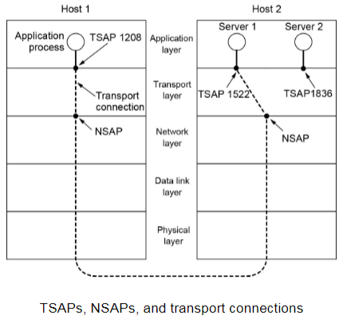

网络层提供的服务是ISP决定的，而运输层的服务由用户内核实现，可以由应用程序自己决定运输层的协议来确定服务质量

传输层是面向通信部分的最高层，负责向应用层提供一组接口

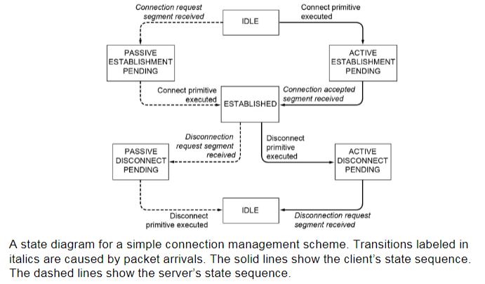

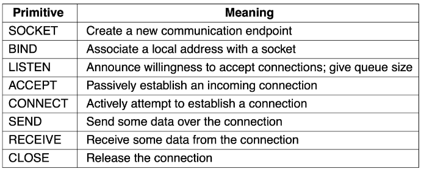

### Connection

建立连接

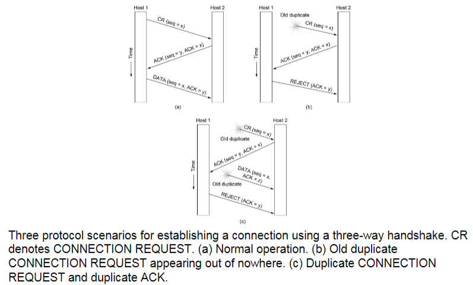

释放连接

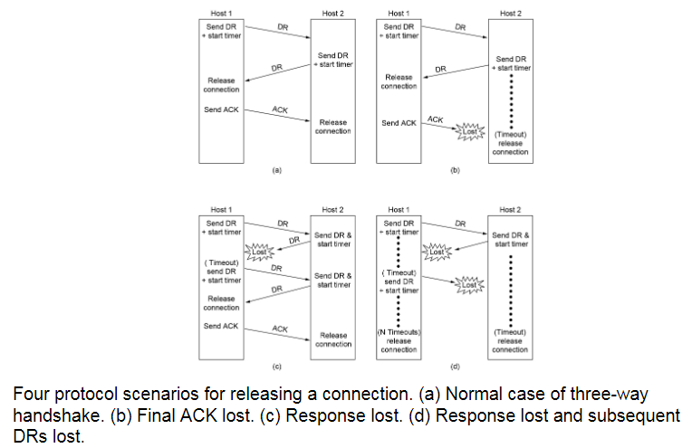

三次握手从这里出现

### Flow Control

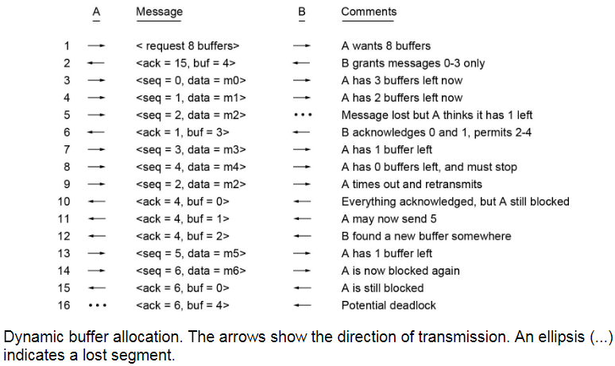

通过缓冲区空余数量进行发送方的流量控制

### Multiplexing

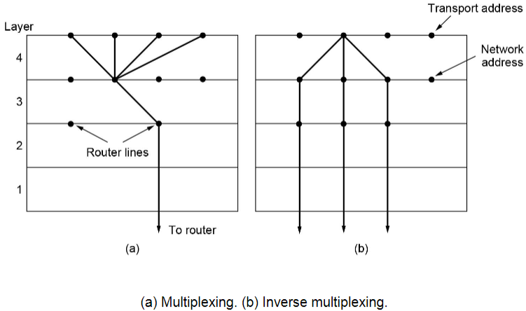

可以多个端口映射到同一个IP上，也可以一个端口的数据通过多个网络发送

### Crash Recovery

很难做到出现故障后100%恢复

不同的故障恢复策略有不同的结果

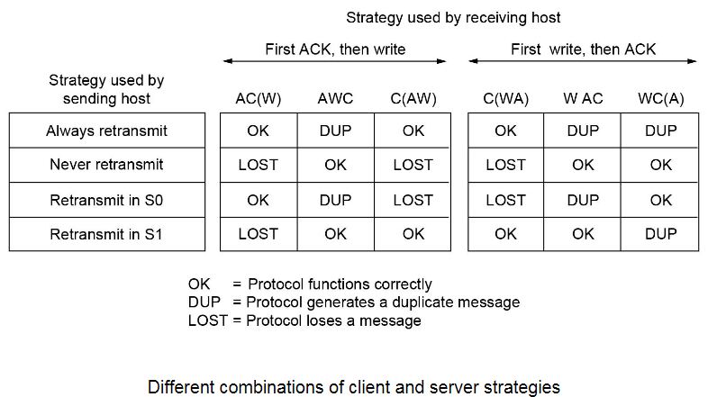

### Congestion Control

出现拥塞的原因是发送的数据量过大

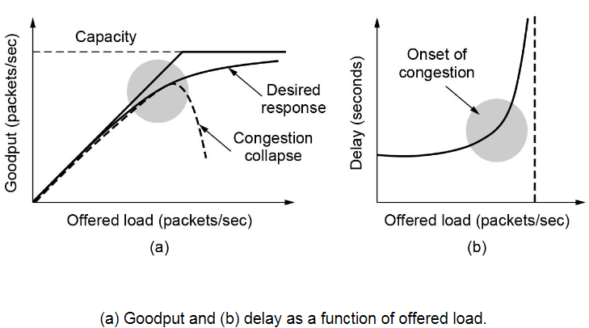

不同的传输层协议对拥塞检测和发送速率的实现不同

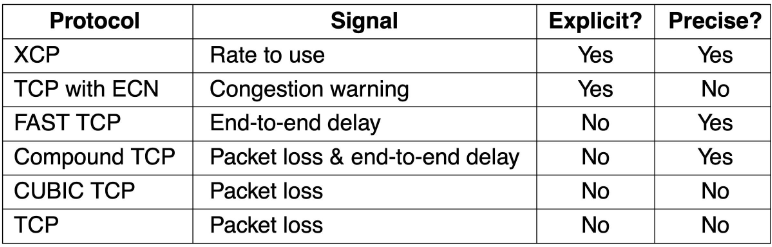

---

## UDP

UDP是无连接的非可靠传输层协议，不进行流量控制和拥塞控制，所有维护可靠性的工作都应该由应用层完成

UDP是面向报文的，发送的数据报有边界

UDP头部：

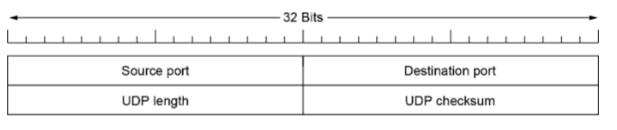

伪头部：

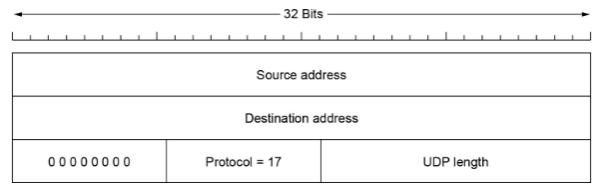

UDP适合一次性传输数据较少的网络应用，也适合那些可靠性不那么重要但不能容忍延迟的应用

### RPC

客户端调用的函数在远程服务器中，需要调用远程过程调用(*Remote Procedure Call*)

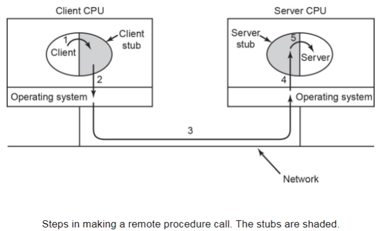

适合客户端能力较弱，需要依赖远程服务端来完成功能

### RTP

实时传输协议(*Real-Time Transport Protocols*)，适用于多媒体数据传输

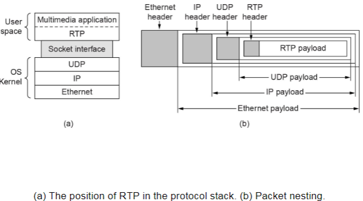

RTP不需要建立连接，但实际上有个数据流，如同媒体数据流一样

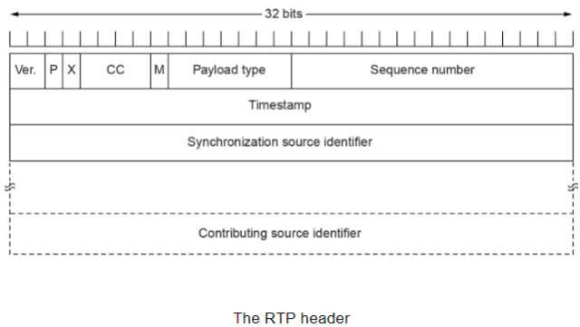

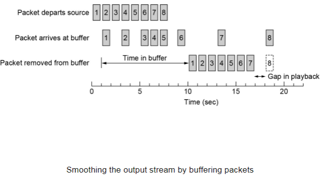

---

## TCP

TCP是面向连接的，一对一通信，提供全双工通信，解决传输的可靠、有序、无丢失、不重复

TCP服务模型是字节流，所有数据进来时进入一个缓冲区，数据之间没有边界

!!! note "一些常用协议及其端口号"
    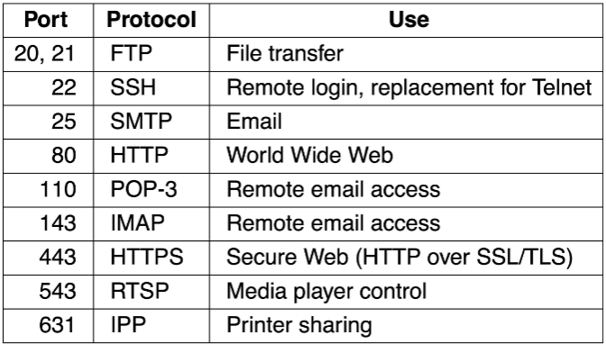

TCP的头部格式：

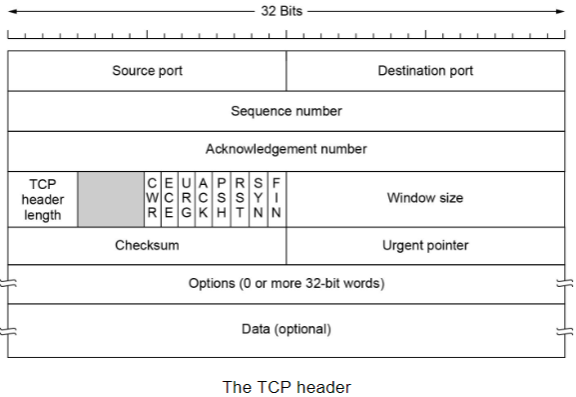

- Sequence Number：以字节计数的数据包编号
- Acknowledgement Number：期望收到的下一个数据包的编号
- ACK：置1时有效
- SYN：置1时表示请求连接或接受连接，配合ACK一起完成三次握手
- FIN：置1时表示发送方数据已经发送完毕，要求释放传输连接
- PSH：置1时表示接收端在接收到数据包后应当尽快交付给应用程序而不是等到缓冲区满了才交付
- RST：置1时进行重置连接
- Window Size：表示允许对方发送数据量的大小

???+ example "TCP头部参数"
    !!! example "三次握手"
        - `SYN = 1`，`ACK = 0`表示请求连接
        - `SYN = 1`，`ACK = 1`表示连接接受

    !!! example "数据包编号"
        如果当前数据包编号为`300`，发送的数据长度是`100B`，那么这个数据包就包含了第`301`到第`400`个字节，下一个数据包的编号就是`401`，接收方的`ACK`就应该是`401`

    !!! example "窗口大小"
        当前接收方发送的ACK序号为`701`，窗口大小为`1000`，就表示允许对方发送`701`到`1700`这些字节

### Connection

建立连接的过程如下：

1. 请求连接`SYN = x`
2. 确认连接`SYN = y, ACK = x + 1`
3. 确认`SEQ = x + 1, ACK = y + 1`

其中前两次握手的数据包不包含数据

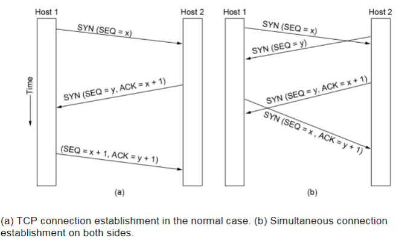

!!! note "TCP连接的状态表"
    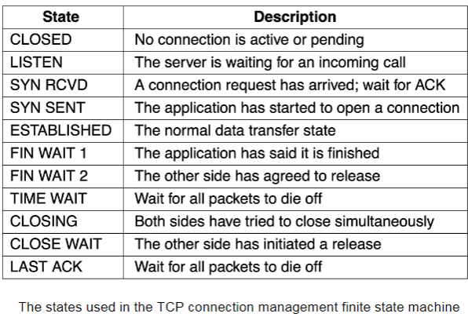

TCP建立连接与释放连接的状态机：

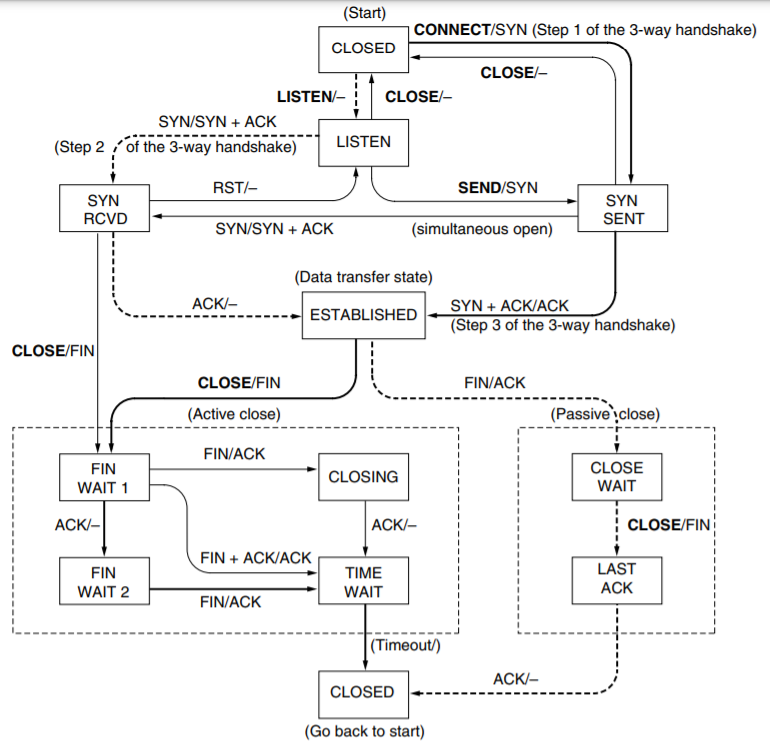

### Timer Management

TCP提供可靠的传输保障，因此会有一个**超时重传**机制，每次发送方维护一个计时器，如果超过重传时间(*Retransmission Time-Out, RTO*)，就会重传这个数据包

!!! tip "关于RTO的设置"
    值得讨论的是重传计时器的RTO该如何设置，由于网络的不确定性，每个数据包的往返时延(*Round-Trip Time, RTT*)都是不确定的，动态变化的，因此RTO也需要根据RTT进行动态调整
    - 如果RTO < RTT，会触发大量重传，造成拥塞和资源浪费
    - 如果RTO > RTT，会出现频繁丢包，重传不及时，造成网络时延大

    因此RTO通常略大于RTT

### Window Management

使用循环缓冲区接收数据，并告知发送方剩余缓冲区大小，以控制下次发送数据的大小不超过剩余缓冲区大小

如果要发的数据比剩余缓冲区大，可能需要等待缓冲区大小更新到合适时再发送

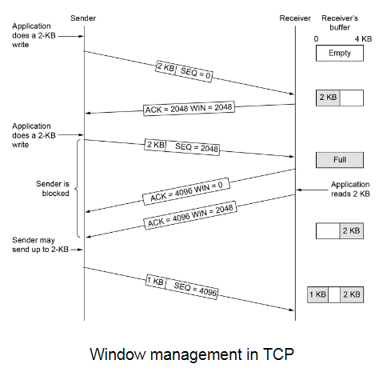

### Congestion Control

延迟增加就是网络拥塞的表象

#### Slow Start

慢启动通过发送包感知拥塞状况

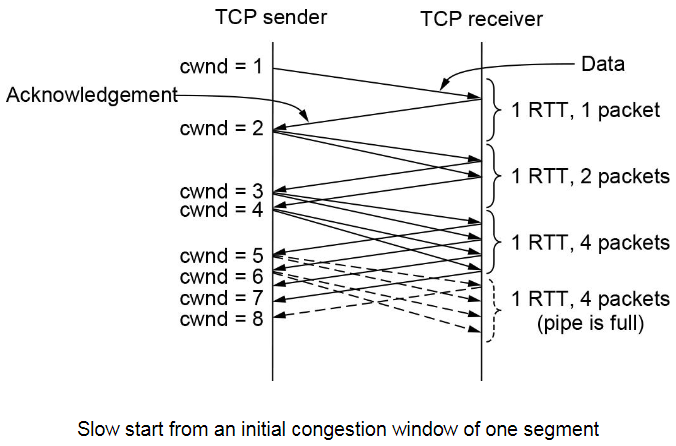

看起来是指数增长类型

#### Additive Increase

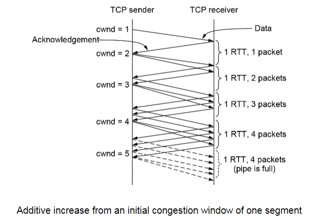

#### Selective Acknowledgements

选择确认，确认一个包时同时附带确认多个包，减少发送ACK包的次数

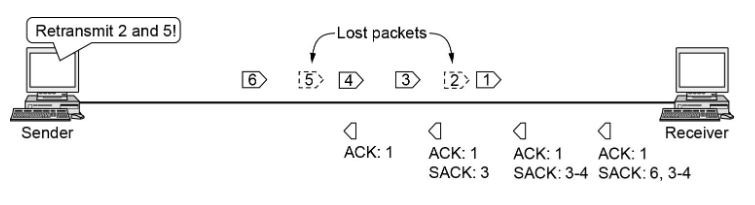
