---
tags:
- ZJU-Courses
---

# Chapter 7: The Application Layer

!!! abstract "本章概要"

---

## DNS

域名系统(*Domain Name System*)

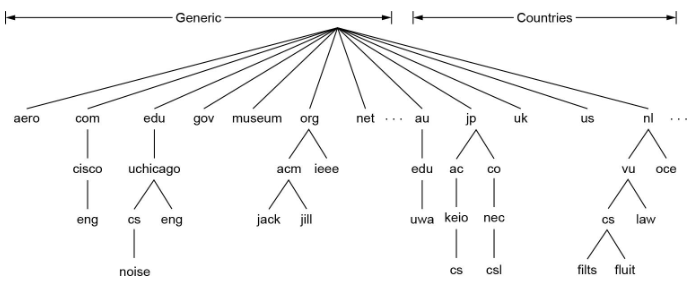

本机的`hosts`文件保存了适用于本地的域名与对应IP

DNS查询时用的一些字段属性

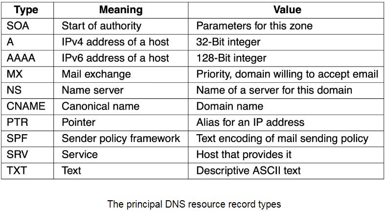

DNS域名解析过程：

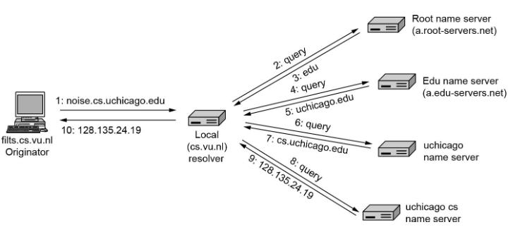

---

## Email

### Architecture And Services

邮件系统的整体架构如下：

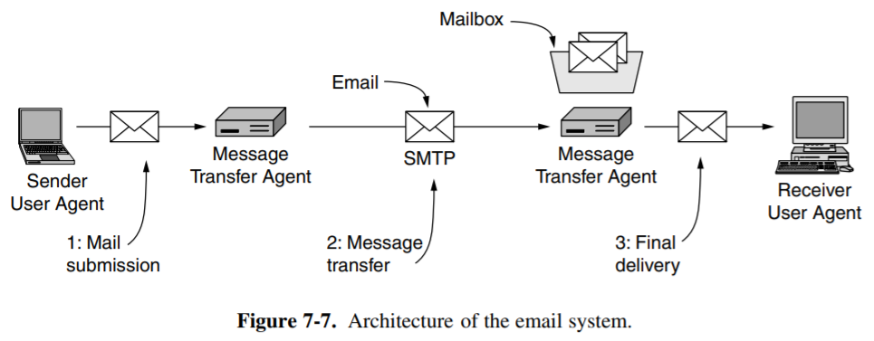

其中

- UA(*User Agent*)，是读取邮件给用户看的程序
- MTA(*Message Transfer Agent*)，负责发送和接收邮件，同时向发送方反馈情况

总体流程为

1. 发送方用UA编辑好后通过SMTP协议给MTA
2. 邮件进入MTA缓存
3. SMTP客户端进程定期扫描MTA缓存，发现后与接收端SMTP服务器建立TCP连接，端口号为25
4. TCP连接建立好后SMTP开始发送邮件，发完后SMTP关闭TCP连接
5. 接收端MTA的SMTP进程收到邮件后放到收信人的用户邮箱中
6. 收信人打算收信，调用UA，通过POP3或IMAP取回邮件

### Message Formats

邮件的一些属性

#### RFC 5322

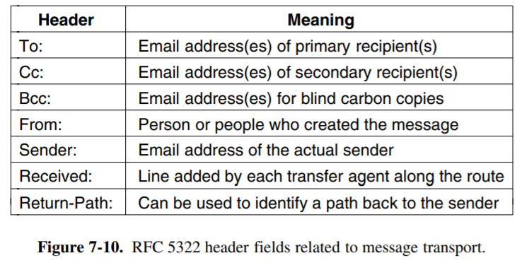

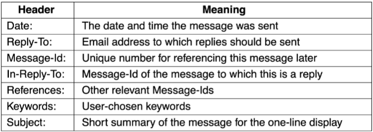

#### MIME

由于SMTP只能传送一定长度的ASCII码邮件，许多非英语国家的文字无法传送，且无法传送可执行文件及其它二进制对象，因此提出了多用途网络邮件补充(*Multipurpose Internet Mail Extensions, MIME*)

MIME并未改动SMTP或取代之，继续使用目前的格式，但增加了邮件主体结构，并定义了传送非ASCII码的编码规则

定义了新的邮件首部字段：

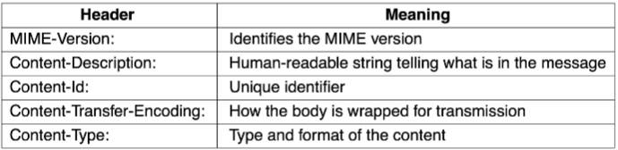

定义了许多邮件内容的格式：

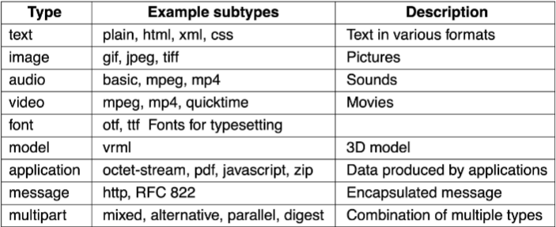

定义了传送编码，可以对任何内容格式进行转换，而不会被邮件系统改变

### SMTP

简单邮件传输协议(*Simple Mail Transfer Protocol*)是一种ASCII码协议，基于文本

可能导致垃圾邮件

### POP3

使用TCP，端口号为110

可以离线看，可以从服务器下载到本地，之后可以从服务端删除，也可以选择保留

### IMAP

POP3改进版，使用TCP，端口号为143

服务器和本地完全一致，连上就可以看邮件

---

## WWW

万维网(*World Wide Web*)，由网页组成，观看的程序是浏览器

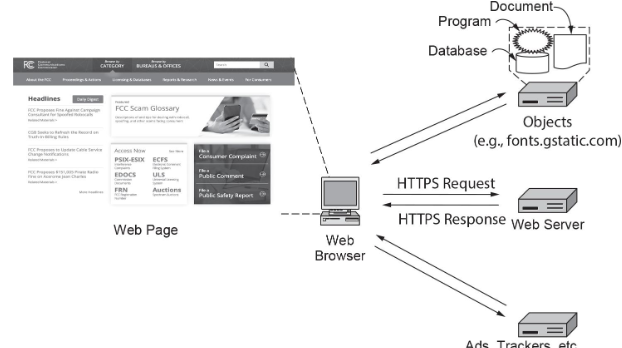

使用了前端服务器的Web服务器，所有的客户端的请求都发送到这个前端服务器，由这个前端服务器向服务器部分的各个子服务器转发，然后各个子服务器处理后返回的响应再返回到前端服务器，由其再转发给对应客户端，这样可以突破服务器的限制，有多台服务器

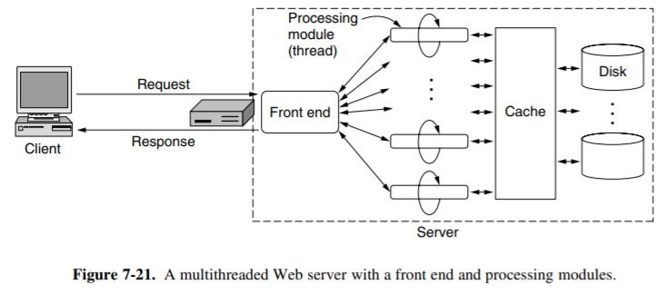

### URL

统一资源定位符(*Uniform Resource Locator*)

```txt
<protocol>://<host ip>:<port>/<path>
```

其中协议部分的默认值为http/https

基本流程：

1. 浏览器确定URL
2. 浏览器进行DNS查询获取服务器IP
3. 浏览器建立TCP连接
4. 发送HTTP请求
5. 服务器响应页面请求
6. 浏览器获取其它必需的URL
7. 浏览器渲染页面
8. 释放TCP连接

### HTTP && HTTPS

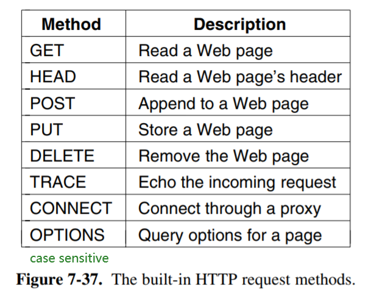

响应码：

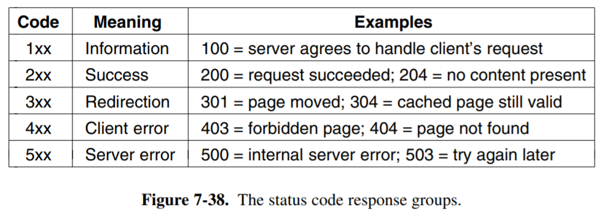

连接建立：

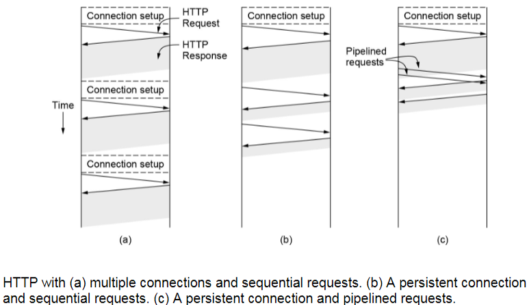
