---
tags:
- ZJU-Courses
---

# Chapter 5: CPU Scheduling

---

## Basic Concepts

CPU调度等价于进程调度，为了实现多道，提升CPU利用率

### Three-level Scheduling

- 高级调度(*Long-Term*)：根据某种算法，从后备队列中将某些作业调入内存，为它们创建进程、分配必要资源、放入就绪队列
- 中级调度(*Mid-Term*)：根据某种算法，将那些暂时不能运行的进程调至外存中等待（挂起），当条件具备时将它们重新载入内存
- 低级调度(*Short-Term*)：根据某种算法，从就绪队列中选取某个进程进入处理机执行

### CPU Scheduler

- 非抢占式(*Non-preemptive*)调度：调度程序把处理机分配给某进程后一直让它运行，直至某事件发生而阻塞或进程完成时才分配处理机给另一个进程
- 抢占式(*Preemptive*)调度：当一个进程运行时，系统可以基于某种原则（优先权原则、短进程优先原则、时间片原则）剥夺并重新分配处理机给其它进程

### Dispatcher

调度程序包括：

- 切换上下文
- 切换到用户态
- 跳转至用户程序的特定位置重新启动程序

调度延迟(*Dispatch Latency*)：调度程序停止一个进程到启动另一个进程所需要的时间

---

## Scheduling Criteria

调度算法有一定的选择准则

### User-Oriented

面向用户的选择准则

- 周转时间(*Turnaround Time*)：进程从提交到完成所经历的时间，包括CPU执行时间、就绪队列和阻塞队列中等待时间
- 响应时间(*Response Time*)：从进程提出请求到首次被响应的时间段
- 等待时间(*Waiting Time*)：进程在就绪队列中等待的时间总和
- 截止时间：开始截止时间与完成截止时间

### System-Oriented

- 吞吐量(*Throughput*)：单位时间内完成的进程数
- CPU利用率(*Utilization*)：使CPU尽可能忙碌
- 各种设别的均衡利用：CPU的繁忙和I/O繁忙进程的搭配

### Algorithm

除此之外，还需要考虑调度算法的易于实现和执行开销小

### Optimization Criteria

- 最大的CPU利用率
- 最大的吞吐量
- 最短的周转时间
- 最短的等待时间
- 最短的响应时间

---

## Scheduling Algorithms

### FCFS

先来先服务调度(*First-Come, First-Served, FCFS*)算法，按照进程或作业的提交顺序形成就绪状态的先后次序分派CPU

**FCFS属于非抢占式调度**，当前进程或作业占用CPU直到执行完成或阻塞才让出CPU；在进程或作业唤醒后（如I/O完成）并不立即恢复执行，通常等到当前作业或进程让出CPU

- 利用长进程而不利于短进程
- 利于CPU繁忙型而不利于I/O繁忙型

!!! example "FCFS调度"
    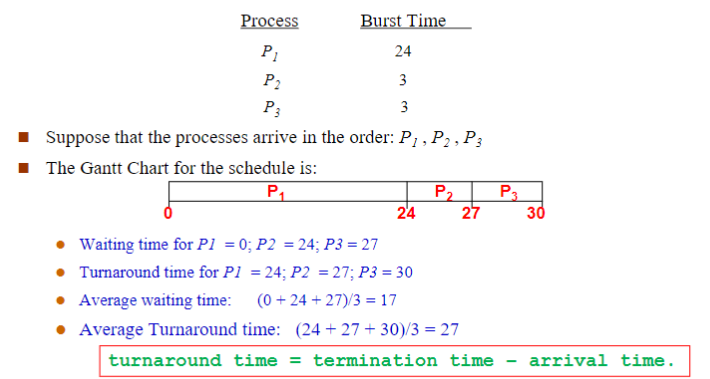
    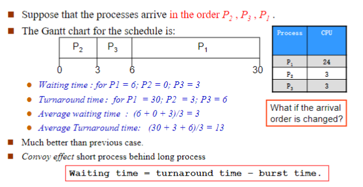

注意到，FCFS最大的问题就是如果一个长作业排在前面，会导致后续排队的短作业的周转时间非常长

### SJF

短进程优先(*Shortest Process First, SJF*)算法，是对FCFS的改进，目标是减少平均周转时间

SJF需要估计每个进程的执行时间，并对预计执行时间短的作业优先分派处理机

- 非抢占式调度：当前CPU已经占用时就必须等待
- 抢占式调度：如果有执行时间更少的作业那么让出当前CPU

!!! example "SJF"
    非抢占式SJF：
    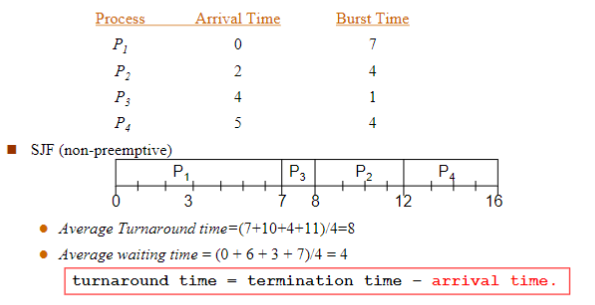
    抢占式SJF：
    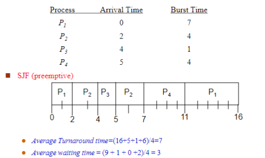

估计CPU运行时间为

$$\tau_{n+1}=\alpha t_n+(1-\alpha)\tau_n$$

其中，

- $t_n$是第$n$个进程的实际CPU运行时间
- $\tau_{n+1}$为预计的下一个进程的CPU运行时间
- $0\leq\alpha\leq1$

!!! note "饥饿"
    由于SJF总是先给短进程分派处理机，长进程可能会长时间得不到处理机的分派而产生饥饿现象

### Priority Scheduling

优先权调度算法总是把处理机分派给就绪队列中具有最高优先权的进程，通常由以下两种方法来确定进程的优先权：

- 静态优先权：在创建进程时确定，整个运行期间不再改变
- 动态优先权：给予某种原则使进程的优先权随时间改变而改变

通常来说，内核级别的进程优先级更高

!!! tip "SJF的关联"
    SJF是以下一次CPU脉冲长度作为优先级判定的优先级调度

优先级调度也分为抢占式和非抢占式调度

- 非抢占式调度：当前CPU已经占用时就必须等待
- 抢占式调度：如果有优先级更高的作业那么让出当前CPU

!!! example "优先级调度"
    非抢占式：
    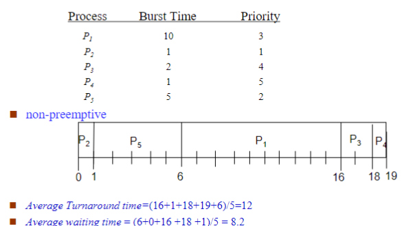
    抢占式：
    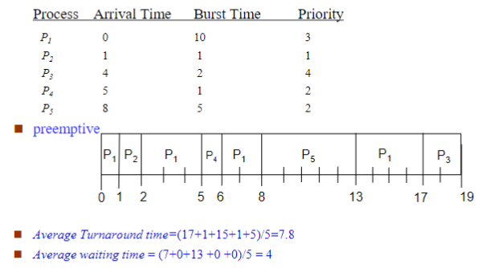

!!! tip "饥饿"
    优先权调度同样存在饥饿现象，对于静态优先级来说，可能优先级靠后的作业永远得不到CPU的分派
    > *Rumor has it that ,When they shut down the IBM 7094 at MIT in 1973,they found a low-priority process that had been submitted in 1967 and had not yet been run* 🫢

    解决饥饿的方法：老化(*Aging*)，即随时间增加而增加进程的优先级

### RR

时间片轮转调度(*Round Robin*)算法，通过时间片轮转，提高进程的并发性和响应时间

- 将系统中所有的就绪进程按照FCFS原则排成一个队列
- 每次调度时将CPU分派给队首进程，让其执行一个时间片(*Time Slice*)
- 在一个时间片结束时，暂停当前进程的执行，将其送到就绪队列队尾，并通过上下文切换执行就绪队列的队首进程
- 进程可以未使用完一个时间片就让出CPU，如遇到阻塞情况

!!! tip "RR本质"
    本质上，时间片轮转调度算法就是FCFS

通常来说，时间片的大小为几十毫秒

影响时间片长度的因素：

- 就绪进程的数目：数目越多，时间片越小
- 系统的处理性能

!!! example "RR"
    时间片大小为20的情况：
    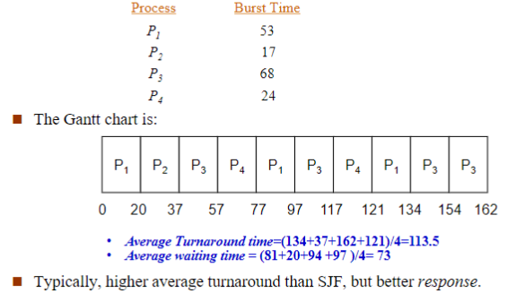

可以看到RR的平均周转时间更长，但是响应更好，适合前台进程，即与用户交互的进程

### Multilevel Queue Scheduling

多级队列调度，即操作系统根据就绪队列中进程的性质或类型的不同创建多个就绪子队列

每个进程固定归入其中一个队列

通常可以分为

- 前台，交互式
- 后台，批处理

多级队列调度须在队列间进行，固定优先级调度，即前台运行完再运行后台；给定时间片调度，使得每个队列得到一定的CPU时间

### Multilevel Feedback Queue Scheduling

多级反馈队列调度是时间片轮转调度和优先级算调度的综合

- 提高系统吞吐量，缩短平均周转时间，照顾短进程
- 更好的I/O设备利用率，更短的响应时间，更加照顾I/O型进程
- 不必估计进程的执行时间，动态调节

设置多个就绪队列，分别赋予不同的优先级，每个队列的执行时间片长度也不同，规定优先级越低则时间片越长

- 对于I/O型进程，让其进入最高优先级队列，及时响应I/O交互，通常执行一个小时间片，处理完一次I/O请求后转入阻塞队列
- 对于CPU型进程，每次都执行完时间片，然后进入更低级队列，最终采用最大时间片执行，减少调度次数
- I/O次数不多的进程，主要是CPU处理，在I/O完成后，放回优先I/O请求时离开的队列，以避免每次都回到最高优先级队列后再逐次下降

为适应一个进程在不同时间段的运行特点，I/O完成时，提高优先级；时间片用完时，降低优先级

---

## Windows Scheduling

Windows 2000/XP的处理机调度的调度对象是线程，其线程是内核线程，其线程调度并非单纯采用某种算法，而是多种算法的综合体，针对实际系统的需要进行针对性优化和改进

!!! note "Windows 2000/XP线程七种状态"
    - 就绪状态(*Ready*)：线程已获得除处理机外的所需资源，正等待调度执行
    - 备用状态(*Standby*)：已选择好线程的执行处理机，正等待描述表切换，以进入运行状态。系统中每个处理机上只能有一个处于备用状态的线程
    - 运行状态(*Running*)：已完成描述表切换，线程进入运行状态。线程会一直处于运行状态，直到被抢占、时间片用完、线程终止或进入等待状态
    - 等待状态(*Waiting*)：线程正等待某对象，以同步线程的执行。当等待事件出现时，等待结束，并根据优先级进入运行或就绪状态
    - 转换状态(*Transition*)：转换状态与就绪状态类似，但线程的内核堆栈位于外存。当线程等待事件出现而它的内核堆栈处于外存时，线程进入转换状态；当线程内核堆栈被调回内存时，线程进入就绪状态
    - 终止状态(*Terminated*)：线程执行完就进入终止状态；如执行体有一指向线程对象的指针，可将处于终止状态的线程对象重新初始化，并再次使用
    - 初始化状态(*Initialized*)：线程创建过程中的线程状态

    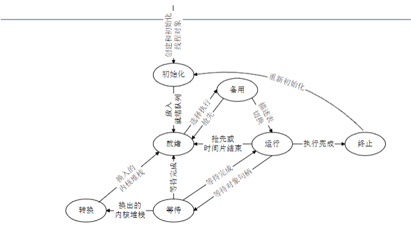

### Thread Scheduling Keys

**采用严格的抢占式动态优先级调度，根据优先级和分配时间配额来进行调度**

- 每个优先级的就绪队列排成一个先进先出队列
- 当一个线程状态变成就绪时，它可能立即运行或排到响应优先级队列的尾部
- 完全的事件驱动机制，在被抢占之前没有保证的运行时间
- 同一优先级的各线程按照时间片轮转算法进行调度
- 在多处理机系统中多个线程并行运行

### Thread Priority

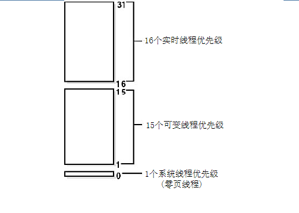

线程得到的优先级是相对于它们的进程优先级类而言的，开始时由`CreateProcess`设置6个进程优先级类，并且每个类都有一个基本优先级值，线程优先级在进程基本优先级的±2范围之内

??? note "进程优先级类"
    - **REALTIME_PRIORITY_CLASS**，基本优先权为24
    - **HIGH_PRIORITY_CLASS**，基本优先权为13
    - **ABOVE_NORMAL_PRIORITY_CLASS**，基本优先权为10
    - **NORMAL_PRIORITY_CLASS**，基本优先权为8
    - **BELOW_NORMAL_PRIORITY_CLASS**，基本优先权为6
    - **IDLE_PRIORITY_CLASS**，基本优先权为4

??? note "线程优先级"
    - **THREAD_PRIORITY_TIME_CRITICAL**
    - **THREAD_PRIORITY_HIGHEST** +2
    - **THREAD_PRIORITY_ABOVE_NORMAL** +1
    - **THREAD_PRIORITY_NORMAL** 0
    - **THREAD_PRIORITY_BELOW_NORMAL** -1
    - **THREAD_PRIORITY_LOWEST** -2
    - **THREAD_PRIORITY_IDLE**

    前台线程通常使用**ABOVE**级别，后台线程通常使用**BELOW**级别

如果用户进程的实时优先级运行时间过多，它可能会阻塞关键系统功能的执行，阻塞系统线程的运行，但不会阻塞硬件中断处理

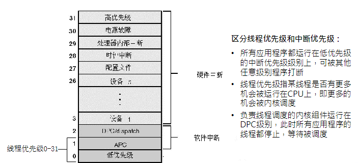

### Thread Quantum

时间配额(*Quantum*)是一个线程从进入运行状态到系统检查是否有其它优先级相同的线程需要开始运行之间的时间总和

一个线程用完了自己的时间配额时，如果没有其它相同优先级线程，Windows 2000/XP将重新给该线程分配一个新的时间配额，并继续运行

时间配额的单位是配额单位(*Quantum Unit*)的整数倍

每次时钟中断，时钟中断服务例程从线程的时间配额中减少一个固定值3，如果没有剩余的时间配额，系统出发时间配额用完处理机制，选择另一个线程进入运行状态

在线程等待完成时，允许减少部分时间配额，防止线程的时间配额永远不减少

### Scheduling Data Structures

- 就绪位图：为了提高调度速度，Windows 2000维护了一个称为就绪位图(*KiReadySummary*)的32位，就绪位图中的每一位指示一个调度优先级的就绪队列中是否有线程等待运行
    - B0与调度优先级0相对应
    - B1与调度优先级1相对应
    - ...
- 空闲位图：Windows 2000还维护一个称为空闲位图(*KiIdleSummary*)的32位，空闲位图中的每一位指示一个处理机是否处于空闲状态
- 调度器自旋锁：为了防止调度器代码与线程在访问调度器数据结构时发生冲突，处理机调度仅出现在DPC/调度层次；但在多处理机系统中，修改调度器数据结构需要额外的步骤来得到内核调度器自旋锁(*KiDispatcherLock*)，以协调各处理机对调度器数据结构的访问

### Scheduling Policies

Windows 2000/XP严格基于**线程的优先级**来确定哪一个线程将占用处理机并进入运行状态

Windows 2000/XP在单处理机系统和多处理机系统中的线程调度是不同的

#### Positive Scheduling

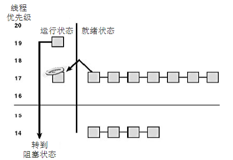

通常进入等待状态线程的时间配额不会重置，而是在等待事件出现时，线程的时间配额减1，如果线程的优先级大于等于14，在等待事件出现时，线程的时间配额被重置

#### Preemptive Scheduling

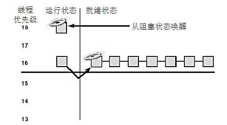

当一个高优先级线程进入就绪状态时，正在运行的低优先级线程被抢占

!!! warning "注意"
    并不考虑线程处于用户态还是内核态，调度器只是依据线程优先级判断是否抢占

当线程被抢占时，它被放回响应优先级的就绪队列的队首

- 处于实时优先级的线程被抢占时，时间配额被重置为完整时间配额
- 处于动态优先级的线程被抢占时，时间配额不变

#### Quantum Running Out

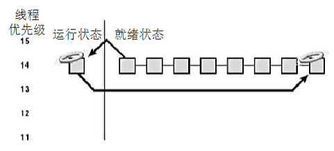

线程完整用完一个规定的时间片值时，重新赋予新时间片值，优先级降一级，放在相应优先级就绪队列的尾部

- 如果刚用完时间配额的线程优先级降低了，Windows 2000将寻找一个优先级高于刚用完时间配额线程的新设置值的就绪线程
- 如果刚用完时间配额的线程的优先级没有降低，并且有其他优先级相同的就绪线程，Windows 2000将选择相同优先级的就绪队列中的下一个线程进入运行状态，刚用完时间配额的线程被排到就绪队列的队尾(即分配一个新的时间配额并把线程状态从运行状态改为就绪状态)
- 如果没有优先级相同的就绪线程可运行，刚用完时间配额的线程将得到一个新的时间配额并继续运行

#### Thread End

当线程完成运行时，它的状态从运行状态转到终止状态

### Thread Priority Elevating

Windows 2000会提升线程的当前优先级：

- **I/O操作完成**：完成I/O操作后，线程优先级被临时提升，以保证等待I/O操作的线程能有更多机会立即开始处理得到的结果；为了避免I/O操作导致的不公性，将I/O操作完成后唤醒等待线程时把该线程的时间配额减1
- **信号量或事件等待结束**：当一个等待信号量或事件的线程完成等待后，它的优先级将提升1
- **前台进程中的线程完成一个等待操作**：对于前台进程中的线程，完成它的等待操作时小幅提升它的优先级以使它更有可能马上进入运行状态，有效改进前台应用的响应时间特征
- **由于窗口活动而唤醒图形用户接口线程**：拥有窗口的线程在窗口活动唤醒时（如收到窗口消息）将得到一个幅度为2的额外优先级提升，以改进交互应用的响应时间
- **处理机饥饿线程**：线程处于就绪状态超过一定时间，但没能进入运行状态，系统线程平衡集管理器(*Balance Set Manager*)每秒钟检查一次就绪队列中是否存在一直在就绪队列中排队超过300个时钟中断间隔的线程，如果找到就将该线程优先级提升到15，并分配两倍正常值的时间配额，当其提升优先级后用完时间配额时，该线程的优先级立即衰减到原先的优先级

!!! note "注意"
    - 线程优先级提升是以线程的基本优先级为基点而不是当前优先级
    - 当提升优先级后线程用完一个时间配额后，线程会降低一个优先级并运行另一个时间配额，直至线程优先级降低至原本的基本优先级

线程优先级提升的目的是改进系统吞吐量、系统响应时间等，解决线程调度策略中潜在的不公性

!!! info "注意"
    Windows 2000 永远不会提升实时优先级范围内(16~31)的线程的线程优先级

### Multiple Processor System

Windows 2000/XP 只保证一个优先级最高的线程处于运行状态

#### Affinity

亲和关系用于描述该线程可在哪些处理机上运行，线程的亲和掩码是从进程的亲和掩码继承得到

缺省时，所有进程的亲和掩码为系统中所有可用处理机的集合

#### Ideal And Last

首选处理机(*Ideal Processor*)是线程运行时的偏好处理机，线程创建后系统不会修改线程的首选处理机设置，应用程序可以修改

第二处理机(*Last Processor*)是线程第二个选择的运行处理机

#### Ready

- 当线程进入运行状态时，Windows 2000首先试图调度该线程到一个空闲处理机上运行
    - 如果有多个空闲处理机，线程调度器的调度顺序为：
        - 线程的首选处理机
        - 线程的第二处理机
        - 当前执行处理机，即正在执行调度器代码的处理机
    - 如果这些处理机都不是空闲的，Windows 2000将依据处理机标识从高到低扫描系统中的空闲处理机状态，选择找到的第一个空闲处理机
- 如果被选中的处理机已有一个线程处于备用状态(即下一个在该处理机上运行的线程)，并且该线程的优先级低于正在检查的线程，则正在检查的线程取代原处于备用状态的线程，成为该处理机的下一个运行线程
- 如果已有一个线程正在被选中的处理机上运行，Windows 2000将检查当前运行线程的优先级是否低于正在检查的线程；如果正在检查的线程优先级高，则标记当前运行线程为被抢占，系统会发出一个处理机间中断，以抢占正在运行的线程，让新线程在该处理机上运行

#### Special Processor

在多处理机系统，Windows 2000不能简单地从就绪队列中取第一个线程，它要在亲合掩码限制下寻找一个满足下列条件之一的线程

- 线程的上一次运行是在该处理机上
- 线程的首选处理机是该处理机
- 处于就绪状态的时间超过2个时间配额
- 优先级大于等于24

如果Windows 2000不能找到满足要求的线程，它将从就绪队列的队首取第一个线程进入运行状态

#### Highest Priority

有可能出现这种情况，一个比当前正在运行线程优先级更高的线程处于就绪状态，但不能立即抢占当前线程，进入运行状态

!!! example "实例"
    假设0号处理机上正运行着一个可在任何处理机上运行的优先级为8的线程，1号处理机上正运行着一个可在任何处理机上运行的优先级为4的线程；这时一个只能在0号处理机上运行的优先级为6的线程进入就绪状态

    在这种情况下，优先级为6的线程只能等待0号处理机上优先级为8的线程结束。因为Windows 2000不会为了让优先级为6的线程在0号处理机上运行，而把优先级为8的线程从0 号处理机移到1号处理机。即0号处理机上的优先级为8的线程不会抢占1号处理机上优先级为4的线程

---

## Linux Scheduling

Linux系统采用**抢占式调度**方式，进程无论是内核态还是用户态都可能被抢占

Linux调度基于**分时技术**(*Time-Sharing*)，相同优先级进程采用**时间片轮转法**

Linux依据进程的优先级进行分类，进程的优先级是动态的

### Scheduling Policies

Linux进程分为普通进程和实时进程，实时进程优先级高于普通进程

```c title="include/uaip/linux/sched.h"
#define SCHED_NORMAL 0   // 普通进程的时间片轮转算法
#define SCHED_FIFO 1     // 实时进程的先进先出算法
#define SCHED_RR 2       // 实时进程的时间片轮转算法
#define SCHED_BATCH 3    // 后台处理进程

#define SCHED_IDLE 5     // 最不重要的进程
#define SCHED_DEADLINE 6 // 实时进程调度算法，最早到期优先
```

#### CFS

Linux 2.6.23内核发布的一种新的调度算法，**完全公平调度器**(*Completely Fair Scheduler*)，调度器通过将进程在红黑树中排序，跟踪进程的等待时间

#### O(1)

Linux 2.6的O(1)调度算法，调度器开销恒定，实时性能好

Linux 2.6的进程设置140个优先级，实时进程优先级为0-99，普通进程优先级 100-139的数，0为最高优先权，139为最低优先权

优先级分为静态优先级和动态优先级

调度程序根据动态优先级来选择新进程运行

#### Dynamic Priority

Linux 2.4的进程调度程序是内核中的`schedule()`函数，，采用动态优先级法，调度对象是可运行队列，每个处理机有一个可运行队列，可运行队列中优先级最大的进程首先进入CPU运行

Linux采用加权方法保证实时进程的优先级高于普通进程

在调度过程中，调度程序检查可运行队列中所有进程的权值，选择其中权值最大的进程作为下一个运行程序
