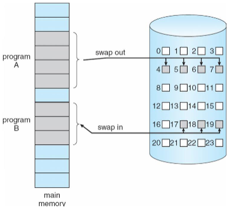
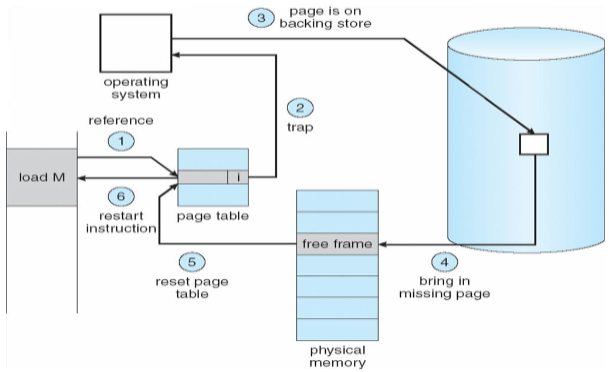
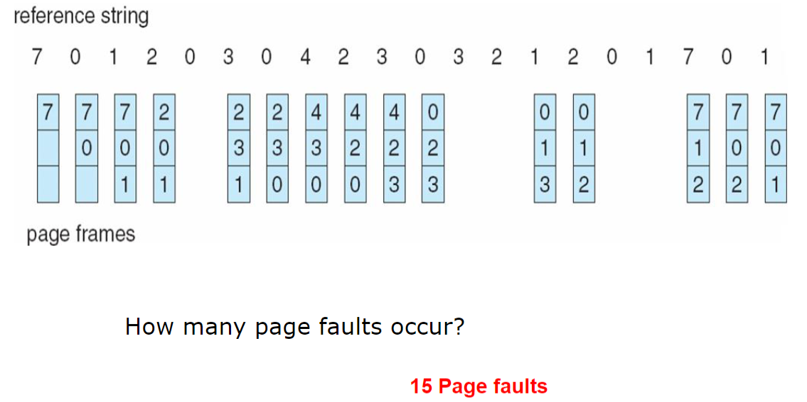
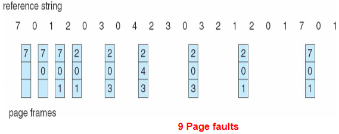
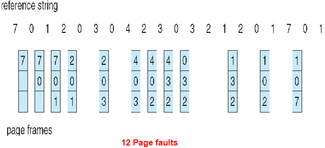
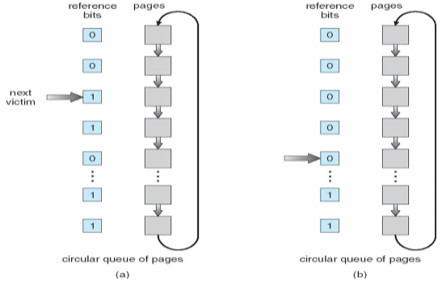
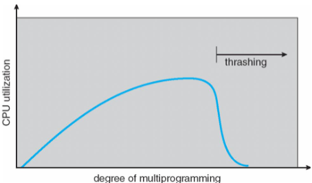

---
tags:
- ZJU-Courses
- OS
---

# Chapter 9: Virtual Memory

## Introduction

程序运行时只有一部分程序需要被装入内存执行

虚拟存储器是具有请求调入功能和置换功能，仅把进程的一部分装入内存便可运行进程的存储管理系统，它能从逻辑上对内存容量进行扩充的一种虚拟的存储管理系统

---

## Demand Paging

按需调页，请求调页，只有需要一个内存页时才装入内存，否则不装入

懒交换(*Lazy Swapper*)是只有内存页被需要时才会交换进入内存，否则不进入



可以使用有效位来在页表中标记，其中每个页表项如下：

| 物理块号 | 状态位P | 访问字段A | 修改位M | 外存地址 |
|:--------:|:-------:|:---------:|:-------:|:--------:|

- 状态位P（存在位）：用于指示该页是否已调入内存，供程序访问时参考
- 访问字段A：用于记录本页在一段时间内被访问的次数，或最近已有多长时间未被访问，提供给置换算法选择换出页时参考
- 修改位R/W：表示该页在调入内存后是否被修改过
- 外存地址：用于指出该页在外存上的地址，供调入该页时使用

### Page Fault

如果对一个页的访问是无效的，即缺页，需要进行陷入处理

1. 检查进程的页表，确定该引用地址是否合法
    1. 如果引用非法，那么终止进程
    2. 如果引用合法，但尚未调入页面，需要调入页面
2. 找到一个空闲帧
3. 调度磁盘操作，将所需的页调入刚分配的帧
4. 当磁盘读操作完成后，修改进程内部表和页表，表示该页已在内存中
5. 重新开始因非法地址陷入而中断的指令，现在进程可以访问所需的页



!!! question "没有空闲帧的情况"
    需要通过页置换，即在内存中找到一些不在使用的页，将其换出，性能上最好是能够导致最小的页错误发生的置换

定义缺页率(*Page Fault Rate*)为$0\leq p\leq1$，通常来说缺页率都是非常低的

那么有效访存时间(*Effective Memory-Access Time, EAT*)为未缺页的部分的开销加上缺页部分的开销，其中

- 未缺页的部分的开销为直接访问物理内存的开销
- 缺页部分的开销为
    - 缺页中断处理(*Page Fault Overhead*)：处理缺页异常的中断
    - 交换页(*Swap Page In & Out*)：将缺页读入内存
    - 重新启动(*Restart Overhead*)：重新启动进程

缺页部分的开销又称为**缺页异常服务时间**

??? note "缺页异常服务流程"
    1. OS陷入
    2. 保存用户寄存器和进程状态
    3. 确定中断原因是缺页异常
    4. 检查页引用地址是否合法，确定页在磁盘中的地址
    5. 从磁盘中读出到内存中的一个空闲帧上
        1. 在等待队列中等待磁盘读写设备开始服务这个读请求
        2. 等待磁盘读写的寻道时间和延迟
        3. 向内存帧传输页
    6. 在等待时让出CPU给其它用户进程
    7. 磁盘I/O操作完成，中断返回
    8. 保存让出的CPU的其它用户进程的进程寄存器和状态
    9. 确定中断来自磁盘
    10. 更新页表，表明目标页已经进入内存
    11. 等待CPU重新分配给原进程
    12. 恢复寄存器、进程状态、更新后的页表，从中断处返回，继续执行

!!! tip "上下限问题"
    如果有$m$个物理帧最开始是空的，引用串的长度为$p$，里面包含$n$个不同的页访问，那么
    - 最少缺页数为$n$
    - 最大缺页数为$p$

---

## Process Creation

虚拟内存允许创建进程以写时拷贝的方式进行

### Copy-On-Write

写时拷贝允许父进程和子进程最开始共享内存中相同的页，只要其中一个进程修改了一个共享页，那么这个页才进行拷贝

写时拷贝使得进程创建更加高效，因为只有被修改的页才会进行拷贝

Linux中使用了写时复制机制，`fork`创建的子进程首先与父进程共享物理内存空间，直到父子进程有修改内存的操作发生时再为子进程分配物理内存

!!! tip "空页池"
    拷贝的页可以事先创建一个空页在空页池里

---

## Page Replacement

在进程运行过程中，如果发生缺页，而内存中又没有空闲块时，就需要从内存中调出一页程序或数据送到磁盘交换区以产生一个空页，用来调入新页

!!! tip "脏位"
    可以使用脏位来表示页是否修改过，如果没有修改过的页，就可以直接进行替换，不用调回磁盘

页面置换的过程如下

1. 在磁盘上找到需要的页
2. 找一个内存中的空闲帧
    1. 如果有空闲帧，直接使用
    2. 如果没有空闲帧，使用页面置换算法交换出一个帧，把它写入磁盘，并修改页表和帧表
3. 读入目标页到空闲帧，更新页表和帧表
4. 重启进程

页面置换需要根据一定的置换算法进行

### FIFO

先进先出



!!! note "Belady's Anomaly"
    越多的帧会导致越多的缺页异常

### OPT

最佳页面置换算法(*Optimal Page Replacement*)，选择未来不再使用或在离当前位置最远位置上出现的页进行置换



### LRU

最近最少使用算法(*Least Recently Used*)，选择内存中最久没有引用的页面进行置换

LRU是局部性原理的合理近似，性能上最接近最佳算法

需要记录页面的使用时间，硬件开销增大：

- 计数器：每个页面设立计数器，用于记录每一页最后使用的时间
- 栈：特殊的栈，把被访问的页面移到栈顶，所以栈底是最久未被使用的页面
- 移位寄存器：被访问时左边最高位置1，并定期右移，高位补0，所以寄存器数值最小的是最久未被使用的页面



### NRU

LRU近似算法(*LRU Approximation Algorithms*)

在页表项中选择一位作为引用位或访问位(*Reference Bit*)，初值为0，当页被访问时就置1

把访问位为0的页置换出去

!!! tip "引用位的产生"
    为了充分利用页表项，由于页表项中有些位没有利用起来，所以刚好选择一个位使用

#### Additional-Reference-Bits Algorithm

移位寄存器的方法，通常是8位大小，被访问时左边最高位置1，并定期右移，高位补0，所以寄存器数值最小的是最久未被使用的页面

#### Second-Chance Algorithm

Clock算法，二次机会算法

当要选择一个页时，检查其引用位

- 如果引用位为0，直接置换
- 如果引用位为1，就给该页第二次机会，并选择下一个FIFO页

当一个页获得第二次机会时，其引用位清零，且其到达时间设为当前时间



#### Enhanced Second-Chance Algorithm

改进型Clock算法，使用引用位和修改位

- (0,0)是最佳的置换页面
- (0,1)
- (1,0)很快会再次使用
- (1,1)

置换的淘汰顺序为

```txt
(0,0) -> (0,1) -> (1,0) -> (1,1)
```

### Counting Algorithms

使用计数器记录页被访问的次数

- LFU：最不经常使用算法，替换掉计数器值最小的页面
- MFU：最经常使用算法，计数器值最小的页很可能是刚刚进入内存而且未被使用

### Page Buffering Algorithm

页面缓冲算法，设置缓冲以方便找回被置换的页面，相当于回收站

用FIFO算法选择被置换页，把被置换的页面放入两个链表之一

- 如果页面未被修改，就将其归入到空闲页面链表的末尾
- 否则将其归入到已修改页面链表

需要调入新的页面时，将新页面内容读入到空闲页面链表的第一项所指的页面，然后将第一项删除

空闲页面和已修改页面会仍停留在内存中一段时间，如果这些页面被再次访问，这些页面还在内存中

当已修改页面达到一定数目后，再将它们一起调出到外存，然后将它们归入空闲页面链表

!!! example "现代OS"
    Windows和Linux的页面置换算法是基于页面缓冲算法的

---

## Allocation Of Frames

分配帧主要有两种模式，固定分配和优先级分配

### Allocation Schemes

#### Fixed Allocation

- 平均分配算法(*Equal Allocation*)，每个进程同样数量的帧数
- 按比例分配(*Proportional Allocation*)，根据进程的大小分配对应比例的帧数

#### Priority Allocation

如果一个进程产生缺页异常，选择自己进程中的一个帧进行替换，或选择优先级低的进程进行替换

### Allocation Policies

页面置换策略可以分为

- 全局置换：从内存中所有进程的所有帧中进行置换
- 局部置换：从自己进程的所有帧中进行置换

分配策略又可以分为固定分配和可变分配，所以帧的分配和置换策略可以组合一下，得到

- 固定分配局部置换策略
- 可变分配全局置换策略
- 可变分配局部置换策略

---

## Thrashing

抖动，一个进程如果没有足够的页就会产生很高的缺页率，导致频繁进行页面交换

导致CPU利用率低下，一直进行I/O操作而CPU空闲



通过局部置换算法能限制系统抖动

!!! note "L=S准则"
    L是产生缺页的平均时间，S是系统处理进程缺页的平均时间
